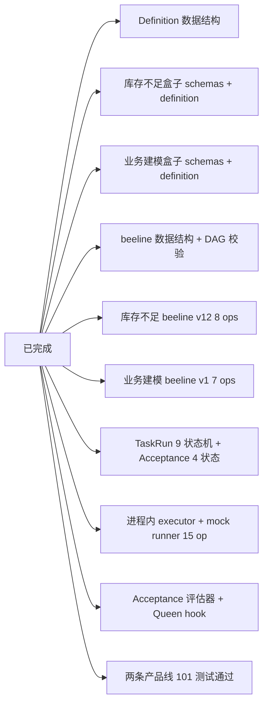

# beeOS

> Business Fulfillment Operating System — 业务履约操作系统

beeOS 是一个面向业务的履约操作系统：把一次业务履约（business fulfillment）
建模为可验证的产物，而不是一段胶水脚本。

## 三句话架构宣言

- **beeOS**：提供让业务履约可被定义、可被运行、可被验收的基础设施
- **beeBox**：单一业务履约盒子的完整定义 + 实现 + 验收契约
- **Business Fulfillment fulfills under explicit contract and policy,
  producing verifiable result**：履约按明确合同与政策发生，
  产出可被验收的业务结果

## 仓库结构

```mermaid
flowchart TB
    Repo[beeOS repo]
    Repo --> Docs[docs/ design]
    Repo --> Core[core/ kernel]
    Repo --> Boxes[boxes/ products]
    Repo --> Beelines[beelines/ procedures]
    Repo --> Runtime[runtime/ executor]
    Repo --> Tests[tests/ verification]

    Docs --> D1[beebox-design]
    Docs --> D2[beebox-definition-schema]
    Docs --> D3[beebox-beeline-schema]
    Docs --> D4[beebox-runtime-design]
    Docs --> D5[beebox-runtime-schema]
    Docs --> D6[beeos-gtm]
    Docs --> D7[examples/order-exception-box]

    Core --> C1[models.py Definition shapes]
    Core --> C2[beeline_models.py Beeline shapes]
    Boxes --> B1[inventory_shortage Order Exception Box - Operations Line]
    Boxes --> B2[modeling Business Modeling Box - Software Line]
    Beelines --> BL1[inventory_shortage procedure v12]
    Beelines --> BL2[business_modeling procedure v1]
    Runtime --> R1[executor + TaskRun + Acceptance]
    Tests --> T1[test_definition.py]
    Tests --> T2[test_beeline.py]
    Tests --> T3[test_runtime.py]
    Tests --> T4[test_modeling_box.py]
```



## 布局说明

- **`docs/`** — 设计稿（5 文件 schema + GTM + 示例盒子）
  - `beebox-design.md` — 主设计稿（架构宣言 / 核心契约 / 执行语义 / 实现设计）
  - `beebox-definition-schema.md` — beeBox Definition 数据形状
  - `beebox-beeline-schema.md` — beeline / Operation 数据形状
  - `beebox-runtime-design.md` — Runtime 设计
  - `beebox-runtime-schema.md` — Runtime 数据形状
  - `beeos-gtm.md` — 商业定位 / Catalog（Operations + Software 两条线）/ Certification / 飞轮
  - `examples/order-exception-box.md` — 订单异常履约盒完整示例

- **`core/`** — 基础设施内核
  - `models.py` — Definition / Schema / Field / Task / Result / Acceptance /
    Exception / Queen / Metrics 顶层数据结构（pydantic）
  - `beeline_models.py` — beeline / Operation / NextRef / Idempotency / Bee /
    ExternalSystem（含 DAG 校验）

- **`boxes/`** — 业务履约盒子（产品层，**两条产品线**）
  - `inventory_shortage/` — 第一只盒子：订单异常履约（**Operations Line**）
  - `modeling/` — 第二只盒子：业务建模履约（**Software Line 第一只**）
  - 每只盒子：`__init__.py` / `schemas.py` / `definition.py` / `README.md`

- **`beelines/`** — 履约作业路线（procedure 实现，独立维护）
  - `inventory_shortage.py` — beeline_inventory_shortage_v3 v12（8 ops + 4 分支）
  - `modeling.py` — beeline_business_modeling_v1 v1（7 ops 顺序链）

- **`runtime/`** — 执行运行时（PoC 2 落地）
  - `models.py` — TaskRun durable object + 9 状态机 + Acceptance 4 状态
  - `executor.py` — BeelineExecutor（顺序 / 分支 + when 评估）
  - `mock_runner.py` — Mock operation runner（15 个业务 op handler 跨两条线）
  - `acceptance.py` — Acceptance 评估器（4 状态转移）
  - `queen.py` — Queen escalation hook

- **`tests/`** — 验证
  - `test_definition.py` — Definition 数据结构加载验证
  - `test_beeline.py` — beeline 图结构 + 库存 beeline 集成验证
  - `test_runtime.py` — TaskRun / executor / acceptance 集成验证
  - `test_modeling_box.py` — 业务建模盒 definition + beeline + e2e

## 当前状态



下一阶段：RETRYING/WAITING_EXTERNAL 状态机 + 业务系统开发盒（Software Line 第二只）+ mock runner 补 acceptance 字段自动化。

## 开发

```bash
# Python 3.11+
.venv/bin/python -m pytest tests/ -v

# 加载运营线盒子
.venv/bin/python -c "from boxes.inventory_shortage import get_definition; d = get_definition(); print(d.id, d.version)"

# 加载软件线盒子
.venv/bin/python -c "from boxes.modeling import get_definition; d = get_definition(); print(d.id, d.version)"

# 端到端冒烟（订单异常）
.venv/bin/python -c "
from boxes.inventory_shortage import get_definition
from beelines.inventory_shortage import get_beeline
from runtime import create_task_run, BeelineExecutor, evaluate_acceptance
box = get_definition(); beeline = get_beeline()
tr = create_task_run('o', 'handle_order_exception', box.result.result_schema, f'{box.id}@v{box.version}', beeline.id, beeline.version, 'rt', 'in')
tr = BeelineExecutor().execute(tr, beeline, {'exception_type': 'inventory_shortage', 'amount': 100})
print('inventory_shortage:', tr.status.value)
"

# 端到端冒烟（业务建模）
.venv/bin/python -c "
from boxes.modeling import get_definition
from beelines.modeling import get_beeline
from runtime import create_task_run, BeelineExecutor, evaluate_acceptance
box = get_definition(); beeline = get_beeline()
input_data = {'set_id': 'r1', 'business_goal': 'test', 'requirements': [{'requirement_id': 'req_obj_1', 'description': 'x', 'requirement_type': 'object', 'priority': 'must_have'}]}
tr = create_task_run('pm', 'handle_modeling_request', box.result.result_schema, f'{box.id}@v{box.version}', beeline.id, beeline.version, 'rt', 'in')
tr = BeelineExecutor().execute(tr, beeline, input_data)
print('modeling:', tr.status.value, 'result:', tr.result)
"
```