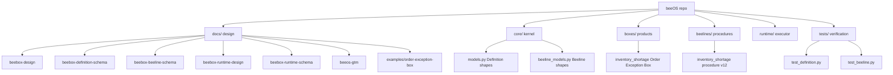
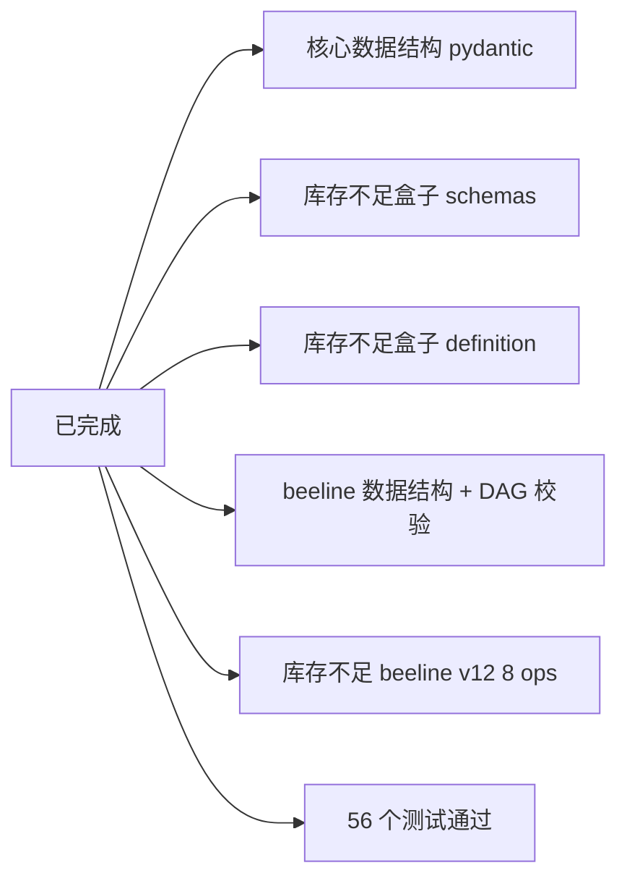

# beeOS

> Business Fulfillment Operating System — 业务履约操作系统

beeOS 是一个面向业务的履约操作系统：把一次业务履约（business fulfillment）
建模为可验证的产物，而不是一段胶水脚本。

## 三句话架构宣言

- **beeOS**：提供让业务履约可被定义、可被运行、可被验收的基础设施
- **beeBox**：单一业务履约盒子的完整定义 + 实现 + 验收契约
- **Business Fulfillment fulfills under explicit contract and policy,
  producing verifiable result**：履约按明确合同与政策发生，
  产出可被验收的业务结果

## 仓库结构



## 布局说明

- **`docs/`** — 设计稿（5 文件 schema + GTM + 示例盒子）
  - `beebox-design.md` — 主设计稿（架构宣言 / 核心契约 / 执行语义 / 实现设计）
  - `beebox-definition-schema.md` — beeBox Definition 数据形状
  - `beebox-beeline-schema.md` — beeline / Operation 数据形状
  - `beebox-runtime-design.md` — Runtime 设计
  - `beebox-runtime-schema.md` — Runtime 数据形状
  - `beeos-gtm.md` — 商业定位 / Catalog / Certification / 飞轮
  - `examples/order-exception-box.md` — 订单异常履约盒完整示例

- **`core/`** — 基础设施内核
  - `models.py` — Definition / Schema / Field / Task / Result / Acceptance /
    Exception / Queen / Metrics 顶层数据结构（pydantic）
  - `beeline_models.py` — beeline / Operation / NextRef / Idempotency / Bee /
    ExternalSystem（含 DAG 校验）

- **`boxes/`** — 业务履约盒子（产品层）
  - `inventory_shortage/` — 第一只盒子：订单异常履约
  - 每只盒子包含：`__init__.py` / `schemas.py` / `definition.py` / `README.md`

- **`beelines/`** — 履约作业路线（procedure 实现，独立维护）
  - `inventory_shortage.py` — beeline_inventory_shortage_v3 v12（8 ops + 4 分支）

- **`runtime/`** — 执行运行时（PoC 0 占位）

- **`tests/`** — 验证
  - `test_definition.py` — Definition 数据结构加载验证
  - `test_beeline.py` — beeline 图结构 + 库存 beeline 集成验证

## 当前状态



下一阶段：Runtime 最小闭环（进程内 executor + task_run 9 状态机）+ Acceptance 独立阶段。

## 开发

```bash
# Python 3.11+
.venv/bin/python -m pytest tests/ -v

# 加载第一只盒子
.venv/bin/python -c "from boxes.inventory_shortage import get_definition; d = get_definition(); print(d.id, d.version)"

# 加载第一只 beeline
.venv/bin/python -c "from beelines import get_beeline; b = get_beeline(); print(b.id, b.version, len(b.operations))"
```