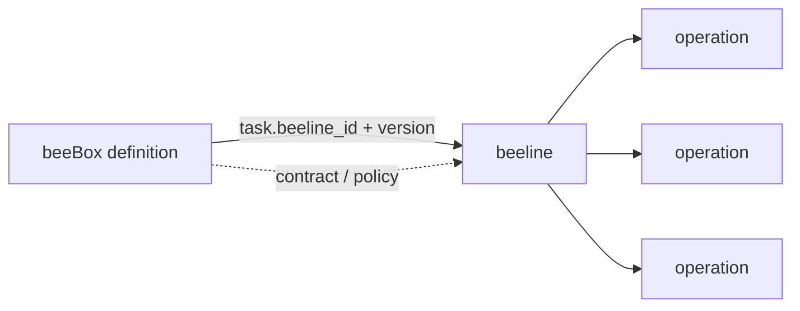
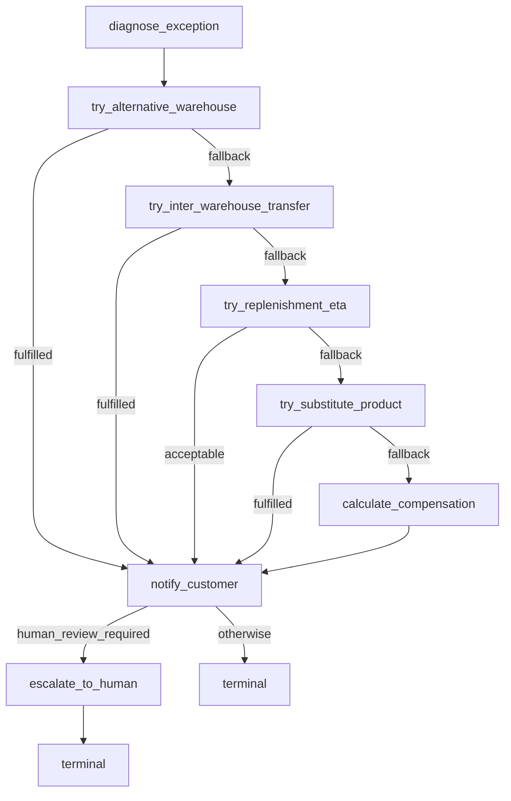

# beelines - 履约作业路线（procedure 实现）

> beeline 是 1 类任务的标准作业路线，本质是 1 张有向图——节点是 operation，
> `next` 字段是节点之间的有向边（支持顺序 / 并发 / 分支）。

## 与 boxes/ 的关系

- **boxes/** — 业务履约盒子（contract + intent + queen policy）
- **beelines/** — 履约作业路线（operation 有向图 + 幂等性策略）

beeline 独立维护，**不归 beeBox definition 管**——
beeBox definition 通过 `task[].beeline_id + beeline_version` 引用 beeline。



## 布局

```
beelines/
  __init__.py                # 入口（导出所有 beeline）
  inventory_shortage.py      # 库存不足订单履约作业路线（v3 ver12）
```

## 第一只 beeline：beeline_inventory_shortage_v3 (v12)

业务流——按 queen `inventory_shortage_priority` 优先级链：



8 个 operation / 4 个 try_* 分支 / 1 个 fan-in 汇聚点 / 1 个终态。

## 幂等性策略

| operation | mode | key | 原因 |
|---|---|---|---|
| `diagnose_exception` | required | order_id | 重复诊断必须同结果 |
| `try_alternative_warehouse` | required | order_id | 不重复扣减库存 |
| `try_inter_warehouse_transfer` | required | order_id | 不重复发起调拨 |
| `try_replenishment_eta` | required | order_id | 不重复查询 ETA |
| `try_substitute_product` | required | order_id | 不重复锁替代品 |
| `calculate_compensation` | required | order_id | 不重复计算补偿 |
| `notify_customer` | **forbidden** | — | 不重复发通知 |
| `escalate_to_human` | required | order_id | 不重复升级 |

## 加载

```python
from beelines import get_beeline

b = get_beeline()                                # beeline_inventory_shortage_v3 v12
b.get_operation("try_alternative_warehouse")     # 查 operation
b.get_start_operations()                         # 入口 ops
```

## 入口校验

`Beeline` model_validator 强制：
- `op_id` 唯一
- `next.op_id` 引用必须真实存在
- `input_from` 必须 `external` 或真实 op_id
- 每 op 至少 1 个 bee / external_system
- 有向无环（DAG）——拓扑排序校验

完整数据形状参考 [`docs/beebox-beeline-schema.md`](../docs/beebox-beeline-schema.md)。