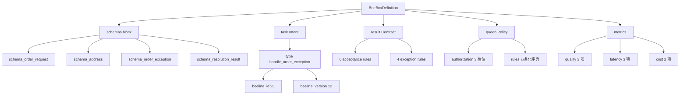
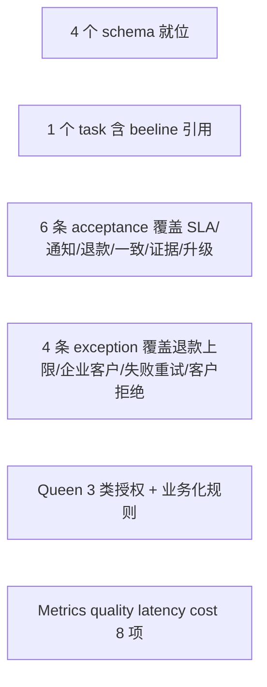

# 订单异常履约盒（order_exception_box）

> 第一只业务履约盒子——按政策在 SLA 内给客户一个符合政策的可验证结果。

## 业务定位

订单履约过程中发生的异常（库存不足 / 支付失败 / 物流延迟 / 客户投诉 /
部分缺货），由本盒子统一处理。

业务语义是真的：
- **Contract**：6 条 acceptance（按 SLA / 通知 / 退款准确 / 订单状态一致 /
  证据完整 / 必要时升级人工）
- **Policy**：3 类 queen rules（task_routing / exception_handling /
  continuous_improvement）
- **Result**：resolution_result 业务结果

基础设施是假的（runtime / executor / worker 待下一阶段实现）。

## 数据形状



## 文件

- `__init__.py` — 入口（导出 `get_definition` 与 `ORDER_EXCEPTION_BOX`）
- `schemas.py` — 4 个业务 schema 定义（order_request / address /
  order_exception / resolution_result）
- `definition.py` — 完整 BeeBoxDefinition 实例 + get_definition 函数

## 加载方式

```python
from boxes.inventory_shortage import get_definition

d = get_definition()
print(d.id, d.version)            # order_exception_box 3
print(d.get_schema("schema_order_exception"))
print(d.get_task("handle_order_exception"))
```

## 验收清单



完整定义参考 `docs/examples/order-exception-box.md`。