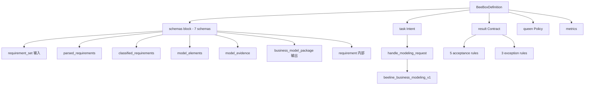

# 业务建模履约盒（business_modeling_box）

> Software Line 第一只盒子——按结构化业务需求产出可机械验证的业务模型包。

## 业务定位

承接**企业业务软件建设的"建模"业务责任**——从结构化业务需求产出可被业务方验收的业务模型包（含模型元素 + 5 项机械验证证据）。

## 关键设计：5 项机械 acceptance（无主观项）

业务建模盒的核心挑战是"建模质量难量化"。本盒通过把输入**结构化**（每条需求带 id / type / priority）和要求输出带**显式 traceability**（每个 model 元素记录 trace_to requirement_id），让验收规则全部可机器验证：

| 验收项 | metric | op | value | 可验方式 |
|---|---|---|---|---|
| 1 | requirement_coverage | gte | 100 | 所有 requirement_id 在 model 元素的 trace_to 中出现 |
| 2 | rule_consistency | eq | true | 规则无矛盾（解析 + 静态分析）|
| 3 | reference_integrity | eq | true | 引用全部解析成功 |
| 4 | structural_compliance | eq | true | 结构符合建模标准 |
| 5 | metrics_defined | eq | true | 每个 metric 有 target 值 |

**没有"模型好不好"这种主观项**——所有验收都是可观察可机器验证的事实。

## 数据形状



## beeline 7 ops 顺序链

```
parse_requirements → classify_requirements → generate_model_elements →
verify_coverage → check_consistency → generate_evidence → package_model (terminal)
```

全部 ops 用 `idempotency.mode=required, key=set_id`，重复建模产出同模型。

## 与 box #1（订单异常）的关键差异

| 维度 | box #1 订单异常（运营线）| box #2 业务建模（软件线）|
|---|---|---|
| 产品线 | Business Operations Fulfillment | Business Software Fulfillment |
| 输入 | 异常事件（半结构化）| 业务需求集（全结构化）|
| 履约程序 | 4 个 try_* 优先级链 + 分支 | 7 ops 顺序链 |
| Acceptance | 5 条（含 SLA / 通知 / 退款）| 5 条（全机械：无主观项）|
| 异常类型 | 业务异常（库存/支付/物流）| 模型异常（矛盾/缺引用/超量）|

## 加载

```python
from boxes.modeling import get_definition
from beelines.modeling import get_beeline
from runtime import create_task_run, BeelineExecutor, evaluate_acceptance

box = get_definition()
beeline = get_beeline()

input_data = {
    "set_id": "req_set_001",
    "business_goal": "建模订单退款流程",
    "requirements": [
        {"requirement_id": "req_obj_1", "description": "订单实体", "requirement_type": "object", "priority": "must_have"},
        # ...
    ],
}

task_run = create_task_run(...)
task_run = BeelineExecutor().execute(task_run, beeline, input_data)
eval_result = evaluate_acceptance(task_run, box.result)
# → ACCEPTED (5/5 pass) / REJECTED / COMPENSATING_ACCEPTANCE
```

## Software Line 完整链路

```
业务建模盒 (建模)
  ↓ Validated Business Model Package
业务系统开发盒 (开发)
  ↓ Software Release
软件验收盒 (验收)
  ↓ Accepted Release
软件部署盒 (部署)
  ↓ Running Instance
软件运营盒 (运营)
  ↓ SLA 履约报告
  └─→ 反馈给业务建模（持续改进）
```

每段是独立 Business Fulfillment，盒子之间通过**已验收的业务结果**连接。