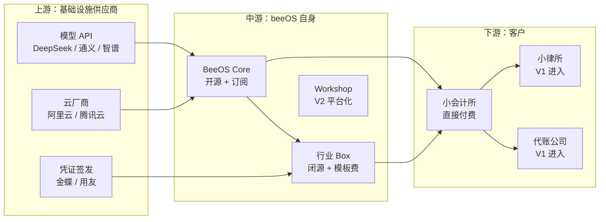
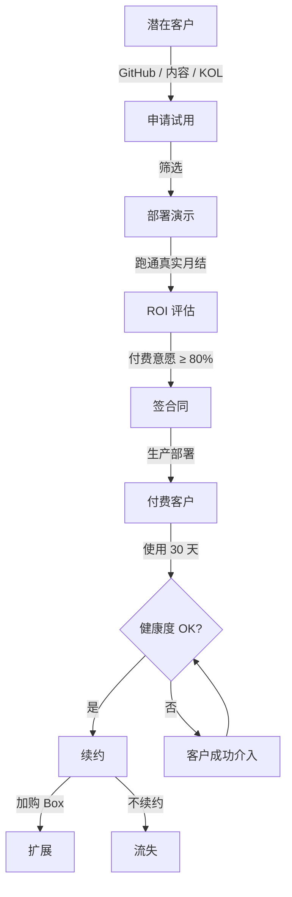
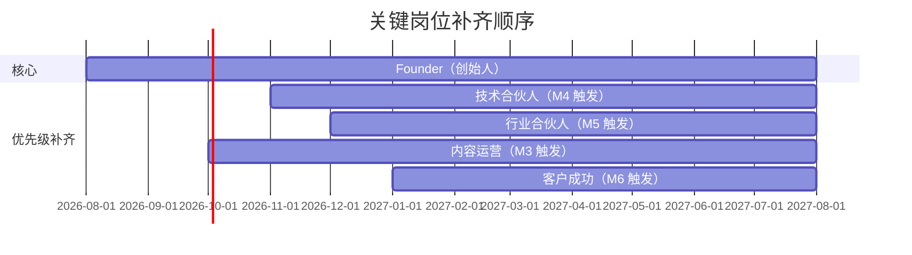

# beeOS 业务架构

> **版本**：v0.1
> **日期**：2026-08-07
> **状态**：MVP 设计稿 · 与商业模型 v0.1 对齐
> **关联文档**：[产品架构](product-architecture.md) ｜ [技术架构](tech-architecture.md) ｜ [商业模型 v0.1](../business-model.md) ｜ [术语表](glossary.md)

---

## 1. 北极星指标与年度目标

### 1.1 北极星指标

> **周活付费 Box 数**（Weekly Active Paid Boxes, WAPB）

**为什么不是"月活客户数"**？

- 月活客户数 = 滞后指标（客户流失时才知道）
- 周活 Box = **早期可观测**——如果客户本周有 1 个 Box 在跑，意味着他们真的在用
- 每多 1 个活跃付费 Box = **真实留存 + 真实用量**双信号

### 1.2 2 个支撑指标

| 指标 | 定义 | 目标 (Y1) |
|---|---|---|
| **ARR** | 年度经常性收入 | ¥50 万 |
| **净流失率** | (流失 - 找回) / 期初客户数 | < 10% / 月 |

### 1.3 Y1 目标拆解（引用商业模型）

详见 [商业模型 §10](../business-model.md#10-mvp-路线图3-阶段)：

- M1-M3：3 家种子客户（免费）
- M4-M6：5-10 家付费客户 / ¥25-50 万 ARR
- M7-M12：30 家付费客户 / ¥150 万 ARR

---

## 2. 价值链与利益相关方地图

### 2.1 价值链三段



### 2.2 利益相关方地图

| 角色 | 关系 | 关键诉求 | 我方策略 |
|---|---|---|---|
| **模型厂商** | 供应商 | API 调用量增长 | 至少 2 家 AB；申请 API 折扣 |
| **云厂商** | 渠道 + 供应商 | Marketplace 流量 | 上架镜像，争取推荐位 |
| **金蝶 / 用友** | 集成方 | 客户数据沉淀 | 互推 + 数据接口合作 |
| **会计师协会** | 渠道 | 协会会员服务 | 培训合作 + 推荐分成 |
| **算法社区** | 影响力 | 案例分享 | Open BeeOS Core GitHub |
| **种子客户** | 共创方 | 行业 Know-how | 折扣换联合署名 |
| **会计所合伙人** | 付费方 | ROI | 5×8 trial + ROI 报告 |
| **会计操作员** | 使用方 | 简单易用 | 极简 UI + 文档 |
| **IT 治理员** | 决策方 | 安全可控 | 完整审计 + 私有化 |

---

## 3. 客户细分与 ICP / Persona

### 3.1 一级 ICP：小会计师事务所

| 维度 | 标准 |
|---|---|
| 规模 | 50-500 人 |
| 业务 | 月结 / 报税 / 审计三大业务至少 2 项 |
| 现有 IT | 金蝶 / 用友 / 钉钉 / 飞书其中之一 |
| 年营收 | ¥3000 万 - ¥5 亿 |
| 决策速度 | 1-3 个月（含试用） |
| 客单价 | ¥5 万 / 年（订阅） |

### 3.2 二级 ICP（V1+ 才进入）

- **代账公司**：多客户并行的，模板复用性更强
- **小律所**：合同审查 / 尽调，模板复用性类似
- **咨询公司**：行业 know-how 密集，但付费意愿较弱

### 3.3 Persona 表

| Persona | 画像 | 决策权 | 痛点 | 付费动机 | 反对意见 |
|---|---|---|---|---|---|
| **合伙人 张总** | 男，45+，本科，行业 15 年 | **预算、决策** | 团队人员流失、成本上涨 | "能不能让我少招 3 个人" | "ROI 真的算得过来吗？" |
| **PM 李经理** | 女，35+，本科，10 年 | **审批、流程** | 团队效率低、月结加班 | "能不能让团队不用每周加班" | "用不顺手会被团队骂" |
| **操作员 小王** | 25-30，本科，3 年 | **发起、结果** | 重复劳动 | "能不能让我有成就感" | "学新工具很麻烦" |
| **IT 周工** | 男，30+，本科，5 年 | **部署、权限** | 运维压力 | "能不能让我轻松点" | "出安全事故我担责" |

---

## 4. 业务全生命周期流程

### 4.1 阶段漏斗



### 4.2 各阶段详细定义

| 阶段 | 输入 | 触点 | 责任人 | 转化目标 | SLA |
|---|---|---|---|---|---|
| **1. 获客** | 渠道流量 | GitHub / 公众号 / KOL 推荐 | 创始人 | 100 条 / 月 | 持续 |
| **2. 申请试用** | 官网表单 / 微信 | 网页 + 邮件 | 创始人 | 30% → 试用 | 24h 内回应 |
| **3. 商务对接** | 申请信息 | 微信 / 邮件 | 创始人 | 50% → 部署 | 3 天内完成 |
| **4. 部署演示** | 客户服务器 | 远程 / 上门 | 创始人 + IT 顾问 | 80% → 跑通 | 1 人天 |
| **5. 跑通真实月结** | 客户真实数据 | 远程指导 | 创始人 | 70% → 评估 | 7 天 |
| **6. ROI 评估** | 跑通结果 | ROI 报告 | 创始人 | 60% → 付费 | 7 天 |
| **7. 签合同** | ROI 通过 | 商务 | 创始人 + 法务 | 80% → 付费 | 14 天 |
| **8. 生产部署** | 付费确认 | 1 人天 | 创始人 | 100% → 上线 | 1 人天 |
| **9. 使用与支持** | 上线 | 邮件 + 工单 | 客户成功 | WAPB 周活 | 5×8 响应 |
| **10. 续约** | 到期前 30 天 | 商务 | 创始人 | 80% → 续约 | 14 天 |

### 4.3 关键漏斗指标

**Year 1 转化漏斗**（自顶向下）：

```
申请试用 (100)           ─────┐
  └─ 部署演示 (50)        ──50%─┤
  └─ 跑通真实 (40)        ──80%─┤
  └─ ROI 评估 (34)        ──85%─┤
  └─ 签合同 (27)          ──80%─┤
  └─ 生产部署 (27)        ──100%─→ 27 个付费客户
                                            ─────→ Year 1 ARR = 27 × ¥5 万 = ¥135 万 ✓
```

> **关键转化率监控**：漏斗中任何一档 < 60% 必须停下来复盘。

### 4.4 客户健康度模型

**3 个信号合成**：

| 信号 | 阈值 | 权重 |
|---|---|---|
| 周活 Box 数 | > 1 = 健康 | 40% |
| 月结任务完成率 | > 90% = 健康 | 30% |
| 支持工单频率 | < 5/月 = 健康 | 20% |
| 续约前问卷评分 | > 8/10 = 健康 | 10% |

**健康度 = 加权得分**（0-100）。低于 60 触发客户成功介入。

---

## 5. 收入机制与定价模型

### 5.1 三层定价（商业模型 §5 之外补充）

| 层级 | 定价 | 计费方式 | 客户感受 |
|---|---|---|---|
| **L1 - BeeOS 平台订阅** | ¥3-8 万 / 年 / 实例 | 年付 | "买操作系统" |
| **L2 - 行业 Box 模板** | ¥1-3 万 / 盒 / 年 或 ¥2-5 万一次性 | 月付 / 年付 / 一次性 | "买应用" |
| **L3 - 增值服务** | ¥1-5 万 / 年 | 年付 | "买服务" |
| **L4 - 培训认证** | ¥2-5 千元 / 人 | 一次性 | "买培训" |

**默认套餐 = L1 + L2 月结 Box** = ¥5 万 / 年（典型）

### 5.2 价格锚点对照

| 替代方案 | 客户当前成本 | beeOS 价格 | 客户感知 |
|---|---|---|---|
| 自建 LLM Agent | ¥50 万 + 1 个工程师 | ¥5 万 / 年 | **省 90%** |
| UiPath 企业版 | ¥30 万 / 年 | ¥5 万 / 年 | **省 80%** |
| 多招 1 个会计 | ¥15 万 / 年 | ¥5 万 / 年 | **省 67%** ⭐ |
| 金蝶云星空 + 报表 | ¥10 万 / 年 | 增量 | **附加价值** |

**核心话术**："一个资深员工 15 万 / 年，beeOS 5 万 / 年 + 1 个人就能干 3 个人的活。"

### 5.3 动态定价规则

| 客户规模 | 推荐 L1 定价 | L2 模板折扣 | 服务包 |
|---|---|---|---|
| 50-100 人 | ¥3 万 / 年 | 9 折 | 银 |
| 100-300 人 | ¥5 万 / 年 | 标准 | 金 |
| 300-500 人 | ¥8 万 / 年 | 9 折 | 金 |
| 500+ 人 | 谈判 | 谈判 | 铂金 |

**不打折的雷区**：

- ❌ 创始人不批准，**不打折超过 20%**
- ❌ 不接受"免费换署名"（除非首批 3 家种子客户）
- ❌ 不接受"基础版免费"（避免出现劣币驱逐良币）

### 5.4 续约与扩展

| 续约触发条件 | 续约动作 |
|---|---|
| 到期前 60 天 | 客户成功主动触达 |
| 到期前 30 天 | 商务对接续约 |
| 到期前 7 天 | 高优先级跟进 |
| 到期后 | 暂时停服 + 30 天宽限期 |

**扩展触发**：

- 周活 Box 数 > 3 → 推荐加购 Box
- Token 预算 > 80% → 推荐加 Bee 实例
- 客户主动询问 → 商务跟进

---

## 6. 渠道与合作伙伴

### 6.1 渠道矩阵

| 渠道 | 类型 | 优先级 | 成本 | 预期贡献（Y1） |
|---|---|---|---|---|
| **GitHub + 内容（公众号/知乎）** | 直接 | P0 | 极低 | 30% |
| **行业 KOL 推荐** | 直接 | P0 | 顾问费 | 25% |
| **云厂商 Marketplace** | 间接 | P1 | 0-15% 分成 | 15% |
| **金蝶 / 用友嵌入推荐** | 间接 | P2 | 0-10% 分成 | 15% |
| **会计师事务所协会** | 间接 | P2 | 0-20% 分成 | 10% |
| **付费投放（暂缓）** | 直接 | P3 | 高 | 5% |

### 6.2 合作伙伴矩阵

| 伙伴 | 合作模式 | 启动时间 | 关键人 |
|---|---|---|---|
| **DeepSeek** | API 折扣 + 联合发布 | M1 | 商务对接 |
| **通义千问** | API 折扣 + 联合发布 | M1 | 商务对接 |
| **阿里云 ACR** | 镜像托管 + Marketplace | M2 | 商务对接 |
| **腾讯云 ACR** | 镜像托管 + Marketplace | M2 | 商务对接 |
| **本地会计师协会** | 培训合作 + 推荐 | M3 | 会长 |
| **金蝶云** | 数据接口 + 联合推广 | M3 | 渠道经理 |
| **用友网络** | 数据接口 + 联合推广 | M3 | 渠道经理 |

### 6.3 激励与分成

| 渠道 | 渠道分成 | 备注 |
|---|---|---|
| GitHub / 内容 | 0% | 创始人自营 |
| KOL 推荐 | 5-10% | 顾问费形式 |
| 云厂商 Marketplace | 10-15% | 一次性抽成 |
| 金蝶 / 用友 | 5-10% | 持续抽成 |
| 协会推荐 | 5-15% | 一次性抽成 |

**对账规则**：每月 1 日对账，15 日前打款。

---

## 7. 成本结构与单位经济

### 7.1 单客户成本拆解（Year 1）

| 成本项 | 月成本 | 年成本 | 占比 |
|---|---|---|---|
| 模型 API（客户用量） | ¥8 / 客户 | ¥100 | 0.2% |
| 部署支持（摊销） | ¥300 | ¥3,600 | 7.2% |
| 内容获客（摊销） | ¥200 | ¥2,400 | 4.8% |
| 顾问费（摊销） | ¥400 | ¥4,800 | 9.6% |
| 客户成功（摊销） | ¥500 | ¥6,000 | 12.0% |
| 平台维护（摊销） | ¥2,000 | ¥24,000 | 48.0% |
| **单客户总成本** | **¥3,408** | **¥40,900** | **100%** |
| **单客户营收** | ¥4,167 | ¥50,000 | |
| **单客户毛利** | ¥759 | ¥9,100 | **18.2%** |

**关键问题：毛利 18% 太低**。需要规模上去后再摊薄。

### 7.2 规模化路径

| 客户数 | 月营收 | 月成本 | 毛利率 |
|---|---|---|---|
| 5 | ¥20,800 | ¥30,000 | -44%（亏损） |
| 10 | ¥41,700 | ¥40,000 | 4% |
| 30 | ¥125,000 | ¥80,000 | 36% |
| 100 | ¥416,700 | ¥200,000 | 52% |

**盈亏平衡点**：约 **10 个付费客户**（M5-M6 达成）

### 7.3 LTV / CAC 估算

| 指标 | 估算 |
|---|---|
| **CAC**（获客成本） | ¥3,000-5,000 / 客户 |
| **LTV**（客户终身价值） | ¥5 万 / 年 × 3 年留存 = **¥15 万** |
| **LTV/CAC 比** | **30-50**（健康范围 3-5）** |

### 7.4 12 个月烧钱 vs 收入

| 月 | 累计成本 | 累计收入 | 累计现金 | 备注 |
|---|---|---|---|---|
| M1 | ¥3 万 | ¥0 | -¥3 万 | 启动 |
| M3 | ¥9 万 | ¥0 | -¥9 万 | 3 家种子 |
| M6 | ¥18 万 | ¥12 万 | -¥6 万 | 5-10 付费 |
| M9 | ¥27 万 | ¥50 万 | +¥23 万 | 30 付费 |
| M12 | ¥36 万 | ¥150 万 | +¥114 万 | 30 付费稳定 |

**Runway**：以 ¥30 万自有资金，**M9 现金流转正**。如果前期烧得快，**M8 必须见到付费客户**。

---

## 8. 组织、角色与治理机制

### 8.1 12 个月角色配置



### 8.2 关键岗位触发条件

| 岗位 | 触发条件 | 责任 |
|---|---|---|
| **技术合伙人** | 付费客户 > 3 家 | 平台后端 + 部署支持 |
| **行业合伙人** | 付费客户 > 5 家 | 行业 Box 模板 + 客户咨询 |
| **内容运营** | M3 起 | 公众号 / 知乎 / GitHub 内容 |
| **客户成功** | 付费客户 > 10 家 | 续约 + 健康度监控 |

### 8.3 治理机制

| 维度 | 规则 |
|---|---|
| **数据合规** | 客户数据不出客户服务器；厂商侧默认零遥测 |
| **SLA 条款** | MVP：5×8 邮件响应；V1：7×24 工单；V2：7×24 电话 |
| **退订规则** | 30 天无理由退款（仅订阅产品） |
| **定价变更** | 提前 90 天通知已付费客户 |
| **数据迁移** | 退订后 30 天内提供数据导出，过期销毁 |
| **License 失效** | 过期后 30 天宽限期，期间功能继续 |

### 8.4 决策权限

| 决策类型 | 创始人 | 合伙人 | 备注 |
|---|---|---|---|
| 价格调整 ≤ 20% | ✅ | ❌ | 创始人独断 |
| 价格调整 > 20% | ✅ + 合伙人 | ✅ | 联合决策 |
| 新增功能规划 | ✅ | 建议 | 创始人独断 |
| 战略调整 | ✅ + 合伙人 | ✅ | 联合决策 |
| 重大支出 (> ¥10 万) | ✅ + 合伙人 | ✅ | 联合决策 |

### 8.5 风险与熔断机制

| 风险 | 触发 | 熔断 |
|---|---|---|
| 现金流 < ¥5 万 | 立即 | 暂停非必要支出 + 启动融资 |
| 月流失 > 20% | 立即 | 暂停获客，复盘产品 |
| 重大安全事故 | 立即 | 启动应急 + 客户通知 |
| 模型 API 全面涨价 | 24h | 切本地小模型 + 重谈合约 |

---

## 决策项 / 待澄清

1. **首年是否融资**：自有 ¥30 万 不融资可行，但压力大；是否启动种子？→ **建议 M3 评估**
2. **行业合伙人来源**：会计所合伙人还是代账公司老板？→ **M3 之后明确**
3. **渠道分成的法律风险**：KOL 返佣是否构成商业贿赂？→ **建议咨询法律顾问**

---

## 变更日志

| 日期 | 决策 | 影响章节 |
|---|---|---|
| 2026-08-07 | 北极星 = 周活付费 Box 数 | §1.1 |
| 2026-08-07 | 一级 ICP：小会计所 50-500 人 | §3.1 |
| 2026-08-07 | 盈亏平衡点：10 个付费客户（M5-M6） | §7.2 |
| 2026-08-07 | LTV/CAC 比 = 30-50（健康） | §7.3 |
| 2026-08-07 | 技术合伙人 M4 触发、行业合伙人 M5 触发 | §8.1 |
