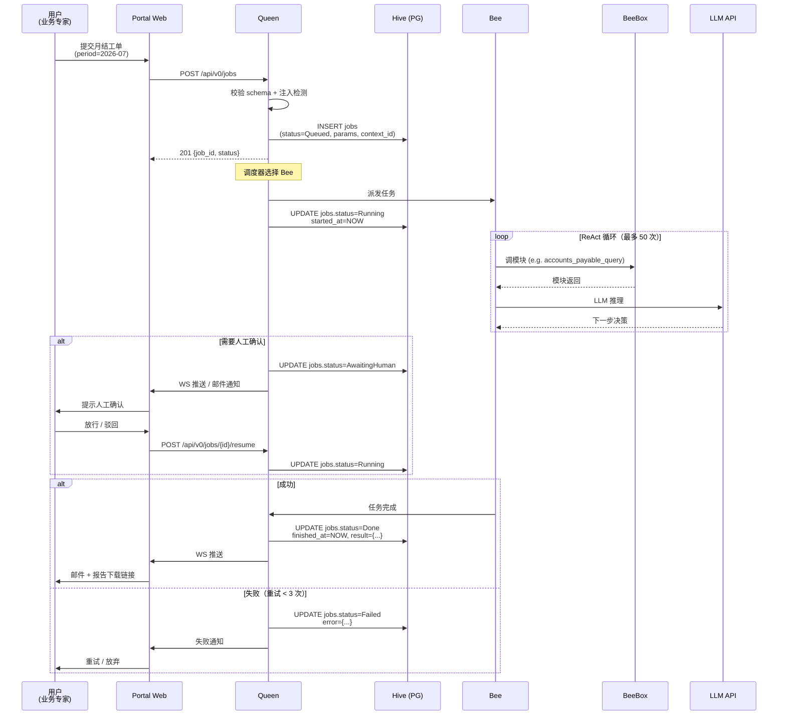
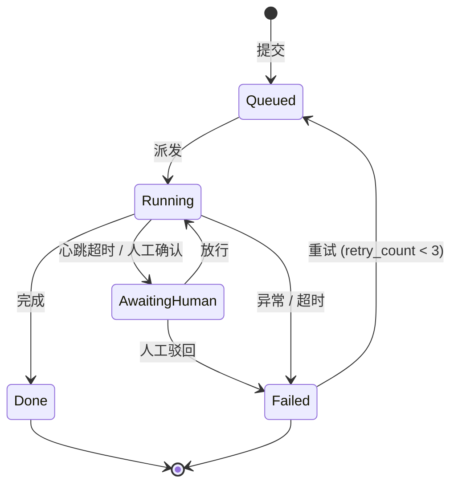

# beeOS Job 系统设计

> **版本**：v0.1
> **日期**：2026-08-10
> **状态**：MVP 设计稿
> **关联文档**：[技术架构 §4.1 Queen](tech-architecture.md) · [产品架构 §6 工单契约](product-architecture.md#6-关键数据契约产品接口层) · [术语表 §1.5 Job vs Task](glossary.md#15-命名规范job-vs-task)

---

## 0. Job 是 beeOS 的核心实体

**核心命题**：beeOS 整个系统的价值 = 帮用户成功完成 N 个 Job。

```
用户视角：  提交工单 → 等结果 → 收报表
                  ↓
内部实现：  Job → 状态机 → Bee 执行 → 产物
                  ↓
商业视角：  1 个 Job = 1 次付费单位
```

**Job 之外的一切**（Queen / Bee / Box / Hive / Pollen）都是为 Job 服务的实现细节。

---

## 1. Job 生命周期（sequence diagram）

### 1.1 完整路径



### 1.2 关键节点

| 节点 | 触发者 | 状态变化 | 持久化 |
|---|---|---|---|
| 提交工单 | 用户 | (无) → Draft | INSERT jobs |
| 校验通过 | Queen | Draft → Queued | UPDATE |
| 派发 | Queen | Queued → Running | UPDATE + started_at |
| 暂停 | Queen (timeout) | Running → AwaitingHuman | UPDATE |
| 失败 | Bee / Queen | * → Failed | UPDATE + error |
| 完成 | Bee | Running → Done | UPDATE + finished_at + result |
| 重试 | 用户 / 系统 | Failed → Queued | UPDATE |

---

## 2. Job 数据模型

### 2.1 现状（MVP 已有）

```python
# packages/beeos-core/src/beeos_core/models.py
class Job(Base):
    job_id: UUID          # primary key
    bee_type: str         # 派给哪种 Bee（month_close / tax_box / ...）
    status: str           # 5 状态机
    params: JSONB         # 工单入参
    context_id: UUID      # 关联 Pollen
    started_at: datetime
    finished_at: datetime
    result: JSONB
    error: JSONB
    created_at: datetime
```

### 2.2 MVP 扩展（v0.2 加）

```python
class Job(Base):
    # === 标识 ===
    job_id: UUID              # PK
    short_id: str             # 短码（前 8 位），用户可见
                                # 例如 "job-a3f9c2b1"，URL 友好

    # === 类型与归属 ===
    bee_type: str             # 月结 / 报税 / 审计
    tenant_id: UUID           # V1+ 多租户；MVP 留 NULL
    created_by: UUID          # 关联 User.user_id（"谁提交的"）

    # === 状态机 ===
    status: str               # Queued / Running / AwaitingHuman / Done / Failed
    status_reason: str        # AwaitingHuman 时填"等谁确认什么"
    priority: int             # 0=低 1=普通 2=紧急 3=关键
                                # MVP 仅 1/2 两种

    # === 入参 / 产物 ===
    params: JSONB             # {"period": "2026-07", "clients": [...], ...}
    result: JSONB             # 完成时填，引用产物存放路径
    error: JSONB              # 失败时填 {code, message, trace}

    # === 时间 ===
    created_at: datetime      # 提交时间
    scheduled_at: datetime    # 期望开始时间（V1+ 用）
    started_at: datetime       # 实际开始
    finished_at: datetime      # 实际结束
    deadline: datetime         # SLA 截止（用户可指定）

    # === 资源预算 ===
    max_tokens: int            # Token 上限，0=无限制
    max_seconds: int           # 运行时长上限，默认 1800
    tokens_used: int           # 实际消耗
    retry_count: int           # 已重试次数，< 3

    # === 上下文 ===
    context_id: UUID           # 关联 Pollen（执行上下文）
    parent_job_id: UUID        # 跨 Box 编排时上层 Job（V1+）

    # === 元数据 ===
    tags: JSONB                # 客户打的标签，便于筛选
    notes: str                 # 备注（用户填的）
```

### 2.3 字段优先级

| 字段 | MVP 必须 | 说明 |
|---|---|---|
| job_id / short_id / bee_type / status / params / result / error / created_at / started_at / finished_at / context_id / retry_count | ✅ | **当前已实现** |
| priority / urgency / deadline / max_tokens / max_seconds / tokens_used | ✅ 立即加 | 影响 SLA + 成本控制 |
| created_by / status_reason / tags / notes | ⏳ V0.3 | 用户系统完整后 |
| tenant_id / parent_job_id / scheduled_at | ⏳ V1+ | 多租户 + 编排 |

---

## 3. Job 状态机详图

### 3.1 5 状态 + 合法转换



### 3.2 状态机不变式

```python
# 任何状态下必须满足：
- status="Done" implies finished_at IS NOT NULL AND result IS NOT NULL
- status="Failed" implies finished_at IS NOT NULL AND error IS NOT NULL
- status="Running" implies started_at IS NOT NULL
- status="Queued" implies started_at IS NULL AND finished_at IS NULL
```

### 3.3 触发矩阵

| from | to | 触发 | 谁触发 |
|---|---|---|---|
| - | Queued | 用户提交 | 用户 |
| Queued | Running | Queen 调度 | Queen |
| Running | AwaitingHuman | 1. 超时 2. Bee 主动要求确认 3. 关键操作 | Queen / Bee |
| AwaitingHuman | Running | 人工放行 | 用户 |
| AwaitingHuman | Failed | 人工驳回 / 超时 | 用户 / Queen |
| Running | Done | Bee 报告完成 | Bee |
| Running | Failed | 异常 / 超过 max_seconds / 超过 max_tokens | Queen |
| Failed | Queued | 自动重试（retry_count < 3）| Queen |
| Failed | - | 放弃 / 超过 max_retries | 用户 |

---

## 4. Job API 契约

### 4.1 对外 3 个端点 + 3 个辅助

```yaml
# === 核心 3 端点（产品架构 §6.4 已定）===

POST /api/v0/queen/jobs
  入参: JobSubmitRequest
  出参: { job_id, status, created_at }

GET /api/v0/queen/jobs/{job_id}
  出参: { job_id, status, progress, current_step, result_url }

POST /api/v0/queen/jobs/{job_id}/cancel
  出参: { job_id, status: "Failed" }

# === 辅助 3 端点（M2+ 加）===

POST /api/v0/queen/jobs/{job_id}/resume   # AwaitingHuman → Running
POST /api/v0/queen/jobs/{job_id}/retry    # Failed → Queued
GET  /api/v0/queen/jobs                   # 列表（带筛选）
```

### 4.2 JobSubmitRequest Schema

```json
{
  "type": "object",
  "required": ["bee_type", "period"],
  "properties": {
    "bee_type": {
      "type": "string",
      "enum": ["month_close"],
      "description": "M1P 只支持 month_close"
    },
    "priority": {
      "type": "integer",
      "enum": [1, 2],
      "default": 1,
      "description": "1=普通 2=紧急"
    },
    "deadline": {
      "type": "string",
      "format": "date-time",
      "description": "ISO 8601，期望完成时间"
    },
    "period": {
      "type": "string",
      "pattern": "^\\d{4}-(0[1-9]|1[0-2])$"
    },
    "clients": {
      "type": "array",
      "items": { "type": "string" }
    },
    "max_tokens": {
      "type": "integer",
      "default": 200000,
      "description": "0=无限制"
    },
    "max_seconds": {
      "type": "integer",
      "default": 1800
    },
    "tags": {
      "type": "array",
      "items": { "type": "string" }
    },
    "notes": {
      "type": "string",
      "maxLength": 500
    }
  }
}
```

### 4.3 JobResponse Schema

```json
{
  "job_id": "uuid",
  "short_id": "job-a3f9c2b1",
  "status": "Running",
  "bee_type": "month_close",
  "priority": 1,
  "created_at": "2026-07-15T08:00:00Z",
  "started_at": "2026-07-15T08:00:05Z",
  "finished_at": null,
  "progress": 0.42,
  "current_step": "bank_reconcile",
  "tokens_used": 8432,
  "result_url": null,
  "error": null
}
```

---

## 5. Job 资源预算（防止烧钱）

### 5.1 双预算

| 预算 | 来源 | 触发熔断 | 默认 |
|---|---|---|---|
| **Token 预算** | max_tokens | tokens_used > max_tokens | 200K |
| **时间预算** | max_seconds | elapsed > max_seconds | 1800s |

### 5.2 熔断后行为

```
Token 超限 → status=Failed, error.code=TOKEN_BUDGET_EXCEEDED
时间超限 → status=AwaitingHuman, status_reason="超过 max_seconds，请确认是否继续"
         如果用户不响应 → 30 分钟后 → Failed
```

### 5.3 监控指标（埋点）

- 单 Job tokens_used（避免幻觉式空跑）
- 单 Job elapsed_seconds（识别异常拖慢）
- 历史 P50 / P95 tokens_used（优化 max_tokens 默认值）

---

## 6. Job 命名规范

### 6.1 ID 双轨

| 字段 | 用途 | 示例 |
|---|---|---|
| **job_id** (UUID) | 内部所有地方使用 | `7c9e6679-7425-40de-944b-e07fc1f90ae7` |
| **short_id** (前 8 位) | 用户可见（URL/UI） | `job-a3f9c2b1` |

`short_id` 生成：`job-` + UUID 前 8 位，去掉 `-`。可读、可截断复制。

### 6.2 状态枚举值

```python
JOB_STATUS = {
    "Queued":         "已入队，等待派发",
    "Running":        "Bee 正在执行",
    "AwaitingHuman":  "需要人工确认",
    "Done":           "成功完成",
    "Failed":         "失败，已记录 error",
}
```

**禁止**：用 PAUSED / CANCELLED / RETRYING 等衍生状态，**全部归并到 5 状态**。

---

## 7. Job × 其他子系统的关系

| 子系统 | 与 Job 的关系 |
|---|---|
| **Pollen** | 1 Job : 1 Pollen（一对一）— Job 的执行上下文 |
| **AuditLog** | 1 Job : N Audit — Job 的每一步操作打点 |
| **Bee** | 1 个 Bee 实例同一时间跑 1 个 Job（V1+ 可并行） |
| **BeeBox** | Job 跑在某个 Box 实例内（Box 共享，Job 隔离） |
| **Credential** | Job 间接引用（通过 Box 模块） |
| **User** | Job.created_by → 谁发起的 |

---

## 8. 评审清单（写代码前必过）

- [ ] Job 模型字段是否完整（V0.2 扩展）
- [ ] 状态机合法转换是否覆盖
- [ ] API 入参 / 出参 schema 是否 JSON Schema 验证
- [ ] 资源预算是否在 Queen 派发前校验
- [ ] 状态变化是否都写 audit_log（hive.audit_log）
- [ ] 5 状态机的 4 个不变量是否在数据库约束 / 模型层 guard 住
- [ ] 失败原因是否结构化（error.code + error.message + error.trace）

---

## 9. 变更日志

| 日期 | 变更 | 备注 |
|---|---|---|
| 2026-08-10 | 初版 v0.1 | Job 系统设计稿 |
