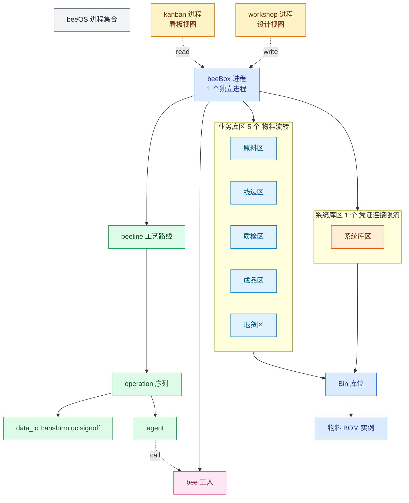
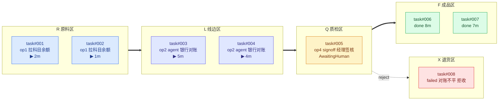
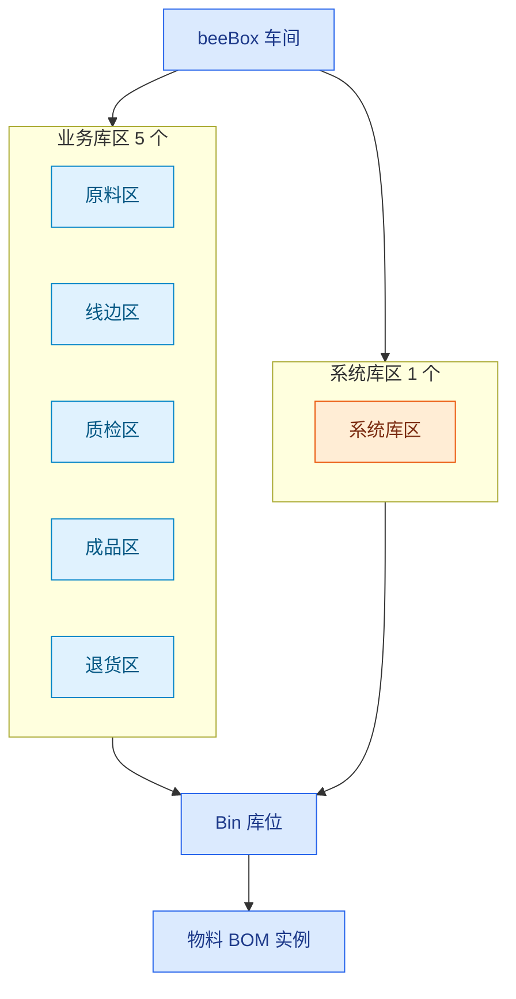
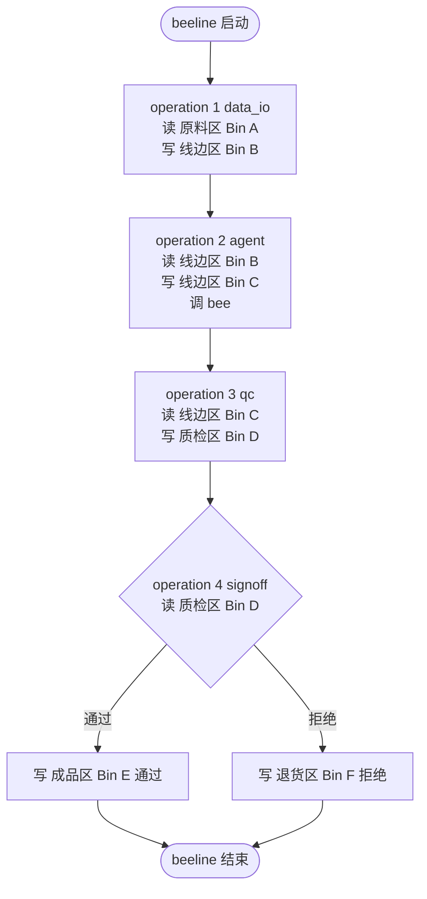
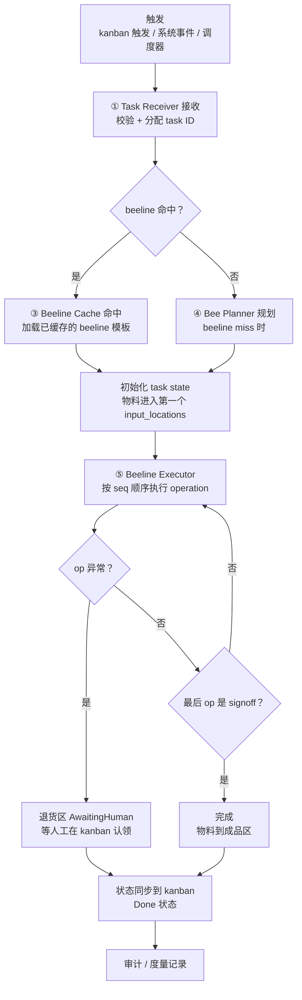
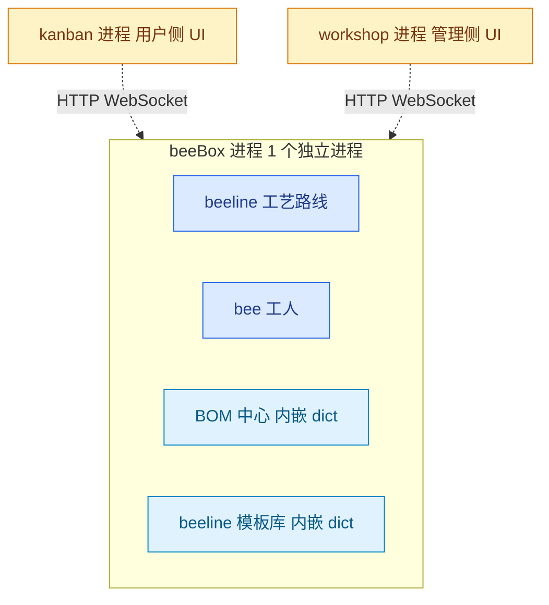

# beeOS 内核设计 v0.1

> **状态**：v0.1 草稿 · 修订中
> **日期**：2026-09-06
> **定位**：beeOS = 数字精益工作 OS

## 0. 一句话

beeOS 三大模块 **beeBox（容器）/ beeline（流水线）/ bee（工人）**，两个控制台 **kanban（用户）/ workshop（管理）**。
**beeline 在 beeBox 内跑**，由 **operation（工序）** 序列组成（operation 是 beeline 内部组件），**agent operation 调 bee**；
beeBox 内部库区分为 **2 类**：**业务库区**（5 个：原料/线边/质检/成品/退货，物料流转）+ **系统库区**（1 个：凭证/连接/限流，bee 按需调取）。
每个 operation 驱动物料在 **5 业务库区**间流转。

## 1. 关系总览

## 2. 精益概念 ↔ beeOS 映射

| 精益概念 | beeOS 落地 |
|---|---|
| 价值流（Value Stream） | beeline |
| 标准化作业 | beeline 模板（operation 序列）|
| 自働化（Jidoka） | bee 智能体 + 异常回流 |
| 看板（Kanban） | kanban 控制台 + Bin 在制视图 |
| 拉动（Pull） | Task Receiver 接收触发 |
| 单件流（One-piece Flow）| operation 一次执行一份物料 |
| 改善（Kaizen） | 度量（§4 待澄清 H）+ 审计 |
| 标准化作业 | operation 序列本身就是标准作业（输入/输出/类型已声明清楚）|

## 3. 核心要素

### 三大模块

| 模块 | 类比 | 定位 | 关系 |
|---|---|---|---|
| **beeBox** | 车间 | 容器 | beeline 在它内部执行；bee 被它调度 |
| **beeline** | 流水线 / 工艺路线 | beeBox 内的工作流 | 由 operation 序列组成；agent operation 调 bee |
| **bee** | 工人 | 智能体执行者 | 被 agent operation 调用 |

### beeline 内部组件

| 组件 | 类比 | 定位 | 关系 |
|---|---|---|---|
| **operation** | 工序 | beeline 的一步 | 驱动物料在 Bin 间流转 |

## 4. 两个控制台

### 4.1 beeOS **kanban**（用户侧 / 现场视角）

- **面向**：终端用户 / 操作员 / 业务人员
- **核心问题**：现在 task 在 beeBox 里怎么跑？跑到哪了？哪里堵？哪里出问题？
- **输入**（看什么）：
  - task 列表：每个 task 的状态（Queued / Running / Done / Failed / AwaitingHuman）
  - task 当前 operation：跑到第几步
  - task 当前位置：在 5 业务库区/Bin 的哪个（task 内物料的位置）
  - 异常 task：哪些 task 异常、待人工处理
  - 耗时：每个 task / operation 的实际执行时间
- **操作**（能做什么）：
  - 触发新 task
  - 认领异常 task（退货区）
  - 签核 task（质检区 / 成品区）
- **视觉**：Kanban 看板 —— task 在 beeBox 5 业务库区间流转的可视化视图
- **精益对位**：Kanban（看板管理）—— 可视化、拉动、暴露问题

**看板视图示意（Trello 风格：5 列横排 = 5 业务库区，每列下 task 卡片堆叠）**：

### 4.2 beeOS **workshop**（管理侧 / 设计视角）

- **面向**：管理员 / 业务分析师 / 工艺工程师
- **核心问题**：这个 beeBox 需要什么 beeline / operation / 物料 / bee？
- **输入**（基于什么改）：
  - 现有 beeOS 资产：已注册的 beeBox / beeline 模板 / bee / BOM（**beeline 模板库与 BOM 中心是两类独立资产**：beeline = 工艺路线 schema；BOM = 物料清单 schema）|
  - 业务需求：新增场景、调整工艺、注册新 bee
- **输出**（产出什么）：
  - 设计好的 beeBox（含 6 库区 / Bin / BOM）
  - 编辑好的 beeline（含 operation 序列）
  - 注册的 bee（智能体）
  - 更新的 BOM
- **视觉**：IDE / 表单 / 拖拽
- **精益对位**：Standard Work Design（标准作业设计）—— 标准化、模板化、复用

**workshop 主要模块**：

| 模块 | 作用 |
|---|---|
| beeBox 设计器 | 定义业务领域 / 6 库区 / Bin / BOM |
| beeline 编辑器 | 拖拽 / 编排 operation 序列（**beeline 模板**，独立于 BOM）|
| operation 库 | 各类 operation 模板（data_io / transform / agent / qc / signoff）|
| bee 注册表 | 管理 bee 智能体（能力 / 输入输出 / 适用 operation）|
| **beeline 模板库** | **跨 beeBox 共享 beeline 模板**（工艺路线 schema，独立于 BOM 中心）|
| BOM 中心 | 跨 beeBox 共享 BOM（物料清单 schema）|

### 4.3 读写关系

| 控制台 | 输入（看 / 基于什么） | 操作（做 / 产出什么） |
|---|---|---|
| **kanban** | task 实时状态（task / 当前 operation / 所在库区 / 异常 / 耗时） | 触发 task / 认领异常 / 签核 |
| **workshop** | 现有 beeOS 资产（beeBox / beeline 模板 / bee / BOM） | 设计 / 编辑 / 注册 / 上传 |

> **workshop 写 → beeOS 资产；beeOS 状态 → kanban 读。设计在 workshop，运行在 kanban。**

> **库位（Bin）是统一管理粒度**——所有库区（业务 5 + 系统 1）下面都有 Bin，所有物料（数据 / 工具 / 凭证 / 文档等）都按 Bin 存放。

## 5. beeBox 内部结构

### beeBox 还"装"什么（已定结论）

| # | 候选 | 状态 | 结论 |
|---|---|---|---|
| A | 适配器（Adapter） | ✅ **已定** | 适配器 = 物料的一种（工具类），beeBox 通过 Bin 装适配器 |
| B | 资源 / 凭证 | ✅ **已定** | 凭证 = 物料 = 凭证类 BOM 的实例。schema 在 BOM 中心，instance 在系统库区 Bin，bee 加工时按需调取（`operation.credential_ref`）|
| C | 业务规则（Rule） | ✅ **已定** | 规则在 beeline / operation 里（operation.qc_rules / 约束），beeBox 不单独管 |
| D | **bee 工人池** | ✅ **已定** | bee 跟随 beeline，按需加载（operation.bee_ref 拉取）|
| E | 异常回流 | ✅ **已定** | 初始阶段：退货区物料 = AwaitingHuman 状态，等人工在 kanban 上认领处理 |
| F | Bin 流转规则 | ✅ **已定** | 物料只能按 operation 规定的路径流转（input_locations → output_locations）|
| G | 看板 / 状态 | ✅ **已定** | 看板 = beeBox 物理层（6 库区/Bin/物料状态）+ kanban 控制台层 |
| H | 度量（Metrics） | ✅ **已定** | metrics 从 Bin 物料数 + operation.elapsed 派生，不需要单独服务 |

## 6. beeline 与 operation

### 6.1 operation 类型

| type | 是否需要 bee | 例子 |
|---|---|---|
| data_io | ❌ | 拉科目余额、生成 PDF、存结果 |
| transform | ❌ | 字段映射、聚合、格式转换 |
| agent | ✅ **bee 智能体** | 银行对账推理、合同条款提取 |
| qc | ❌ | 平衡校验、完整性校验 |
| signoff | 🟡 人工/混合 | 经理签核 |

> 关键：**不是每个 operation 都需要 bee**。只有需要"判断/推理/对话"的 operation 才放 bee。

### 6.2 operation 必含属性

| 属性 | 必含 | 含义 |
|---|---|---|
| seq | ✅ | operation 序号 |
| type | ✅ | 加工类型 |
| input_locations | ✅ | 读哪些 Bin 可多 |
| output_locations | ✅ | 落到哪些 Bin 可多 |
| bee_ref | 🟡 agent 才有 | 被调的 bee（如 `beex.finance.bank_reconciler`）—— 按需从 bee 注册表加载 |
| credential_ref | 🟡 agent 才有 | 指向系统库区 Bin（凭证 / 连接 / 限流类物料），bee 从 Bin 拿凭证 |
| qc_rules | 🟡 qc 才有 | 校验规则 |
| exception_handler | 🟡 | 异常处理（退货区 / 重试 / 人工）|

### 6.3 数据流（operation 驱动物料在 5 业务库区间流转）

## 7. 内核组件 & task E2E 流程

### 7.1 内核组件（运行时视角）

| 编号 | 名称 | 职责 | 在哪运行 |
|---|---|---|---|
| ① | Task Receiver | 接收任务 | beeBox 入口 |
| ② | beeBox Router | 路由到目标 beeBox | Kernel 顶层 |
| ③ | Beeline Cache | 缓存 beeline 模板（独立于 BOM 中心）| beeBox 内部 |
| ④ | Bee Planner | beeline miss 时规划 | beeBox 内部 |
| ⑤ | Beeline Executor | 在 beeBox 内部执行 beeline operation | beeBox 内部 |

### 7.2 task E2E 流程（一个 task 从进入到完成）

**触发 → 接收 → 定位 → operation 循环 → 完成**：

**流程阶段说明**：

| 阶段 | 涉及组件 | 关键动作 |
|---|---|---|
| 1. 触发 | （外部）| kanban 上点"新建 task" / 系统事件触发 / 调度器分发（企业版）|
| 2. 接收 | ① Task Receiver | 校验输入 / 权限，分配 task ID，写入 task state |
| 3. 定位 beeline | ③ Beeline Cache / ④ Bee Planner | 命中 → 加载；miss → Bee Planner 规划（推荐 beeline）|
| 4. 初始化 | （Beeline Executor 内部）| 物料从原料区拉到 beeline 第一个 op 的 input_locations |
| 5. operation 循环 | ⑤ Beeline Executor | 按 seq 顺序执行 op；每 op 完成 = 物料流转到 output_locations |
| 6. 异常处理 | （异常回流逻辑）| 任意 op 异常 → 物料到退货区 AwaitingHuman，等人工认领 |
| 7. 签核 / 完成 | ⑤ Beeline Executor | signoff op 通过 → 物料到成品区；qc / data_io / transform / agent → 直接下一 op |
| 8. 状态同步 | ③ Beeline Cache 旁路 / kanban 进程 | 实时推 task 状态变化到 kanban 控制台 |
| 9. 审计 | （Beeline Executor 旁路）| 写 task 审计日志 / 度量数据 |

**关键约束**：
- **operation 严格按 seq 顺序执行**——不允许并行（v0.1），避免物料竞争（参考 §6.2 operation 必含属性）
- **物料在 op 之间流转**——每个 op 必须显式声明 input_locations / output_locations（参考 §6.2）
- **agent op 调 bee**——bee 从系统库区拿凭证（参考 §5.1 / §6.2 credential_ref）
- **异常就回退货区**——不重试，不跳过（v0.1 简化），等人工处理
- **状态实时同步 kanban**——task 状态变化立刻推，不批处理

## 8. 部署形态（修订中）

> **状态**：v0.1 草稿 · 修订中（需要你审 §8.4 单机版推荐 + §8.8 待澄清）

### 8.1 两个维度——别混淆

部署问题分两个**独立**维度：

| 维度 | 问什么 | 答什么 |
|---|---|---|
| **进程层** | beeOS 几个进程，每个进程装哪些模块 | 进程边界 / 跨进程通信 |
| **资产层** | BOM 中心 / beeline 模板库 这两类**数据资产**存哪 | 存储形态 / 访问 API |

**关键澄清**：BOM 中心 / beeline 模板库 是 beeOS 进程**内的数据资产模块**，不是独立部署单元。资产层问的是"这些数据放哪个进程/机器上、谁访问"，不是"BOM 中心是不是个独立服务"。

### 8.2 进程层方案对比

| 方案 | 进程结构 | 适用阶段 | 复杂度 |
|---|---|---|---|
| **A 单机版** | 1 个 beeBox 进程（车间 + beeline + bee + 内嵌资产）+ 1 个 kanban 进程 + 1 个 workshop 进程 | 单机版 | ★★ |
| **B 团队版** | N 个 beeBox 进程 + 1 个资产服务进程 + 1 个 kanban 进程 + 1 个 workshop 进程 | 团队版 | ★★★ |
| **C 企业版** | 1 个调度进程 + N 个 beeBox 进程 + 1 个资产服务进程 + 1 个 kanban 进程 + 1 个 workshop 进程 | 企业版 | ★★★★ |

> **关键约束**：
> - **每个 beeBox 是 1 个独立进程**——beeOS 是进程集合，不是单进程
> - **控制台永远 1 个独立进程**（kanban / workshop 各 1 个）——多用户并发靠单进程内的 asyncio / 多线程扛，要更大规模是"加机器"不是"加进程"

**进程通信**：
- 同一进程内模块：直接函数调用（O(1)）
- 控制台 ↔ beeBox 进程：HTTP / WebSocket（控制台是给人用的 UI，跟 runtime 走不同协议）
- beeBox 进程 ↔ 资产服务进程：HTTP（跨进程）
- beeBox 进程 ↔ 调度进程：RPC / 消息队列

### 8.3 资产层方案对比

| 形态 | 存储位置 | 进程边界 | 访问延迟 | 适用 |
|---|---|---|---|---|
| **内嵌** | beeOS 进程内（Python dict + JSON 文件持久化）| 在 beeOS 进程 | O(1) | 单机版 |
| **本地** | 进程能访问的本地文件 / SQLite | 同机独立进程或同进程 | 1-10ms | 团队版 |
| **远端** | 独立 HTTP API 服务 | 跨进程 / 跨机器 | 10-100ms | 企业版 |

**关键约束**：
- "内嵌"和"远端"**不能同时存在**同一份数据——选一种就不能混
- "本地"和"远端"可以并存（比如 BOM 内嵌、beeline 模板库 远端）

### 8.4 单机版选型（推荐 + 理由）

**进程层 = A 单机版（3 进程：1 个 beeBox + kanban + workshop）**

**核心约束（已修订）**：
- **每个 beeBox 是 1 个独立进程**——单机版也按这个走（虽然单机版只有 1 个 beeBox 进程）
- **控制台独立 1 个进程**——kanban / workshop 不与 beeBox runtime 合并
- **单机版 = 3 进程**（1 个 beeBox + 1 个 kanban + 1 个 workshop）

理由：
1. **每个 beeBox 是 1 个进程**——扩展到 N 个 beeBox 时不用改架构
2. **控制台 = UI，跟 runtime 性质不同**——UI 要支持多用户访问、独立升级、独立伸缩
3. **runtime = 机器跑，跟控制台解耦**——runtime 故障不应影响 UI，反之亦然
4. **进程间通信 = HTTP / WebSocket**——控制台走 REST API 拉 task 状态，runtime 推 bee 事件给控制台
5. **跟"beeOS = 数字精益工作 OS"对齐**——控制台类比"桌面 UI"，beeBox 类比"应用"

**资产层 = 内嵌在 beeBox 进程**

理由：
1. **单机版单 beeBox**——不存在"跨 beeBox 共享 BOM"的需求
2. **资产跟着 beeBox 进程走**——资产是 beeBox 进程内的数据模块，不独立部署
3. **最简实现**——Python dict + JSON 持久化，零外部依赖
4. **团队版触发"多 beeBox 共享"再切远端**——避免提前优化

### 8.5 单机版部署目标

- **单机** / **单 beeBox** / **单用户**
- **3 进程**：1 个 beeBox 进程 + 1 个 kanban 进程 + 1 个 workshop 进程
- 启动方式（待定）：3 个 CLI 入口，或 1 个 CLI 拉起 3 个子进程
- 持久化：BOM / beeline 模板库 落到本地 JSON 文件（在 beeBox 进程内），进程重启可恢复
- 控制台跟 beeBox 进程通过本地 HTTP / WebSocket 通信（`localhost:port`）

### 8.6 演进路径

| 阶段 | 触发条件 | 进程结构 | 资产层 | 关键变化 |
|---|---|---|---|---|
| **单机版** | 起点 | 1 个 beeBox + 1 个 kanban + 1 个 workshop | 内嵌（beeBox 进程内）| 3 进程 |
| **团队版** | 多个 beeBox 共享 BOM / beeline 模板 | N 个 beeBox + 1 个 kanban + 1 个 workshop + 1 个资产服务 | 远端 | 加资产服务进程，多 beeBox 共享 |
| **企业版** | 多业务领域并行 / 团队隔离 | 1 个调度 + N 个 beeBox + 1 个 kanban + 1 个 workshop + 1 个资产服务 | 远端 | 加调度进程，beeBox × N 按业务领域分组 |

**演进原则**：
- **每个 beeBox 永远 1 个独立进程**（不管是哪种规模）
- **控制台永远 1 个独立进程**（多用户靠单进程内并发扛）
- **按触发条件升级资产 / 调度**——不到那个规模不拆
- **进程层和资产层独立演进**——可以"单机版 3 进程 + 资产远端"（理论上）
- **回退要可逆**——团队版拆出去的资产服务，理论上能合并回 beeBox 进程

### 8.7 跟其他章节的对应

- **§1 关系总览**的"beeOS"框 = 进程集合（不是单进程）——包含 N 个 beeBox 进程 + 2 个控制台进程 + 资产进程（按阶段）
- **§1 关系总览**的"beeBox 车间"框 = 1 个独立进程（**v0.1 之前画在 beeOS 框内是错的**，已修正：beeBox 框跟 beeOS 框并列）
- **§1 关系总览**的"kanban / workshop"框 = 各自独立 1 进程（**v0.1 之前画在 beeOS 框内是错的**，已修正）
- **§1 关系总览**里的"业务库区/系统库区" = beeBox 进程内的逻辑模块（不独立进程）
- **§3 kanban / workshop** = 各自独立 1 进程（**v0.1 之前说是"进程内 Web 路由"是错的**）
- **§4 beeBox 内部结构**的"beeBox 车间"框 = 1 个 beeBox 进程（含三大模块 + 资产 + 库区 / Bin / 物料）
- **§7 内核组件** = beeBox 进程内的运行时组件（Task Receiver / Beeline Cache / Bee Planner / Beeline Executor）+ Kernel 顶层 Router
- **§7.2 task E2E 流程** = 触发 → 接收 → 定位 beeline → operation 循环 → 完成
- **§7 精益概念映射**里的"看板/标准化作业"= 控制台进程 + beeBox 进程分别暴露的视图 / 资源

### 8.8 ❓ 待澄清（§8 范围内）

- 单机版启动 CLI 名（`beebox` / `kanban` / `workshop` / 统一 `beeos` ——避免旧 M0/M1 名字）
- 单机版 3 进程启动方式（1 个 CLI 拉 3 子进程 / 3 个独立 CLI 各自起）
- 单机版控制台 ↔ beeBox 进程通信协议（HTTP REST / WebSocket / gRPC）
- 单机版持久化格式（BOM 用 JSON / YAML / SQLite？）
- 团队版远端资产服务的 API 形态（REST / gRPC / 文件 watch？）
- 企业版调度进程具体调度什么（beeline 路由 / bee 资源池 / task 队列？）
- 单 beeBox 内的"多业务领域"是不是允许（单机版/团队版一个 beeBox = 1 个业务领域？还是支持多？）
- beeOS 整体的"操作系统级"能力要不要做（进程监控 / 资源隔离 / 安全沙箱）—— 现在没设计

> §8 范围内的待澄清已挪到 §9 统一管理。

## 9. 决策日志（v0.1 快照）

> **本附录是跨章节的"决策状态"汇总**——前面 §0-§9 写的是设计正文，本附录是"哪些已经定、哪些还要讨论"。本附录应随每次设计推进而更新。

### 9.1 ✅ 已确定

**核心要素**
- 核心要素：beeBox / beeline / bee（三大模块）+ operation（beeline 内部组件）
- 两个控制台：kanban / workshop
- beeline 在 beeBox 内执行
- operation 驱动物料在 5 业务库区间流转

**operation**
- 节点命名为 `operation`（operation 即标准作业，不另设 SOP 层）
- operation 必含：seq / type / input_locations / output_locations
- 4 种基础 operation 类型：data_io / transform / agent / qc / signoff
- agent operation 才调 bee
- operation 用 `credential_ref` 指向系统库区 Bin（bee 从 Bin 拿凭证）

**物料 / 库区 / 凭证**
- **物料 = BOM 实例 = 库位上放的被动资源（数据 / 工具 / 文档等）；bee 不是物料**
- **库区 = 2 类（业务库区 + 系统库区）**：业务库区 5 个（原料/线边/质检/成品/退货，物料流转）+ 系统库区 1 个（凭证/连接/限流，bee 按需调取）
- **库位（Bin）是统一管理粒度**——所有物料（含凭证）都按 Bin 存放
- **凭证也是物料**（系统库区 Bin 存放）—— 跟"工具也按物料管理"原则一致
- **所有库位上的物料 = 某种 BOM 的 instance**（schema 在 BOM 中心，instance 在 Bin）
- **§4 A-H 8 项全部定论**（详见 §4 表格）

**资产 / 模板**
- **beeline 模板（工艺路线 schema）独立于 BOM 中心（物料清单 schema）**—— 两个独立的 beeOS 资产
- **资产服务的存储层 = 文件系统抽象**（本地 fs / OSS / S3），上层是 domain API（schema / 版本 / 引用 / 权限）

**部署形态（§9）**
- **beeOS 没有独立进程**——是进程集合（产品 / 部署名）
- **每个 beeBox 是 1 个独立进程**（单机版 N=1，团队版 / 企业版 N>1）
- **控制台永远 1 个独立进程**（kanban / workshop 各 1 个）——多用户靠单进程内并发扛，要更大规模是"加机器"不是"加进程"
- **单机版 = 3 进程**（1 个 beeBox + 1 个 kanban + 1 个 workshop）
- **团队版 = N+3 进程**（N 个 beeBox + 1 个资产服务 + 1 个 kanban + 1 个 workshop）
- **企业版 = N+4 进程**（1 个调度 + N 个 beeBox + 1 个资产服务 + 1 个 kanban + 1 个 workshop）
- **资产层 = 内嵌（单机版）→ 远端（团队版 / 企业版）**——按触发条件升级
- **命名按目标规模**：单机版 / 团队版 / 企业版（不用 M0/V1/V2 之类的版本号）

### 9.2 ❓ 待澄清

**跨章节（v0.2+）**
- 跨 beeBox 协作（1 个 task 能不能跨车间）
- 系统库区凭证管理（凭证加密 / 注入 / 轮转 / 审计）
- bee 注册表的查找 / 加载 / 释放机制
- 物料粒度（字段 / 记录 / 文件）
- kanban 移动端 / 大屏
- workshop 多租户协作
- operation 编排是否支持并行 / 条件分支
- **§10 beeOS kernel 子系统要不要新增**（类比 Linux kernel 5 大子系统：进程 / 内存 / 文件系统 / 网络 / 设备驱动）

**部署形态（§8 范围内）**
- 单机版启动 CLI 名（`beebox` / `kanban` / `workshop` / 统一 `beeos` ——避免旧 M0/M1 名字）
- 单机版 3 进程启动方式（1 个 CLI 拉 3 子进程 / 3 个独立 CLI 各自起）
- 单机版控制台 ↔ beeBox 进程通信协议（HTTP REST / WebSocket / gRPC）
- 单机版持久化格式（BOM 用 JSON / YAML / SQLite？）
- 团队版远端资产服务的 API 形态（REST / gRPC / 文件 watch？）
- 企业版调度进程具体调度什么（beeline 路由 / bee 资源池 / task 队列？）
- 单 beeBox 内的"多业务领域"是不是允许（单机版/团队版一个 beeBox = 1 个业务领域？还是支持多？）
- beeOS 整体的"操作系统级"能力要不要做（进程监控 / 资源隔离 / 安全沙箱）—— 现在没设计

> 任何"待澄清"定下来后，移到 A.1 已确定，并在对应章节加详细设计。
