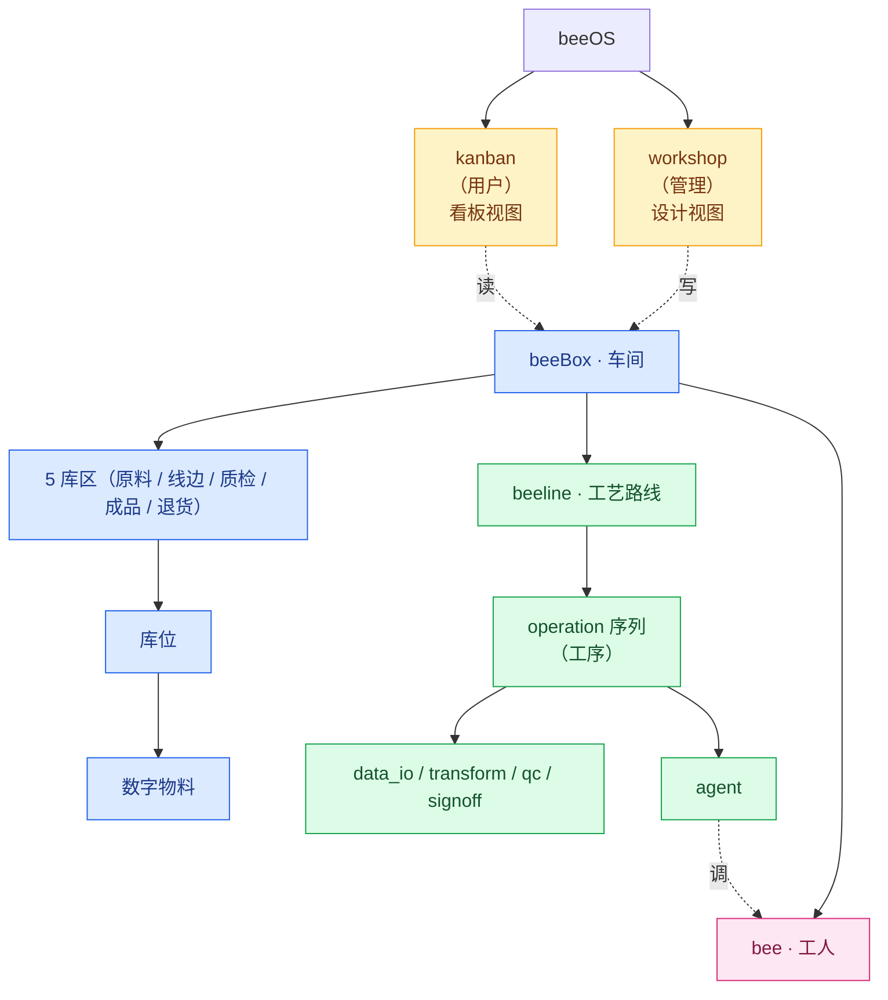
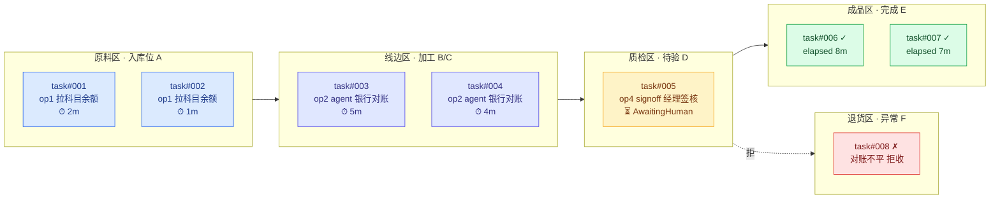
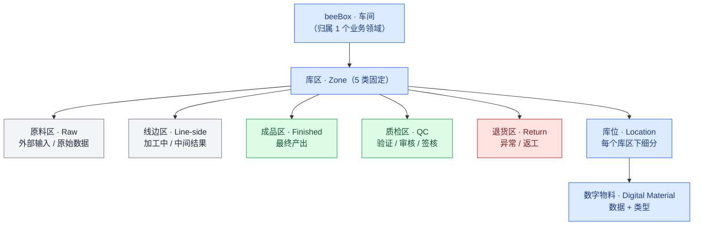
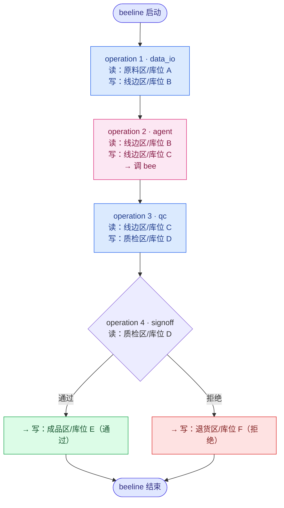

# beeOS 内核设计 v0.1

> **状态**：v0.1 草稿 · 修订中
> **日期**：2026-09-06
> **定位**：beeOS = 数字精益工作 OS

## 0. 一句话

beeOS 三大模块 **beeBox（容器）/ beeline（流水线）/ bee（工人）**，两个控制台 **kanban（用户）/ workshop（管理）**。
**beeline 在 beeBox 内跑**，由 **operation（工序）** 序列组成（operation 是 beeline 内部组件），**agent operation 调 bee**；
每个 operation 驱动数字物料在 **beeBox 的 5 库区**间流转。

## 1. 关系总览

## 2. 核心要素

### 三大模块

| 模块 | 类比 | 定位 | 关系 |
|---|---|---|---|
| **beeBox** | 车间 | 容器 | beeline 在它内部执行；bee 被它调度 |
| **beeline** | 流水线 / 工艺路线 | beeBox 内的工作流 | 由 operation 序列组成；agent operation 调 bee |
| **bee** | 工人 | 智能体执行者 | 被 agent operation 调用 |

### beeline 内部组件

| 组件 | 类比 | 定位 | 关系 |
|---|---|---|---|
| **operation** | 工序 | beeline 的一步 | 驱动数字物料在库位间流转 |

## 3. 两个控制台

### 3.1 beeOS **kanban**（用户侧 / 现场视角）

- **面向**：终端用户 / 操作员 / 业务人员
- **核心问题**：现在 task 在 beeBox 里怎么跑？跑到哪了？哪里堵？哪里出问题？
- **输入**（看什么）：
  - task 列表：每个 task 的状态（Queued / Running / Done / Failed / AwaitingHuman）
  - task 当前 operation：跑到第几步
  - task 当前位置：在 5 库区/库位的哪个（task 内数字物料的位置）
  - 异常 task：哪些 task 异常、待人工处理
  - 节拍时间：每个 task / operation 的耗时
- **操作**（能做什么）：
  - 触发新 task
  - 认领异常 task（退货区）
  - 签核 task（质检区 / 成品区）
- **视觉**：Kanban 看板 —— task 在 beeBox 5 库区间流转的可视化视图
- **精益对位**：Kanban（看板管理）—— 可视化、拉动、暴露问题

**看板视图示意**：

### 3.2 beeOS **workshop**（管理侧 / 设计视角）

- **面向**：管理员 / 业务分析师 / 工艺工程师
- **核心问题**：这个 beeBox 需要什么 beeline / operation / 数字物料 / bee？
- **输入**（基于什么改）：
  - 现有 beeOS 资产：已注册的 beeBox / beeline / bee / BOM
  - 业务需求：新增场景、调整工艺、注册新 bee
- **输出**（产出什么）：
  - 设计好的 beeBox（含 5 库区 / 库位 / 数字物料 schema）
  - 编辑好的 beeline（含 operation 序列）
  - 注册的 bee（智能体）
  - 更新的 BOM
- **视觉**：IDE / 表单 / 拖拽
- **精益对位**：Standard Work Design（标准作业设计）—— 标准化、模板化、复用

**workshop 主要模块**：

| 模块 | 作用 |
|---|---|
| beeBox 设计器 | 定义业务领域 / 5 库区 / 库位 / 数字物料 schema |
| beeline 编辑器 | 拖拽 / 编排 operation 序列 |
| operation 库 | 各类 operation 模板（data_io / transform / agent / qc / signoff）|
| bee 注册表 | 管理 bee 智能体（能力 / 输入输出 / 适用 operation）|
| BOM 中心 | 跨 beeBox 共享数字物料 schema |

### 3.3 读写关系

| 控制台 | 输入（看 / 基于什么） | 操作（做 / 产出什么） |
|---|---|---|
| **kanban** | task 实时状态（task / 当前 operation / 所在库区 / 异常 / 节拍） | 触发 task / 认领异常 / 签核 |
| **workshop** | 现有 beeOS 资产（beeBox / beeline / bee / BOM） | 设计 / 编辑 / 注册 / 上传 |

> **workshop 写 → beeOS 资产；beeOS 状态 → kanban 读。设计在 workshop，运行在 kanban。**

## 4. beeBox 内部结构

### 待澄清（beeBox 还"装"什么）

| # | 候选 | 问题 |
|---|---|---|
| A | 适配器（Adapter） | 外部世界（DB / API / 文件）连接 |
| B | 资源 / 凭证 | 连接串 / 凭证 / 限流 |
| C | 业务规则（Rule） | beeBox 内置硬约束 |
| D | **bee 工人池** | bee 是 beeBox 内部常驻？还是按需从外部拉？ |
| E | 异常回流 | 退货区物料回流路径 |
| F | 库位流转规则 | 物料能否跨库区流转 / 流转约束 |
| G | 看板 / 状态 | 精益"看板"在 beeBox 的体现 |
| H | 度量（Metrics） | 节拍 / 在制 / 良率 |

## 5. beeline 与 operation

### 5.1 operation 类型

| type | 是否需要 bee | 例子 |
|---|---|---|
| data_io | ❌ | 拉科目余额、生成 PDF、存结果 |
| transform | ❌ | 字段映射、聚合、格式转换 |
| agent | ✅ **bee 智能体** | 银行对账推理、合同条款提取 |
| qc | ❌ | 平衡校验、完整性校验 |
| signoff | 🟡 人工/混合 | 经理签核 |

> 关键：**不是每个 operation 都需要 bee**。只有需要"判断/推理/对话"的 operation 才放 bee。

### 5.2 operation 必含属性

| 属性 | 必含 | 含义 |
|---|---|---|
| seq | ✅ | operation 序号 |
| type | ✅ | 加工类型 |
| input_location | ✅ | 从哪里读数字物料 |
| output_location | ✅ | 把数字物料落到哪里 |
| bee_ref | 🟡 agent 才有 | 被调的 bee（如 `beex.finance.bank_reconciler`）|
| task | 🟡 | 工人 / 工具干的具体活（如 `reconcile_bank`）|
| qc_rules | 🟡 qc 才有 | 校验规则 |
| exception_handler | 🟡 | 异常处理（退货区 / 重试 / 人工）|

### 5.3 数据流（operation 驱动物料在 5 库区间流转）

## 6. 5 大内核组件

| 编号 | 名称 | 职责 | 在哪运行 |
|---|---|---|---|
| ① | Task Receiver | 接收任务 | beeBox 入口 |
| ② | beeBox Router | 路由到目标 beeBox | Kernel 顶层 |
| ③ | Beeline Cache | 缓存 beeline 蓝图 | beeBox 内部 |
| ④ | Bee Planner | beeline miss 时规划 | beeBox 内部 |
| ⑤ | Beeline Executor | 在 beeBox 内部执行 beeline operation | beeBox 内部 |

## 7. 精益概念 ↔ beeOS 映射

| 精益概念 | beeOS 落地 |
|---|---|
| 价值流（Value Stream） | beeline |
| 标准化作业 | beeline 蓝图（operation 序列）|
| 自働化（Jidoka） | bee 智能体 + 异常回流 |
| 看板（Kanban） | kanban 控制台 + 库位在制视图 |
| 拉动（Pull） | Task Receiver 接收触发 |
| 单件流（One-piece Flow）| operation 一次执行一份物料 |
| 改善（Kaizen） | 度量（§4 待澄清 H）+ 审计 |
| 节拍时间（Takt Time）| operation.elapsed_ms + 库位在制聚合 |
| 标准化作业 | operation 序列本身就是标准作业（输入/输出/类型已声明清楚）|

## 8. 已确定 vs 待澄清

### ✅ 已确定
- 核心要素：beeBox / beeline / bee（三大模块）+ operation（beeline 内部组件）
- 两个控制台：kanban / workshop
- beeline 在 beeBox 内执行
- operation 驱动数字物料在 5 库区间流转
- 5 库区固定 5 类（原料 / 线边 / 质检 / 成品 / 退货）
- 节点命名为 `operation`（operation 即标准作业，不另设 SOP 层）
- operation 必含：seq / type / input_location / output_location
- 4 种基础 operation 类型：data_io / transform / agent / qc / signoff
- agent operation 才调 bee

### ❓ 待继续打磨（v0.2+）
- §4 beeBox 还"装"什么（A~H 8 个候选）
- **D 项 bee 工人归属**（beeBox 内部常驻 vs 按需拉）
- bee 干的具体活叫 `task`？
- kanban 移动端 / 大屏
- workshop 多租户协作
- 跨 beeBox 协作（1 个 task 能不能跨车间）
- BOM 中心部署形态（远端 / 内嵌 / 本地）
- operation 编排是否支持并行 / 条件分支
- 数字物料粒度（字段 / 记录 / 文件）
