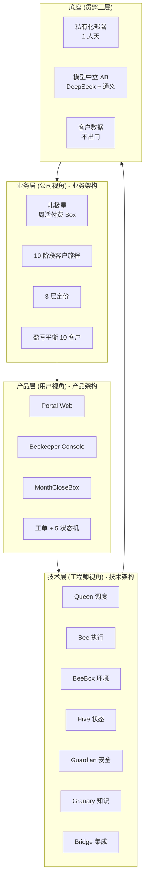
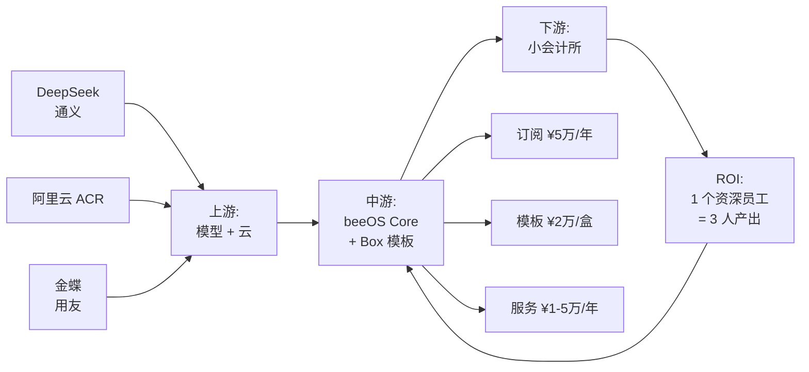
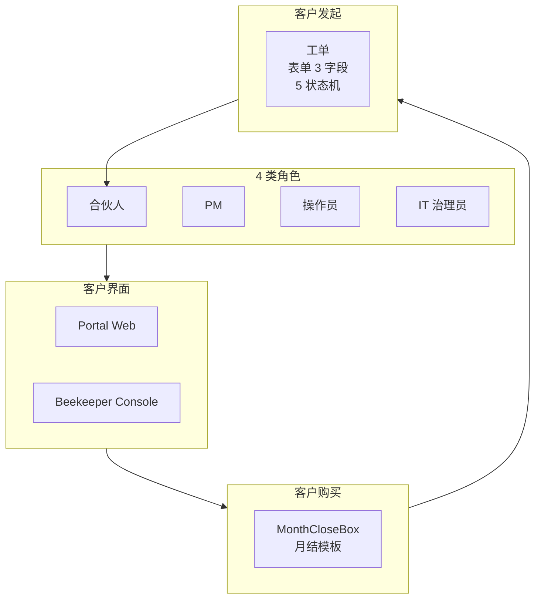
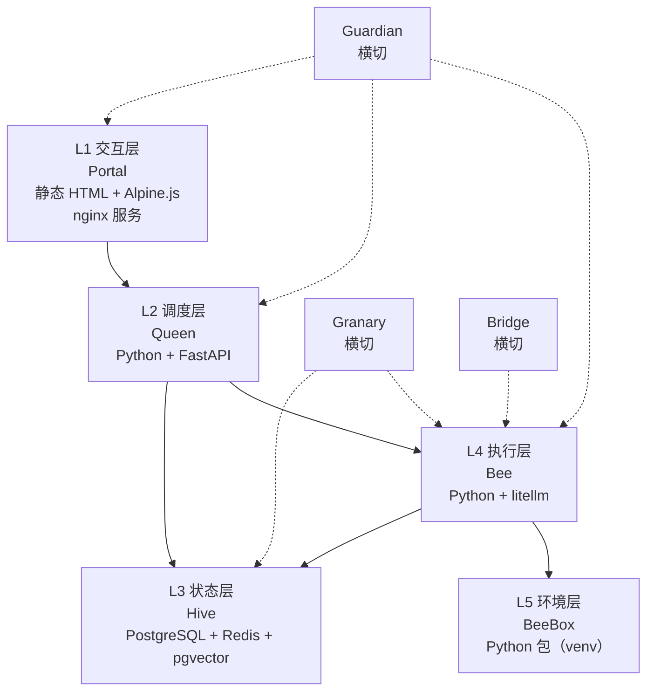
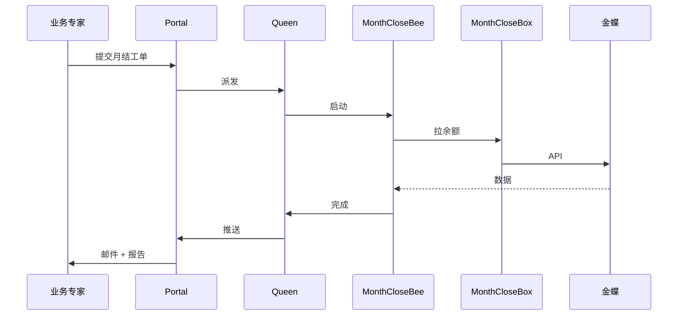
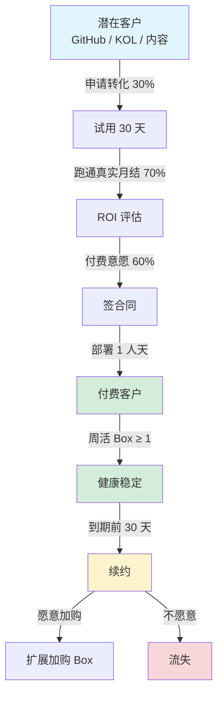
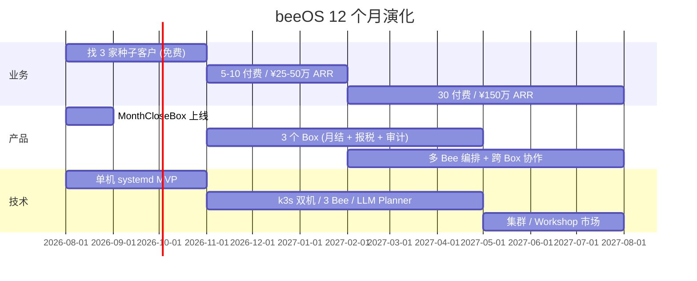
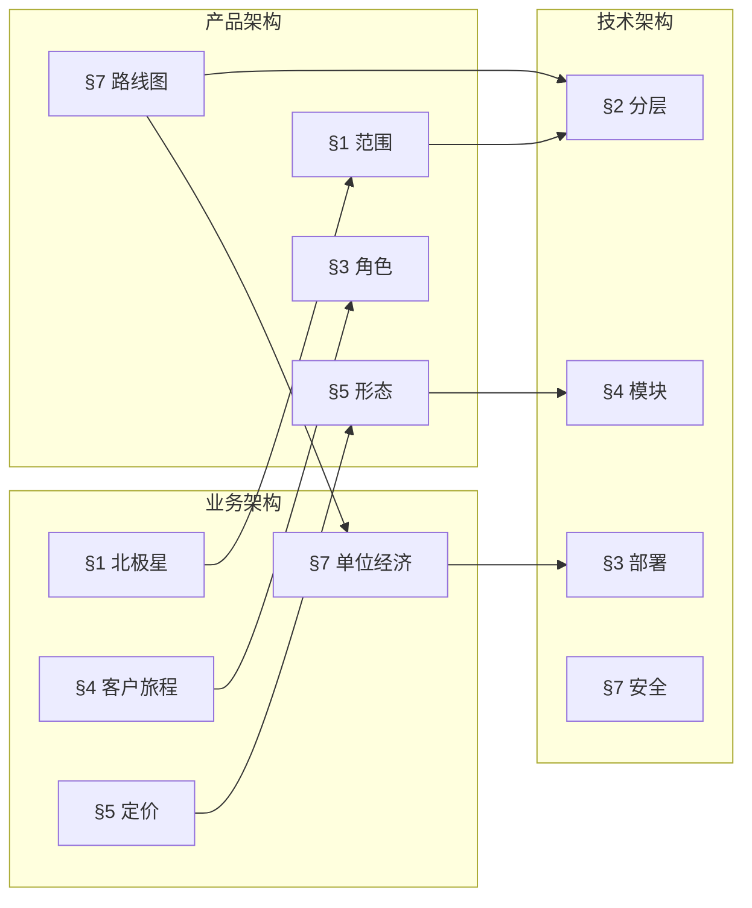

# beeOS 产品演化全景图

> **版本**：v0.1
> **日期**：2026-08-08
> **状态**：3 份架构的总入口 · 团队对齐用
> **关联文档**：[技术架构](tech-architecture.md) ｜ [产品架构](product-architecture.md) ｜ [业务架构](business-architecture.md) ｜ [术语表](glossary.md) ｜ [商业模型 v0.1](../business-model.md)

---

## 0. 一图概览（终极主图）



**这个图的口诀**：

> **业务交付 → 产品承载 → 技术实现 → 底座支撑 → 价值回流**
>
> 业务定义"卖什么"，产品定义"是什么"，技术定义"怎么做"，底座定义"凭什么做"。

---

## 1. 4 个视角切换

### 1.1 业务视角：怎么赚钱



**关键数字**：

- 北极星：周活付费 Box 数
- Y1 目标：¥50 万 ARR → 10 个付费客户
- 盈亏平衡：10 个付费客户（M5-M6）
- LTV/CAC：30-50

详见 [业务架构 §2](business-architecture.md#2-价值链与利益相关方地图)

### 1.2 产品视角：客户看到什么



**客户实际体验**：

- 业务专家：登录 → 填表 → 等结果 → 下载 ZIP
- IT 治理员：登录 → 配凭证 → 切换模型 → 看审计
- 合伙人：登录 → 看 ROI 报表 → 决策续约

详见 [产品架构 §4](product-architecture.md#4-关键用户旅程)

### 1.3 技术视角：系统怎么搭



**核心约束**：

- 5 层 + 3 横切，对应十巧板
- 月结 Bee 端到端：5 步固定流程，不调 LLM 拆解
- 1 人天部署：4 个 native systemd unit（nginx / postgresql / redis / beeos-queen）

详见 [技术架构 §2](tech-architecture.md#2-逻辑架构与分层)

### 1.4 用户视角：一只蜜蜂飞过 BeeOS



**用户视角只有 4 步**：填表 → 等结果 → 下载 → 决策续约。

---

## 2. 客户价值端到端流程



详见 [业务架构 §4](business-architecture.md#4-业务全生命周期流程)

---

## 3. MVP → V1 → V2 演化时间轴

### 3.1 时间轴



### 3.2 阶段要点对照

| 维度 | MVP (M1-M6) | V1 (M7-M12) | V2 (Y2) |
|---|---|---|---|
| **业务）** | 3 种子 + 10 付费 | 30 付费 | 100+ 付费 |
| **业务）** | ¥50 万 ARR | ¥150 万 ARR | ¥500 万+ ARR |
| **产品）** | MonthCloseBox | +报税 +审计 | +Workshop 市场 |
| **产品）** | 单 Bee | 3 Bee | 多 Bee 编排 |
| **技术）** | 单机 systemd | k3s 双机 | 集群 |
| **技术）** | 写死工作流 | LLM Planner | 自适应 |
| **技术）** | 无 SSO | +SSO | +LDAP/AD |
| **部署）** | 1 人天 | 1 人天 | 半自动 |

详见 [技术架构 §9.4](tech-architecture.md#94-演进路径) ｜ [产品架构 §7](product-architecture.md#7-mvp--v1--v2-能力路线图) ｜ [业务架构 §7.4](business-architecture.md#74-12-个月烧钱-vs-收入)

---

## 4. 3 份架构的引用关系



**单向引用铁律**：

- 业务 → 产品：✓ 业务指标反推产品边界
- 业务 → 技术：✓ 商业毛利反推技术成本
- 产品 → 技术：✓ 用户承诺反推技术实现
- **产品 → 业务**：❌ 不允许
- **技术 → 业务**：❌ 不允许
- **技术 → 产品**：❌ 不允许

---

## 5. 关键决策 vs 待澄清

### 5.1 已敲定（不可回退）

| 决策 | 当前结论 | 来源 |
|---|---|---|
| 定位 | 私有化 AI 数字员工平台 | 商业模型 |
| 客户 | 50-500 人小会计所 | 商业模型 |
| 部署 | 单机私有化 | 商业模型 |
| 团队 | 独立开发者 / 几人小团队 | 商业模型 |
| 技术栈 | Python + FastAPI + PostgreSQL + pgvector + Redis + 静态 HTML + Alpine.js + 4 systemd unit | 技术架构 §5 |
| 模型 | DeepSeek + 通义（AB） | 技术架构 §1.1 |
| 部署 SLA | 1 人天 | 技术架构 §1.1 |
| 首个 Box | MonthCloseBox | 商业模型 |
| 北极星 | 周活付费 Box 数 | 业务架构 §1 |
| 盈亏平衡 | 10 个付费客户 | 业务架构 §7 |

### 5.2 待澄清（跨 3 份架构的开放问题）

| # | 问题 | 决策人 | 截止 |
|---|---|---|---|
| 1 | 创始人是否有会计背景？+ 30 天必须找行业合伙人 | 创始人 | M1 内 |
| 2 | 首选 3 家种子客户名单 | 创始人 | M1 内 |
| 3 | 是否启动种子融资（¥30 万 自有够用） | 创始人 | M3 评估 |
| 4 | Box 模板是否提供试用版（免费 N 次） | 创始人 | M1 内 |
| 5 | 客户能否自带 Box 模板（自定义） | 创始人 | V1 再议 |
| 6 | 智谱是否加入 AB 切换（3 家更稳） | 技术合伙人 | M3 内 |
| 7 | 离线安装包需求（无公网客户） | 技术合伙人 | M3 调研 |
| 8 | KOL 返佣的法律风险 | 创始人 | M1 内 |
| 9 | 行业合伙人来源（会计所 vs 代账） | 创始人 | M3 |
| 10 | LLP / LTV 测算验证 | 创始人 | M6 |

---

## 6. 从全景图到代码

### 6.1 优先级矩阵

按"客户价值 × 实现难度"排：

| 模块 | 客户价值 | 实现难度 | 优先级 |
|---|---|---|---|
| **MonthCloseBox 模块** | ⭐⭐⭐⭐⭐ | 中 | **P0** |
| **Queen 调度核心** | ⭐⭐⭐⭐⭐ | 高 | **P0** |
| **Portal 工单页** | ⭐⭐⭐⭐⭐ | 低 | **P0** |
| **Beekeeper Console 治理** | ⭐⭐⭐⭐ | 中 | **P0** |
| **Guardian 鉴权** | ⭐⭐⭐⭐⭐ | 中 | **P0** |
| **Hive 状态存储** | ⭐⭐⭐⭐ | 中 | **P0** |
| **Bee 执行引擎** | ⭐⭐⭐⭐⭐ | 高 | **P0** |
| **1 人天部署脚本** | ⭐⭐⭐⭐⭐ | 中 | **P0** |
| **Bridge 金蝶适配器** | ⭐⭐⭐⭐ | 中 | **P1** |
| **Granary 知识库** | ⭐⭐⭐ | 中 | **P1** |
| **Bridge 用友适配器** | ⭐⭐⭐ | 中 | **P1** |
| **跨 Box 协作** | ⭐⭐ | 高 | **P2** |
| **Workshop 模板编辑器** | ⭐ | 高 | **P2** |
| **多 Bee 编排** | ⭐⭐ | 高 | **P2** |

### 6.2 第一个里程碑（M1）

```
M1 末必须达成的目标：
├── BeeOS Core 仓库初始化
├── Queen Core 接口定义（不实现）
├── Bee ReAct 循环最小可用
├── MonthCloseBox 第 1 个模块: accounts.payable.query
├── Portal 单页：登录 + 工单提交
├── 1 人天部署脚本 demo（脚本骨架）
└── 1 个种子客户跑通 demo 数据（不要求真实）

不在 M1 范围：
├── 完整 MonthCloseBox 7 模块
├── Beekeeper Console 完整功能
├── 审计日志完整功能
├── 真实金蝶 / 用友对接
└── 任何 V1+ 能力
```

详见 [技术架构 §4](tech-architecture.md#4-核心模块设计)

---

## 7. 文档使用指引

### 7.1 角色 × 文档

| 角色 | 必读 | 选读 |
|---|---|---|
| **创始人** | 本全景图 + 业务架构 + 商业模型 | 产品架构 / 技术架构 |
| **技术合伙人** | 技术架构 + 本全景图 | 产品架构 / 业务架构 |
| **行业合伙人** | 产品架构 + 业务架构 + 本全景图 | 技术架构（高层） |
| **种子客户** | 产品架构 §4 用户旅程 | 商业模型 §1 |
| **投资人** | 本全景图 + 商业模型 | 业务架构 §7 |

### 7.2 决策时怎么查

| 决策类型 | 看哪份 |
|---|---|
| 客户要加新功能 | 产品架构 §1（范围） |
| 客户要改价格 | 业务架构 §5（定价） |
| 性能问题 | 技术架构 §9（性能） |
| 加新 Box | 技术架构 §4.4（Box 模板） |
| 续约谈判 | 业务架构 §4 + §7 |
| 部署出错 | 技术架构 §3 + 部署脚本 |
| 命名疑问 | 术语表 |

### 7.3 文档更新规则

- **本全景图**月度更新，并到 3 份子架构
- **任一子架构变更**对照总体图自查
- **新增术语**先入术语表，再出现在其他文档

---

## 变更日志

| 日期 | 变更 |
|---|---|
| 2026-08-08 | 初版 v0.1，整合 3 份架构 + 商业模型 |
| 2026-08-08 | 加入 4 视角切换 + 端到端价值流 + 9 阶段时间轴 |
| 2026-08-08 | 加入 14 个 P0-P2 模块优先级矩阵 |
| 2026-08-08 | 加入 10 个跨文档待澄清项 |
