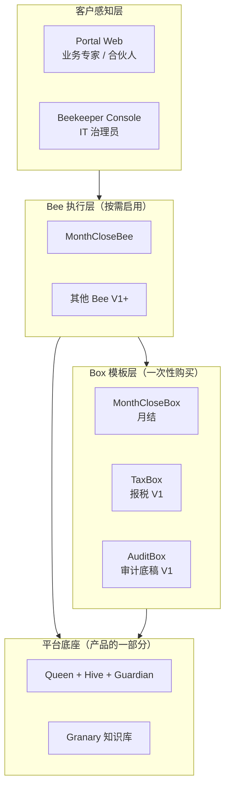
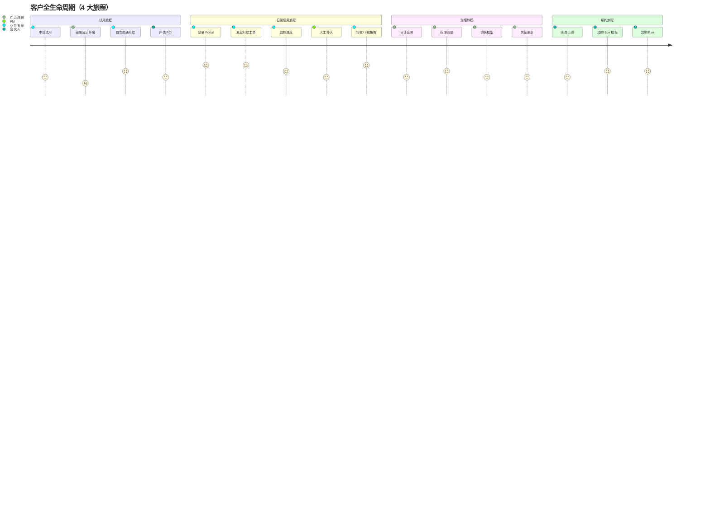
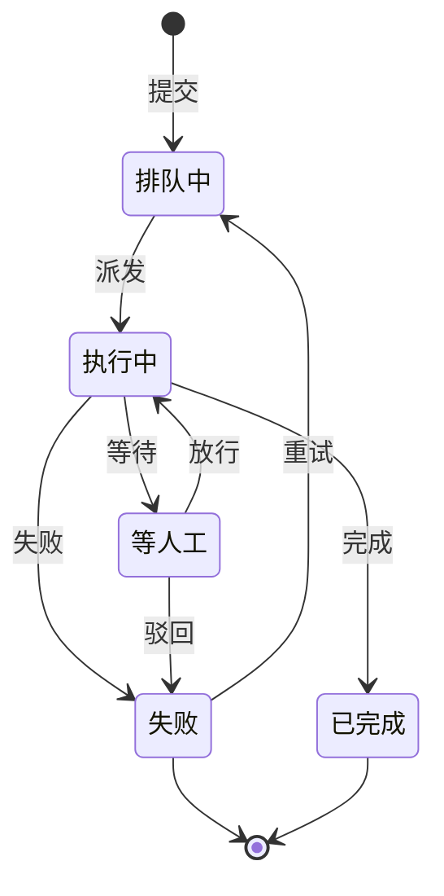

# beeOS 产品架构

> **版本**：v0.1
> **日期**：2026-08-07
> **状态**：MVP 设计稿 · 待客户验证
> **关联文档**：[技术架构](tech-architecture.md) ｜ [业务架构](business-architecture.md) ｜ [商业模型 v0.1](../business-model.md) ｜ [术语表](glossary.md)

---

## 1. 产品愿景与边界声明

### 1.1 一句话定位

> **beeOS 是"AI 数字员工的私有化车间"**——把"懂会计"的 Box 模板装进客户的服务器，让一个资深员工顶三个人。

完整定位见 [商业模型 §0](../business-model.md#0-定位一句话)。

### 1.2 MVP 范围硬清单

**做**：

| 维度 | MVP 范围内 |
|---|---|
| 部署形态 | 单机私有化（4 native systemd unit） |
| 行业 | 小会计师事务所（一级 ICP） |
| 业务 Box | MonthCloseBox（月结自动化） |
| Bee 类型 | MonthCloseBee（1 只） |
| 客户感知组件 | Portal Web + Beekeeper Console（治理） |
| 外部集成 | 金蝶云星空 / 用友 U8 / 钉钉 / 飞书 |
| 模型 | DeepSeek + 通义（AB 双供应商） |
| 平台 | Linux x86_64 / Ubuntu 22.04 |

**不做**（明确反范围）：

- ❌ 多租户 SaaS
- ❌ 模板市场 / Workshop UI
- ❌ 多 Bee 协同编排（V1+）
- ❌ 移动端
- ❌ 私有云以外的云 SaaS
- ❌ 律所 / 咨询 / 医疗等非会计场景（V1+）
- ❌ 银行直连 / SAP / Oracle（V1+）
- ❌ SSO / LDAP（V1+）

### 1.3 与业务模型的关联

本 MVP 范围直接服务于 [商业模型 §10 的 Phase 1（M1-M3）](../business-model.md#10-mvp-路线图3-阶段)：

- 1 个 MonthCloseBox
- 3 家种子客户
- 验证"SMB 愿不愿意为私有化 AI 付费"

**范围外的任何功能都不在本 MVP 文档讨论**。

---

## 2. 核心抽象与产品叙事

### 2.1 客户视角下的"十巧板"呈现

[技术架构 §2.2](tech-architecture.md#22-与十巧板的映射) 给的是工程师视角。客户视角下，**十巧板里只有 3 个对客户可见**：

| 客户可见层 | 客户视角的形态 | 用途 |
|---|---|---|
| **Portal** | 一个 Web 应用 | 业务专家日常工作 |
| **Beekeeper Console** | Portal 内的一个子模块 | IT 治理员管人、管权限、管模型 |
| **Beekeeper**（人） | 客户内部的"AI 运维岗" | 跨 Box 之间的协调者 |

**剩下 7 个对客户不可见**（技术架构里实现，但产品叙事不强调）：

> 客户**不需要**知道"Queen 怎么调度"、"Hive 怎么存"、"Guardian 怎么注入检测"。
> 客户**需要**知道的是："我给 Bee 一个工单，它去做，做完拿结果给我。"

### 2.2 给客户讲的产品故事（一句话）

> **"蜜蜂盒子" = "会做月结的 AI 员工"
> Bee = 那只蜜蜂（干活）
> BeeBox = 蜜蜂专用的工具箱（装满会计技能）
> 你的工作 = 派活 + 收结果**

### 2.3 产品视角分层图



### 2.4 跨 Box 协作的对外解释

> "以后你买了报税 Box，你现在的月结 Bee 在月结完成后，可以**自动**把数据递给报税 Bee，让报税 Bee 接着做完。整个过程你不需要懂，背后 beeOS 自动调度。"

**MVP 不实现**，但讲给客户听，给客户"未来扩展"的预期。

---

## 3. 用户角色与权限矩阵

### 3.1 4 类核心角色

| 角色 | 典型岗位 | 关心什么 | 决策权 |
|---|---|---|---|
| **合伙人** | 会计所合伙人 | ROI / 上线时间 / 风险 | **预算、购买决策** |
| **项目经理 (PM)** | 高级项目经理 / 部门主管 | 团队效率 / 任务调度 / 异常处理 | **权限分配、流程审批** |
| **会计操作员** | 中级会计 | 日常工单发起 / 结果核对 | **发起任务、查看自己任务** |
| **IT 治理员** | 财务 IT / 外包 IT | 部署 / 监控 / 权限 / 凭证 | **用户管理、模型配置、审计** |

### 3.2 角色 × 资源 × 操作的权限矩阵

| 资源 | 合伙人 | PM | 操作员 | IT 治理员 |
|---|---|---|---|---|
| 任务发起 | ✅ 自己 | ✅ 全员 | ✅ 自己 | ❌ |
| 任务查看 | ✅ 全员 | ✅ 团队 | ✅ 自己 | ❌ |
| 任务取消 | ✅ | ✅ 团队 | ✅ 自己（仅 Queued） | ❌ |
| 任务审批 | ✅ | ✅ | ❌ | ❌ |
| Box 模板激活 | ✅ | ❌ | ❌ | ✅ |
| 用户管理 | ❌ | ❌ | ❌ | ✅ |
| 凭证管理 | ❌ | ❌ | ❌ | ✅ |
| 模型配置 | ❌ | ❌ | ❌ | ✅ |
| 审计日志 | ✅（只读） | ✅（只读） | ❌ | ✅ |
| 审计导出 | ✅ | ❌ | ❌ | ✅ |

**MVP 简化的 RBAC 实现**：基于 4 个固定角色，无自定义角色功能。

### 3.3 单租户假设

MVP 假设**一个客户 = 一个 beeOS 实例**。多租户（一个实例服务多个客户）属于 V1+。

---

## 4. 关键用户旅程

### 4.1 旅程总览



### 4.2 试用旅程（M1-M3 关键）

| 阶段 | 触点 | 时间 | 指标 |
|---|---|---|---|
| 1. 申请 | 官网表单 / GitHub / KOL 介绍 | 1 天 | 申请数 |
| 2. 商务对接 | 微信 / 邮件 | 1-2 天 | 转化率 |
| 3. 部署演示 | 远程部署或上门 | 1 天 | 1 人天 SLA |
| 4. 跑通真实月结 | 客户现有数据 | 3-7 天 | 跑通率 ≥ 80% |
| 5. ROI 评估 | 提供 ROI 报告 | 7 天 | 续约意愿 |
| 6. 决定付费 | 商务谈判 | 7-14 天 | 付费转化 |

**Kill 条件**（参见商业模型 §10）：3 家里 0 家愿意付费 → 切换行业。

### 4.3 日常使用旅程（MVP 核心场景）

**主路径：会计操作员发起月结**

```
T+0      登录 Portal
T+0:30   点击"发起月结" → 填写表单（期间 + 客户列表）
T+1:00   提交工单 → 返回任务 ID
T+1:00   控制台显示任务进入"执行中"，进度 0%
T+15:00  进度到 60%，Bee 提示"等人工确认某笔银行差异"
T+15:30  操作员点击"确认"，放行
T+45:00  进度到 100%，任务完成
T+45:30  邮件推送 + 控制台显示下载链接
T+46:00  下载 ZIP（报表 + 凭证 + 审计日志）
```

**关键触点**：

- **表单极简**：MVP 只有 3 个字段（期间 / 客户范围 / 紧急程度）
- **进度可视化**：百分比 + 当前步骤（"正在银行对账..."）
- **中断恢复**：Bee 暂停时显式提示"等你确认"，避免超时
- **结果完整**：报告 + 凭证 + 审计三件套

### 4.4 治理旅程

| 场景 | 角色 | 关键操作 |
|---|---|---|
| 审计追溯 | 合伙人 / IT | 查"那笔 X 月 X 日谁调了什么" |
| 权限调整 | IT | 加 / 减 / 改用户角色 |
| 切换模型 | IT | 切换主模型供应商 / 调模型参数 |
| 凭证更新 | IT | 季度更新金蝶凭证 |
| 备份恢复 | IT | 手动备份 / 灾难恢复演练 |

**MVP 限制**：所有治理操作走 Web UI，**不提供 CLI**（V1+ 加 `beeos` CLI）。

### 4.5 续约与扩展旅程

| 场景 | 行为 | 触发条件 |
|---|---|---|
| 续费订阅 | 自动续 + 发票 | 到期前 30 天 |
| 加购 Box | Portal 一键激活 | 已有 License 槽位 |
| 加购 Bee | 同上 | |
| 加 Bee 实例 | 联系商务 | 当前并发跑满 |

---

## 5. MVP 产品形态与交付物

### 5.1 形态定义

**一台 Linux 服务器上的 Web 应用**：

```
客户数据中心
└── beeos-server (1 台)
      ├── http://101.37.146.194 (Portal) — demo 阶段 IP-only
      ├── http://101.37.146.194/admin (Beekeeper Console)
      ├── postgres (本地)
      └── redis (本地)
```

**用户设备**：

- 业务专家：浏览器（Chrome / Edge / Safari，**不支持 IE**）
- IT 治理员：同上
- 移动端：**MVP 不支持**（响应式但不专门优化）

### 5.2 必交付组件清单

| 组件 | 形态 | 客户感知 | 备注 |
|---|---|---|---|
| **Portal Web** | Web 应用 | 直接使用 | 业务专家日常 |
| **Beekeeper Console** | Portal 子模块 | 直接使用 | 治理员专用 |
| **MonthCloseBox** | 镜像 + 模板 | 激活后用 | 封装所有月结技能 |
| **MonthCloseBee** | 容器 | 不可见 | 用户只看到"任务" |
| **部署脚本包** | `beeos-init.sh` | 一次性 | 1 人天部署 |
| **License 文件** | `.beeos-license` | 一次性 | 商务对接后发放 |
| **客户文档** | 在线 Docs | 直接使用 | 含操作手册 |
| **模型 API Key** | 客户自备 | IT 治理员配置 | beeOS 不私藏 |

### 5.3 暂缓清单（V1+ 再做）

- ❌ Workshop 模板编辑器
- ❌ 模板市场 / 第三方 Box 商店
- ❌ 多 Bee 协同可视化
- ❌ 工作流自定义编辑器
- ❌ CLI 工具
- ❌ SSO / LDAP / SAML
- ❌ 移动端 App
- ❌ 飞书 / 钉钉深度集成（仅推送）

---

## 6. 关键数据契约（产品接口层）

### 6.1 工单契约（用户输入）

**MVP 工单 Schema**（JSON Schema）：

```json
{
  "type": "object",
  "required": ["bee_type", "period"],
  "properties": {
    "bee_type": {
      "type": "string",
      "enum": ["month_close"],
      "description": "M11P 只支持 month_close"
    },
    "period": {
      "type": "string",
      "pattern": "^\\d{4}-(0[1-9]|1[0-2])$",
      "description": "格式 YYYY-MM"
    },
    "clients": {
      "type": "array",
      "items": { "type": "string" },
      "description": "客户编码列表；空 = 全部客户"
    },
    "urgency": {
      "type": "string",
      "enum": ["normal", "urgent"],
      "default": "normal"
    },
    "notes": {
      "type": "string",
      "maxLength": 500,
      "description": "给 Bee 的备注（不超过 500 字）"
    }
  }
}
```

**客户视角的表单**（不是 JSON）：

```
月结发起
├── 期间: [2026-07 ▼]
├── 客户范围: [○ 全部客户 / ○ 指定客户 (多选)]
├── 紧急程度: [○ 一般 / ● 紧急]
└── 备注: [___________________________]
```

### 6.2 任务生命周期状态机（产品视角）



**5 个状态**：排队中 / 执行中 / 等人工 / 已完成 / 失败

**客户可见操作**：发起 / 取消 / 放行 / 驳回 / 重新提交 / 下载结果

### 6.3 交付物清单

| 产物 | 格式 | 用途 |
|---|---|---|
| 月结报告 | HTML / PDF | 给客户看 |
| 凭证包 | ZIP（PDF + Excel） | 给客户归档 |
| 审计日志 | CSV / JSON | 给治理员 |
| 异常清单 | Excel | 给会计操作员 |

**ZIP 结构**：

```
2026-07-月结-客户A-20260807-1800.zip
├── reports/
│   ├── 资产负债表.pdf
│   ├── 利润表.pdf
│   └── 现金流量表.pdf
├── vouchers/
│   └── *.pdf  (凭证扫描件)
├── audit.log
└── README.md
```

### 6.4 对外接口（产品承诺）

**只承诺 3 个 API**（不承诺内部接口）：

```yaml
# 1. 提交工单
POST /api/v0/jobs
  Auth: Bearer Token
  Body: 工单 JSON
  返回: { job_id, status }

# 2. 查询任务
GET /api/v0/jobs/{job_id}
  Auth: Bearer Token
  返回: { job_id, status, progress, current_step, result_url }

# 3. 下载结果
GET /api/v0/jobs/{job_id}/download
  Auth: Bearer Token
  返回: ZIP 文件
```

**任何外部系统（钉钉 / 飞书 / 自研 APP）只通过这 3 个 API 集成**。内部接口（Queen / Hive / Bee）**不承诺契约**，可随时重构。

---

## 7. MVP / V1 / V2 能力路线图

### 7.1 客户视角能力对照表

| 能力 | MVP (M1-M6) | V1 (M7-M12) | V2 (Y2) |
|---|---|---|---|
| 部署形态 | 单机 Compose | k3s 双机 | 集群 |
| 行业 | 会计所 | + 律所 | + 咨询 |
| Box 模板 | MonthCloseBox | + TaxBox + AuditBox | + 行业自配 |
| Bee 数量 | 1 只 | 3 只 | 多 Bee 编排 |
| 跨 Box 协作 | ❌ | ✅（月结→报税） | ✅ |
| 模板市场 | ❌ | ❌ | ✅ |
| SSO | ❌ | ✅ | ✅ |
| 移动端 | ❌ | ❌ | ✅ |
| 模型数 | 2 家 | 3 家 | 4+ 家 |
| SLA | 5×8（邮件） | 7×24（工单） | 7×24（电话） |

### 7.2 与业务架构的对齐

| 阶段 | 业务目标 | 产品能力交付 |
|---|---|---|
| M1-M3 | 3 家种子客户 | MonthCloseBox + 1 人天部署 |
| M4-M6 | 5-10 付费客户 | BeeOS Enterprise 订阅 + Box 模板包 |
| M7-M12 | 30 付费客户 / ¥150 万 ARR | 3 个 Box + 多 Bee + 跨 Box 协作 |

### 7.3 设计冻结原则

- **MVP 结束前不增功能**（除非已签客户的强需求）
- **V1 范围在 M6 末重新评估**（基于 M1-M6 客户反馈）
- 每个能力上线前必须有**至少 1 个客户验证**

---

## 决策项 / 待澄清

1. **Box 模板是否提供试用版**：免费试用 vs 限定月结次数？→ **建议给 3 次免费试用**
2. **客户能否自带 Box 模板**：是否支持客户自定义 Box？→ **MVP 不支持，V1+ 再开放**
3. **Partner 渠道定价**：合作伙伴分成比例？→ **业务架构确定**

---

## 变更日志

| 日期 | 决策 | 影响章节 |
|---|---|---|
| 2026-08-07 | MVP 范围：单机 + MonthCloseBox + 1 Bee | §1.2 |
| 2026-08-07 | 客户视角只露 3 组件（Portal / Console / Beekeeper） | §2.1 |
| 2026-08-07 | 4 类核心角色 + 简化 RBAC | §3 |
| 2026-08-07 | 5 个任务状态机 | §6.2 |
| 2026-08-07 | MVP / V1 / V2 能力对照 | §7 |
