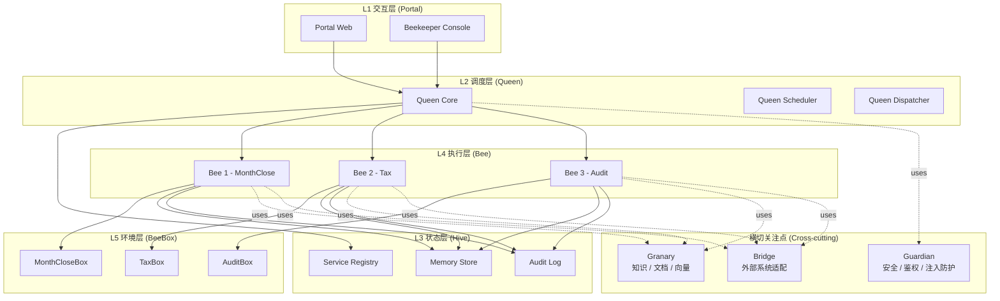
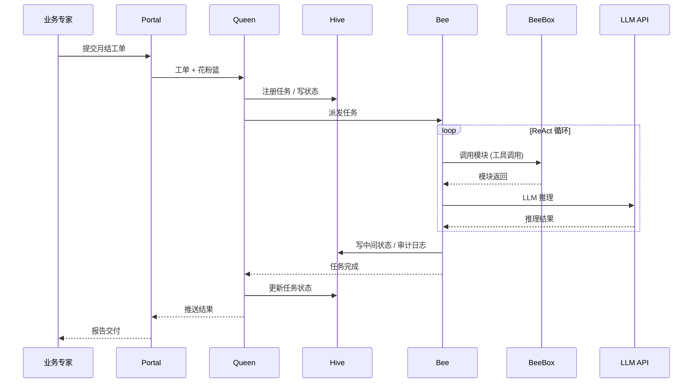
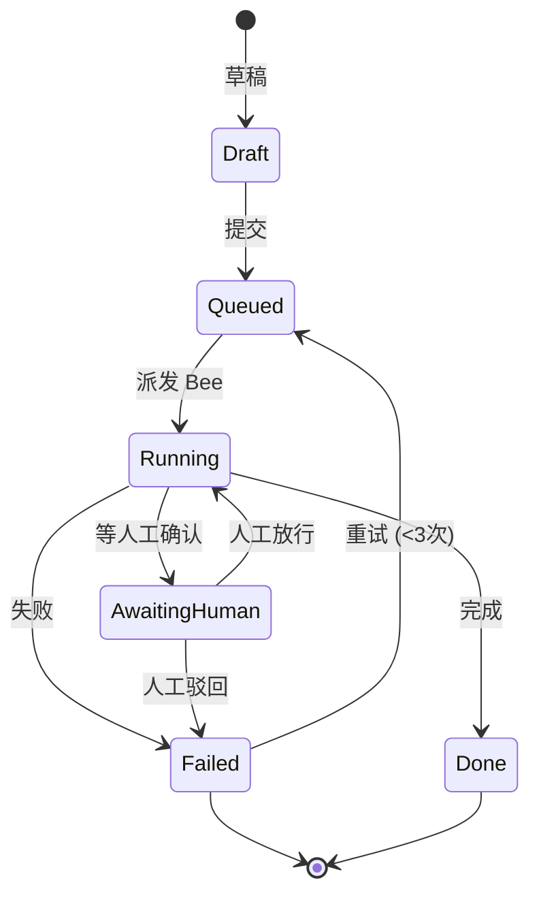
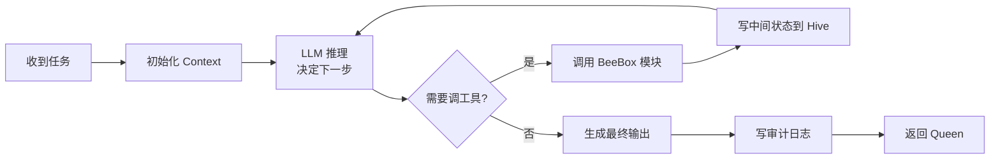
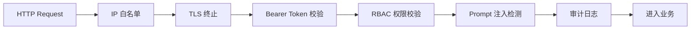
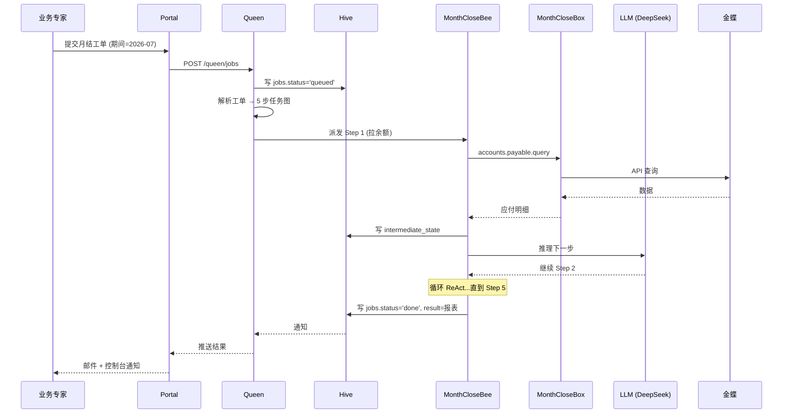
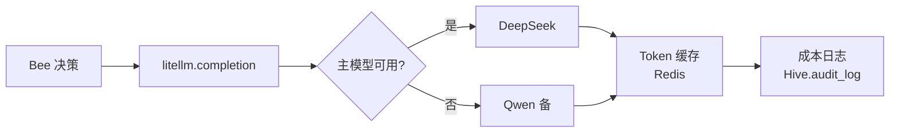
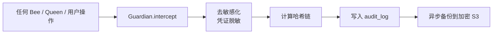
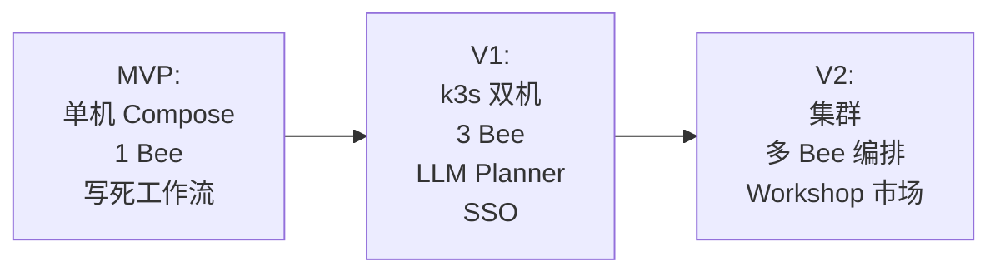

# beeOS 技术架构

> **版本**：v0.1
> **日期**：2026-08-07
> **状态**：MVP 设计稿 · 待实现验证
> **关联文档**：[业务架构](business-architecture.md) ｜ [产品架构](product-architecture.md) ｜ [商业模型 v0.1](../business-model.md) ｜ [术语表](glossary.md)

---

## 1. 技术愿景与设计原则

### 1.1 三大铁律（不可妥协）

1. **私有化优先**：所有组件默认**不可外发任何用户数据**。唯一出门流量是**模型 API 调用**（可配置走客户内网代理）。
2. **1 人天可部署**：从合同签完到生产跑通第一个 Box，**单人 8 小时内完成**。这条倒逼架构不做 K8s、不做复杂编排。
3. **模型中立（AB）**：所有 LLM 调用走 `litellm` 抽象层；**至少 2 家供应商在线 AB**（默认 DeepSeek + 通义），单一供应商故障 30 分钟内切走。

### 1.2 MVP 务实原则

- **可上线 > 工业级**：能跑通真实月结任务即可，**不追求高并发、不追求 99.99%**
- **能跑通 > 高性能**：单租户、单 Bee、串行执行够用
- **明确欠债**：技术债务**写进文档**，不偷偷上

### 1.3 与业务 / 产品的时序对齐

| 阶段 | 业务里程碑 | 技术里程碑 |
|---|---|---|
| M1-M3 | 找 3 家种子客户免费试用 | BeeOS Core MVP 上线 + MonthCloseBox v0.1 + 1 人天部署脚本 |
| M4-M6 | 5-10 个付费客户 / ¥25-50 万 ARR | 3 个 Box（月结 / 报税 / 审计底稿）+ 私有化 Console v1 |
| M7-M12 | 30 个付费客户 / ¥150 万 ARR | k3s 集群模式 + 多 Bee 编排 + Workshop 模板市场 |

---

## 2. 逻辑架构与分层

### 2.1 五层 + 三横切



### 2.2 与十巧板的映射

| 文档概念 | 技术模块 | 物理组件 | MVP 状态 |
|---|---|---|---|
| Queen | 调度层 | Queen Core + Scheduler + Dispatcher | **详** |
| Bee | 执行层 | Bee Runtime | **详** |
| BeeBox | 环境层 | BeeBox Container（Docker） | **详**（MonthCloseBox） |
| Hive | 状态层 | PostgreSQL + Redis Streams | **详** |
| Guardian | 横切 | Guardian Middleware（FastAPI 中间件） | **详** |
| Granary | 横切 | pgvector + 本地 FS | **简** |
| Bridge | 横切 | Bridge Adapter SDK | **简** |
| Portal | 交互层 | Next.js Web | **详** |
| Beekeeper Console | 交互层 | Next.js 治理子模块 | **详** |
| Workshop | 交互层 | 仅占位（MVP 不实现） | **点** |

### 2.3 数据流概览



---

## 3. 部署架构

### 3.1 物理形态

**MVP（推荐）**：单台 Linux 服务器（客户内网机房），Docker Compose 编排，**全部容器跑在一台主机**。

**V1+**：单台升级到 k3s（轻量 K8s），开始允许双机热备。

### 3.2 单机最小规格

| 资源 | 最低 | 推荐 | 备注 |
|---|---|---|---|
| CPU | 4 核 | 8 核 | LLM 调用密集，CPU 影响不大 |
| RAM | 8 GB | 16 GB | 主要是 PostgreSQL + Redis |
| 磁盘 | 100 GB SSD | 200 GB SSD | 凭证 + 审计日志 + 文档向量 |
| 网络 | 1 Gbps 内网 | 1 Gbps + 公网出口 | 需要访问模型 API |
| OS | Ubuntu 22.04 LTS | Ubuntu 22.04 LTS | RHEL/CentOS 兼容但不测 |

### 3.3 1 人天部署清单

```
T+0:00  收客户合同 + 服务器登录信息
T+0:30  SSH 登录，执行 beeos-init（一次性脚本）
        - 自动检测：CPU/RAM/磁盘/Docker/Docker Compose
        - 安装缺失依赖
        - 生成客户专属配置（域名、证书、初始管理员 Token）
T+1:00  上传 License 文件（.beeos-license）
T+1:30  执行 docker compose up -d（自动拉镜像 + 初始化 DB）
T+2:00  访问 https://<server>:8443，初始化 Guardian 管理员
T+3:00  控制台激活 MonthCloseBox（向导式）
        - 上传金蝶 / 用友凭证
        - 配置模型 API Key（DeepSeek + 通义）
        - 配置客户业务参数（科目表 / 期间）
T+5:00  跑通 demo 工单（"上一次月结流程"）
T+6:00  培训客户运维（30 分钟）
T+6:30  验收：客户跑通第一个真实月结
T+8:00  交付
```

**关键工程要求**：
- `beeos-init` 必须是**单一脚本**，零交互
- `docker-compose.yml` 必须在 200 行内
- 镜像必须**国内可拉**（阿里云容器镜像服务 ACR）
- 数据库 schema 必须**自动 migrate**

### 3.4 离线安装包（V1+）

针对完全无公网的客户（部分银行 / 国企）：

```
beeos-offline-v0.1.tar.gz (~2 GB)
├── docker-images/*.tar        # 全部 Docker 镜像
├── installers/beeos-init.sh   # 离线版初始化脚本
├── models/                    # 备用本地小模型（Qwen2.5-7B）
├── licenses/                  # License 文件
└── docs/                      # 脱机文档
```

### 3.5 升级 / 回滚 / 备份

| 场景 | 策略 |
|---|---|
| 升级 | `beeos upgrade --to v0.2.0`：自动备份 DB → 拉新镜像 → 滚动重启 → 验证 → 失败回滚 |
| 回滚 | 保留最近 3 个版本镜像；`beeos rollback --to v0.1.3` |
| 备份 | 每日 02:00 自动 `pg_dump` + 凭证加密备份；保留 30 天 |
| 灾难恢复 | RPO < 1 小时，RTO < 4 小时（半年内验证 1 次） |

---

## 4. 核心模块设计

### 4.1 Queen（调度层）

**职责**：接收工单 → 拆解任务 → 派发 Bee → 监控执行 → 收敛结果。

**对外接口**（REST）：

```yaml
POST /api/v0/queen/jobs
  入参: { "bee_type": "month_close", "params": {...}, "context_id": "pollen-xxx" }
  出参: { "job_id": "job-xxx", "status": "queued" }

GET /api/v0/queen/jobs/{job_id}
  出参: { "job_id", "status", "progress": 0.65, "current_step": "..." }

POST /api/v0/queen/jobs/{job_id}/cancel
```

**任务状态机**：



**关键算法**：
- **任务拆解**：MVP 阶段**写死工作流**（MonthCloseBox = 固定 5 步），不调 LLM 拆解。V1+ 引入 LLM Planner。
- **心跳 / 超时**：Bee 每 30 秒上报心跳；Queen 超时 90 秒未上报认为失联，重派。
- **双蜂王校验（V1+，MVP 仅日志）**：每个 Bee 产出由 Validator Bee 异步校验"是否合理"。

### 4.2 Hive（状态层）

**职责**：服务注册 / 状态存储 / 审计日志 / 版本亲和。

**存储拆分**：

| 数据 | 存储 | 保留 | 备注 |
|---|---|---|---|
| 任务状态 | PostgreSQL `jobs` 表 | 永久 | 客户合规要求 |
| 任务中间态 | Redis Streams | 24 小时 | 仅热数据 |
| 花粉篮（Context） | PostgreSQL `pollen` 表（JSONB） | 90 天 | 长期可配置 |
| 审计日志 | PostgreSQL `audit_log` 表 | **5 年** | 法规要求 |
| 服务注册 | Redis（HASH） | 实时 | Box / Bee 上下线 |
| Box 模块清单 | PostgreSQL `box_manifests` | 永久 | 版本亲和用 |

**关键表**（简化）：

```sql
-- 任务主表
CREATE TABLE jobs (
  job_id UUID PRIMARY KEY,
  bee_type VARCHAR(64) NOT NULL,
  status VARCHAR(32) NOT NULL,
  params JSONB,
  context_id UUID,
  started_at TIMESTAMPTZ,
  finished_at TIMESTAMPTZ,
  result JSONB,
  error JSONB
);

-- 审计日志（不可变）
CREATE TABLE audit_log (
  id BIGSERIAL PRIMARY KEY,
  ts TIMESTAMPTZ DEFAULT NOW(),
  actor VARCHAR(64),        -- 'user:xxx' / 'bee:xxx' / 'queen'
  action VARCHAR(64),        -- 'job.create' / 'tool.call' / ...
  resource VARCHAR(128),
  payload JSONB,
  prev_hash VARCHAR(64),     -- 哈希链，防篡改
  curr_hash VARCHAR(64) NOT NULL
);
```

### 4.3 Bee（执行层）

**职责**：执行具体任务；MVP 阶段只有 **MonthCloseBee**。

**核心循环**（ReAct）：



**关键约束**：

| 约束 | 值 | 理由 |
|---|---|---|
| 单 Bee 最大 Token 预算 | 200K | 单月结任务实际用 30-80K，留 2-3 倍 |
| 单 Bee 最大执行时长 | 30 分钟 | 超时强制结束 |
| 单 Bee 最大工具调用 | 50 次 | 防止死循环 |
| 模型调用超时 | 60 秒 | 含网络 |
| Token 缓存 | 启用（Redis） | 重复 prompt 至少 30% 节省 |

**模型 AB 策略**：

```python
# 简化伪代码
class Bee:
    def __init__(self):
        self.models = [
            ("deepseek", "deepseek-chat", 0.6),  # 主
            ("qwen", "qwen-plus", 0.4),           # 备
        ]
        self.fallback_threshold = 0.95  # 主模型成功率 < 95% 切走
```

### 4.4 MonthCloseBox（业务 Box）

**职责**：封装月结流程所需的所有模块 + 凭证 + 知识。

**模块清单**（MVP）：

| 模块 | 功能 | 输入 | 输出 |
|---|---|---|---|
| `accounts.payable.query` | 查应付账款 | 期间 / 客户编号 | 应付明细 JSON |
| `accounts.receivable.query` | 查应收账款 | 期间 / 客户编号 | 应收明细 JSON |
| `bank.reconcile` | 银行对账 | 银行流水 / 账面 | 对账差异 JSON |
| `expense.classify` | 费用分类 | 凭证 JSON | 分类后 JSON |
| `report.generate` | 出报表 | 期间 / 科目 | 报表 HTML/PDF |
| `evidence.collect` | 凭证归集 | 期间 | 凭证包 ZIP |
| `signoff.request` | 发起审批 | 报表 / 审批人 | 审批单 ID |

**凭证生命周期**（关键）：

```
凭证入库 → Guardian 加密存储（AES-256-GCM）→ Box 启动时解密注入内存
→ 模块调用时**永不出现在日志**
→ Box 停止时内存清零
```

**月结流程编排**（写死版）：

```
Step 1: 拉取期间所有客户最新余额
Step 2: 银行对账（自动 + 标记差异）
Step 3: 费用按科目分类（LLM 辅助）
Step 4: 生成三大报表初稿
Step 5: 归集凭证 + 发起审批
```

每步输出**可追溯**：Bee 写到 Hive 的 intermediate_state，记录每一步的输入/输出。

### 4.5 Granary（知识层，MVP 简化）

**职责**：存储客户的私有知识（科目表 / 历史规则 / 文档）。

**MVP 实现**：

```
客户上传文件 (PDF / Word / Excel)
  ↓
Bee 内嵌文本提取 (PyPDF2 / python-docx / openpyxl)
  ↓
按 500 token 切块（overlap 50）
  ↓
Embedding（Qwen-text-embedding-v3，本地或 API）
  ↓
存入 pgvector（BEGIN; 等等）
```

**MVP 限制**：
- 不做文档自动同步（手动上传）
- 不做权限分级（全员可见）
- 单客户 10 GB 上限

### 4.6 Bridge（集成层，MVP 简化）

**MVP 适配器**：

| 外部系统 | 适配器 | 接口 | 状态 |
|---|---|---|---|
| 金蝶云星空 | `bridge.kingdee` | REST | 详 |
| 用友 U8 | `bridge.yonyou` | REST | 详 |
| 钉钉 | `bridge.dingtalk` | OpenAPI | 简（仅消息推送） |
| 飞书 | `bridge.feishu` | OpenAPI | 简（仅消息推送） |
| 邮件 SMTP | `bridge.smtp` | SMTP | 简 |

**MVP 不做**：SAP / Oracle / 银行直连（V1+）。

### 4.7 Guardian（安全层）

**职责**：所有跨组件请求的**单一鉴权点**。

**核心机制**：



**Prompt 注入防护**（关键）：

```python
# 简化版注入检测
INJECTION_PATTERNS = [
    r"ignore.*previous.*instructions",
    r"disregard.*system.*prompt",
    r"you.*are.*now",
    r"act.*as.*if",
]

def detect_injection(text: str) -> float:
    """返回 0-1 的注入风险分；>0.7 拒绝"""
    score = 0
    for p in INJECTION_PATTERNS:
        if re.search(p, text, re.IGNORECASE):
            score += 0.3
    # LLM 辅助检测（可选）
    return min(score, 1.0)
```

**凭证管理**：

- 所有 API Key / 密码 → AES-256-GCM 加密
- 主密钥从环境变量 `BEEOOS_MASTER_KEY` 读取（部署时通过 `beeos-init` 注入）
- 永不在日志 / 审计 / 错误堆栈中明文出现

### 4.8 Portal + Beekeeper Console（前）

**技术栈**：
- Next.js 14（App Router）
- TypeScript 严格模式
- Tailwind CSS + shadcn/ui（避免重设计）
- React Query（数据获取）
- Zustand（轻量状态）

**关键页面**（MVP）：

| 页面 | 路径 | 角色 |
|---|---|---|
| 登录 | `/login` | 全员 |
| 仪表盘 | `/dashboard` | 全员 |
| 任务列表 | `/jobs` | 全员 |
| 任务详情 | `/jobs/:id` | 全员 |
| 发起月结 | `/jobs/new/month-close` | 业务专家 |
| 审计日志 | `/audit` | IT 治理员 |
| 凭证管理 | `/credentials` | IT 治理员 |
| 用户管理 | `/users` | 管理员 |
| 模型配置 | `/settings/models` | 管理员 |
| Box 管理 | `/admin/boxes` | 管理员 |

**不在 MVP**：
- 移动端（响应式但不专门优化）
- 模板市场 Workshop UI
- 实时协作（多人同时编辑）

---

## 5. 关键技术选型与理由

| 类别 | 选型 | 候选 | 理由 | 风险 |
|---|---|---|---|---|
| 后端语言 | **Python 3.12** | Node.js / Go | 生态最厚（LangChain / Pydantic / FastAPI）；AI 工程师多 | 性能弱（够用） |
| 后端框架 | **FastAPI** | Flask / Django | 异步原生 / 自动 OpenAPI / Pydantic 集成 | 学习曲线 |
| LLM 抽象 | **litellm** | 自研 / LangChain | 30+ 模型统一接口 / 成本追踪 / 缓存 | 跟随上游 |
| 数据库 | **PostgreSQL 16 + pgvector** | MySQL + Milvus | 一站式（关系 + 向量）；运维简单 | pgvector 性能 |
| 队列 | **Redis Streams** | Kafka / RabbitMQ / Celery | 轻量 / 单机够用 / 复用 Redis | 分布式需重写 |
| 缓存 | **Redis 7** | Memcached | 复用队列 / Token 缓存 | 单点故障 |
| 前端 | **Next.js 14** | Vite + React / Remix | 集成度最高 / 文档全 | 体积大 |
| 容器 | **Docker Compose** | k8s / k3s | 单机 1 人天部署；V1 再升 k3s | 不支持多机 |
| 监控 | **OpenTelemetry** | Prometheus 单独 | 标准化 / 兼容多家后端 | 集成复杂 |
| 包管理 | **uv** | pip / poetry | 速度 10x / 锁文件严谨 | 新工具 |
| 配置 | **Pydantic Settings** | python-dotenv | 类型安全 / 校验 | 无 |
| 部署 | **bash + ansible-lite** | Ansible / Terraform | 1 人天部署不需要复杂工具 | 难扩展 |

**选型决策日志**：

- 不选 LangGraph：**自研 ReAct 循环足够简单**，引入框架增加依赖和复杂度。
- 不选 MySQL + 独立向量库：**单机部署一个 DB 进程**，多组件拖运维。
- 不选 K8s：**MVP 阶段单机部署**，K8s 装都装 1 天。
- 不选 LangChain 做 Bee 编排：**太重**，自己写 100 行 ReAct 循环更可控。

---

## 6. 关键数据流

### 6.1 月结 Bee 端到端流



### 6.2 模型调用链



### 6.3 审计日志流



---

## 7. 安全与合规架构

### 7.1 凭证管理

| 凭证类型 | 存储 | 访问 | 备份 |
|---|---|---|---|
| 金蝶 API Key | AES-256-GCM 加密 | 仅 Box Runtime 启动时 | 离线加密备份 |
| 模型 API Key | AES-256-GCM 加密 | litellm proxy | 同上 |
| 用户密码 | bcrypt | 登录时 | 不可导出 |
| 数据库连接密码 | 环境变量 | Guardian | 加密备份 |

**核心原则**：**任何凭证不出现在日志、错误堆栈、审计日志的明文内容中**。审计日志的凭证字段写 `<redacted:kingdee>`。

### 7.2 网络隔离

```
客户内网
  ├── beeos-server (本机)
  │     ├── postgres :5432 (本地)
  │     ├── redis :6379 (本地)
  │     ├── portal :8443 (HTTPS)
  │     └── beekeeper :8443 (HTTPS)
  ├── 客户业务系统 (金蝶 / 用友) : 客户内网
  └── 公网出口（白名单）
        ├── api.deepseek.com
        ├── dashscope.aliyuncs.com
        └── [其他模型 API]
```

**默认白名单**：仅放行模型 API 域名。其他出站连接一律拒绝，由 Guardian 拦截。

### 7.3 Prompt 注入防护

- **输入层**：Guardian 检测（见 4.7）
- **结构层**：所有用户输入必须**JSON Schema 校验通过**才能进入 Context
- **输出层**：Bee 产出**必须经过结构化解析**，自由文本需打 `<untrusted>` 标签，框架不解析其内容
- **审计层**：所有"注入可疑"的事件记录到审计日志

### 7.4 合规要求

- **数据保留**：会计数据 5 年（法规要求）
- **不可篡改**：审计日志哈希链
- **可导出**：审计日志可一键导出 CSV/JSON
- **不可外发**：默认关闭所有厂商遥测
- **可审计**：白盒部署，源代码可托管到客户内网 Git

---

## 8. 可观测性

### 8.1 三件套

| 维度 | 工具 | 存储 | 保留 |
|---|---|---|---|
| 日志 | structlog (JSON) | PostgreSQL + 本地文件 | 90 天 |
| 指标 | OpenTelemetry → Prometheus | 本地 Prometheus | 30 天 |
| Trace | OpenTelemetry → Jaeger（本地） | 本地 | 7 天 |

### 8.2 关键指标

- **北极星**：周活任务数（从 jobs 表聚合）
- **健康**：Bee 成功率 / 平均执行时长 / Token 平均消耗
- **成本**：单任务成本 / 月度总成本 / 客户 ROI 指标
- **告警**：连续 3 个任务失败 / Token 预算超 80% / 磁盘 > 70%

### 8.3 厂商遥测

- **MVP 默认关闭**所有厂商侧遥测（apmplus / sentry / etc）
- 客户可选项：开启"匿名使用统计"（仅上传任务计数，不上传内容）

---

## 9. 性能、成本与风险

### 9.1 模型 Token 成本估算

| 场景 | 平均 Token | 估算成本（DeepSeek） |
|---|---|---|
| 简单月结 | 50K in + 20K out | ¥0.5 / 任务 |
| 复杂月结（多客户） | 200K in + 80K out | ¥2 / 任务 |
| 月结 + 报税 | 300K in + 120K out | ¥3 / 任务 |

**单客户月成本估算**：每月 4 次月结 × ¥2 = ¥8 / 月（极低）

**毛利倒推**：¥5 万 / 年客户，月可摊销模型成本 ¥100 → 模型成本占比 < 0.3%

### 9.2 延迟预算

| 阶段 | 目标 | 备注 |
|---|---|---|
| 提交工单 → 排队 | < 2 秒 | Portal API |
| 排队 → 开始执行 | < 5 秒 | Queen 调度 |
| 单 Bee 任务完成 | < 30 分钟 | 取决于月结复杂度 |
| 月结全流程 | < 2 小时 | 5 步串行 |

### 9.3 MVP 技术债务清单（明确欠债）

| 债务 | 影响 | 偿还时间 |
|---|---|---|
| 工作流写死（不调 LLM 拆解） | 灵活性差 | V1（引入 LLM Planner） |
| 无双蜂王校验 | 幻觉风险 | V1 |
| 单实例部署 | 单点故障 | V1（k3s 双机） |
| 无 SSO | 用户体验差 | V1 |
| 无文档自动同步 | 知识库需手动维护 | V1 |
| 离线小模型只是占位 | 真正离线无法用 | V1+ |
| 监控告警简陋 | 故障发现慢 | V1 |

### 9.4 演进路径



---

## 决策项 / 待澄清

1. **LLM 模型选型优先级**：默认 DeepSeek + 通义，是否加入智谱？→ **建议加入**，3 家更稳
2. **客户行业边界**：MVP 只做会计所，V1 拓展律所/咨询？→ **已在商业模型中定**
3. **离线安装包优先级**：多少客户有需求？→ **建议先做种子客户调研**
4. **多语言**：先做中文，V1+ 英文？→ **MVP 仅中文**

---

## 变更日志

| 日期 | 决策 | 影响章节 |
|---|---|---|
| 2026-08-07 | 选型 Python+FastAPI + pgvector + Redis Streams | §5 |
| 2026-08-07 | MVP 范围：单机 Compose + MonthCloseBox | §3, §4 |
| 2026-08-07 | 三大铁律：私有化优先 / 1 人天部署 / 模型中立 | §1 |
| 2026-08-07 | 凭证存储：AES-256-GCM + Guardian 集中管控 | §7 |
| 2026-08-07 | 审计日志：哈希链 + 5 年保留 | §4.2, §7.4 |
