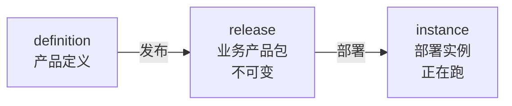
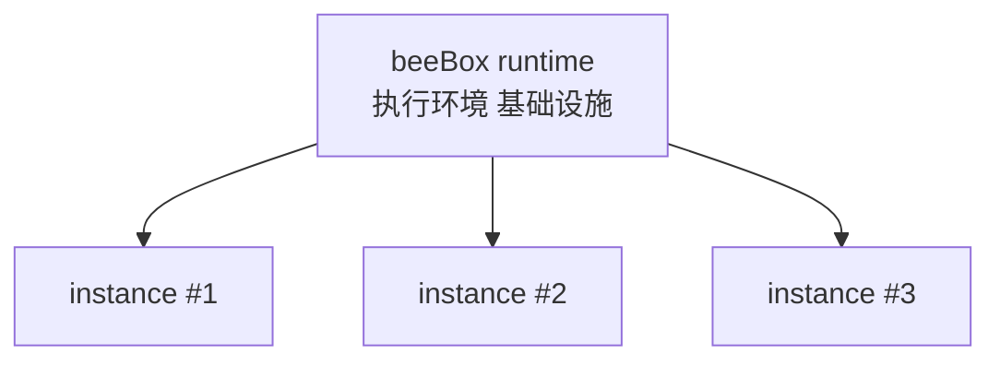

# beeBox 设计 v0.1

> **状态**：v0.1 草稿 · 修订中
> **日期**：2026-09-11
> **定位**：beeBox = 持续交付 1 个明确业务结果的数字精益工作单元

---

## 0. 一句话

beeBox 是持续交付一类明确业务结果的数字精益工作单元。

---

## 1. 产品定位

### 1.1 第一性定义

> **beeBox 是持续交付一类明确业务结果的数字精益工作单元。**

拆开看 4 个关键词：

- **业务结果**——可被验收的产出（不是任务、不是流程、不是操作）；beeBox 围绕"一类"（一组同类的）业务结果构建——可以持续重复跑出 N 个具体的业务结果
- **持续交付**——不是一次性完成，是持续地、可重复地交付
- **数字精益工作单元**——精益 cell 的数字版本，装在机器上的、可远程观察的
- **产品单元**——1 个独立可安装、可运行、可度量、可改善的产品单元

### 1.2 4 个产品属性

| 属性 | 含义 |
|---|---|
| **可安装** | 一份包安装出 1 个可工作的 beeBox |
| **可运行** | 启动后持续接收触发、持续产出业务结果 |
| **可度量** | 运行时数据可观测、可统计 |
| **可持续改善** | 运行时数据反哺业务改进（看板 → 调优 → 验证）|

### 1.3 3 个核心价值

| 价值 | 含义 |
|---|---|
| **业务结果导向** | 1 个 beeBox 围绕 1 个明确业务结果（不是任务、不是流程、不是操作）|
| **持续流动** | 通过拉动 / WIP 限制 / 队列透明 / 瓶颈暴露，持续减少等待与积压 |
| **持续改善** | 运行时数据反哺业务改进（看板数据 → 调优 → 验证）|

### 1.4 边界关系

| 概念 | 范围 | 关系 |
|---|---|---|
| **operation** | 1 个不可再分的加工动作（input / output / type 已声明）| 最小执行单元（原子工序）|
| **beeline** | 1 类任务的标准作业路线 | 1...N 个 operation 的有序序列 |
| **beeBox** | 1 个可独立运营和验收的数字工作 cell | 1...N 条 beeline 组成 |
| **企业价值流** | 端到端业务流 | 1...N 个 beeBox 串联 |

例子（电商订单履行）：
- beeBox 1：订单接收（验收 = 入库率）
- beeBox 2：仓库分拣（验收 = 准确率）
- beeBox 3：物流发货（验收 = 及时率）
- 3 个 beeBox 串联 = 订单履行企业价值流

### 1.5 产品生命周期与运行关系

beeBox 跟所有产品一样有**两件事**：**生命周期**（怎么从设计走到部署）和**运行关系**（产品跑在什么之上）。两件事落到产品上，beeBox 跑起来后每次接收触发产生 1 个 task run——产品完成一次履约，交付 1 个具体业务结果。

#### 1.5.1 产品生命周期（时间维度）

beeBox 走过 3 个阶段，每个阶段交付一份产物，产物被下一阶段消费：

- **definition**（产品定义）——业务结果 / 验收标准 / 改善指标 / beeline 列表 / 物料 schema 引用 / bee 引用
- **release**（业务产品包）——围绕 1 个业务结果发布的不可变版本，固定引用其全部 beeline_version 和依赖版本
- **instance**（部署实例）——release 的一个部署，正在跑

每个阶段一对多：1 个 definition → 多个 release（版本演进）；1 个 release → 多个 instance（多环境 / 多租户）。

#### 1.5.2 运行关系（空间维度）

instance 必须跑在一个执行环境之上——这就是 **beeBox runtime**：

- 1 个 runtime 支撑多个 instance（多租户 / 多环境）
- runtime **不属于 beeBox 产品本身**——它是 beeBox 跑在什么之上
- 升级 runtime 不需要升级 release（runtime 是基础设施维度，跟产品生命周期正交）

#### 1.5.3 产品完成一次履约（task run）

beeBox 跑起来后持续接收触发，每次触发产生 1 个 **task run**——产品完成一次履约，交付 1 个具体业务结果。

- task run **不在产品生命周期里**（不是产品演化的某个阶段）
- task run **不在运行关系里**（不是 instance 跟 runtime 的关系）
- task run 是 **产品完成一次履约**——instance 内的一次具体执行单位
- 走完 1 个 task run = 走完 1 条 beeline = 跑完 N 个 operation 步骤

#### 1.5.4 版本绑定（不可变性原则）

task run 创建时 **snapshot release**——产品一旦发布不可变，task run 锁住它创建时的 release：

- **snapshot 时点** = task run 创建瞬间
- **绑定范围** = release 隐含引用的全部 beeline_version + 依赖版本（隐式跟随 release）
- **升级语义** = 部署新 release 到**新 instance**；旧 instance 继续跑老 release；不影响已 bind task run；只影响新创建的 task run
- **回滚语义** = 部署上一个 release 到新 instance；不改变已 bind task run
- **beeline 升级** = 升级 beeline_version + 产生新 release（beeline 升级必然带动 release 升级）

#### 1.5.5 审计字段

| 字段 | 含义 |
|---|---|
| `task_run.beeBox_release` | 任务创建时的 release 标识 |
| `task_run.beeLine_id` | 任务走的是哪条 beeline（beeLine 的标识）|
| `task_run.beeLine_version` | 任务走的那条 beeline 的版本号（显式记录）|

### 1.6 交付合同

每个 beeBox 都带一份"交付合同"：

- **业务结果定义**——承诺交付什么（可被验收的产出）
- **验收标准**——怎么算"做完了"（量化指标 + 抽样方法）
- **改善指标**——怎么算"做得好"（运行效率 / 异常率 / 时延）
- **例外条款**——什么情况不交付 / 退回（异常 / 失败 / 超出范围时的回退路径）

### 1.7 跟"非运行体"的关键差异

| 维度 | 非运行体（definition / release / 文档 / 设计图 / 配置） | **beeBox instance（运行体）** |
|---|---|---|
| 形态 | 静态描述 / 版本制品 | 在跑 |
| 触发 | 人工启动 | 持续接收触发 |
| 流动 | 不流动 | 物料按工艺路线自动流转 |
| 反馈 | 无 | 运行时数据 → 反馈到改善 |
| 异常 | 靠人盯 | 异常立刻暴露（看板）+ 自働化回流 |

### 1.8 三个对立面（澄清 beeBox 不是什么）

| 对比对象 | beeBox 不一样在哪 |
|---|---|
| ❌ 业务流程文档 / SOP | SOP 是"描述跑法"；beeBox 是"持续交付业务结果" |
| ❌ 通用工作流引擎（Camunda / Airflow）| 工作流引擎只编排任务、不承诺业务结果；beeBox 自带业务结果定义 + 验收标准 |
| ❌ RPA（机器人流程自动化）| RPA 模拟"人在哪个软件点哪里"；beeBox 编排"业务怎么流动、交付什么结果"——RPA 改操作，beeBox 改业务 |
