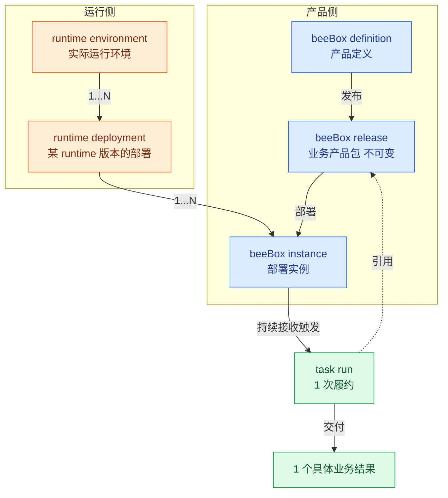
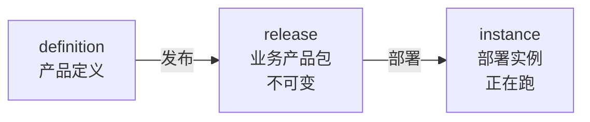
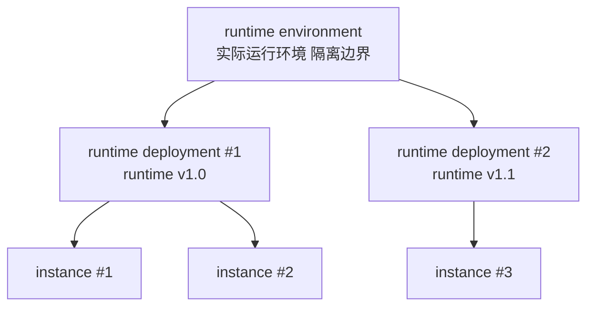

# beeBox 设计 v0.1

> **状态**：v0.1 草稿 · 修订中
> **日期**：2026-09-13
> **定位**：beeBox = 持续交付一类明确业务结果的数字精益工作单元

---

## 0. 一句话

beeBox 是持续交付一类明确业务结果的数字精益工作单元。

---

## 1. 产品定位和领域模型

beeBox 跟所有产品一样有**两件事**：**生命周期**（怎么从设计走到部署）和**运行关系**（产品跑在什么之上）。两件事落到产品上，beeBox 跑起来后每次接收触发产生 1 个 task run——产品完成一次履约，交付 1 个具体业务结果。

**总览图**（概念流转）：

**图怎么读**：

- 蓝色 = **产品侧**（definition → release → instance）
- 橙色 = **运行侧**（environment → deployment → instance）
- 绿色 = **履约层**（instance 持续接收触发 → task run → 交付业务结果）
- **instance 是产品侧和运行侧的交叉点**——既来自 release，又跑在 deployment 里
- **task run 引用 release**——instance 跑 task run 时固定引用 release 版本（不可变）

### 1.1 第一性定义

> **beeBox 是持续交付一类明确业务结果的数字精益工作单元。**

拆开看 4 个关键词：

- **业务结果**——可被验收的产出（不是任务、不是流程、不是操作）；beeBox 围绕"一类"（一组同类的）业务结果构建——可以持续重复跑出 N 个具体的业务结果
- **持续交付**——不是一次性完成，是持续地、可重复地交付
- **数字精益工作单元**——精益 cell 的数字版本，装在机器上的、可远程观察的
- **产品单元**——1 个独立可安装、可运行、可度量、可改善的产品单元
- **owner 运营**——1 个 beeBox 由 1 个 owner 负责运营（owner 是 beeBox 的运营责任主体）

### 1.2 产品属性

beeBox 是 owner 视角下的产品单元，4 个属性都是 owner 关心 / 能用上的能力：

| 属性 | 含义 |
|---|---|
| **可安装** | 一份包安装出 1 个可工作的 beeBox |
| **可运行** | 启动后持续接收触发、持续产出业务结果 |
| **可度量** | 运行时数据可观测、可统计 |
| **可持续改善** | 运行时数据反哺业务改进（owner 看板 → 调优 → 验证）|

### 1.3 核心价值

| 价值 | 含义 |
|---|---|
| **业务结果导向** | 1 个 beeBox 围绕一类明确业务结果（不是任务、不是流程、不是操作）|
| **持续流动** | 通过拉动 / WIP 限制 / 队列透明 / 瓶颈暴露，持续减少等待与积压 |
| **持续改善** | 运行时数据反哺业务改进（看板数据 → 调优 → 验证）|

### 1.4 边界关系

| 概念 | 范围 | 关系 |
|---|---|---|
| **operation** | 1 个不可再分的加工动作（input / output / type 已声明）| 最小执行单元（原子工序）|
| **beeline** | 1 类任务的标准作业路线 | 1...N 个 operation 组成的有序结构（支持顺序 / 并发 / 分支）|
| **beeBox** | 1 个可独立运营和验收的数字工作 cell | 1...N 条 beeline 组成 |
| **beeBox owner** | 1 个 beeBox 的运营责任主体 | 1 个 beeBox 指定 1 个 owner（1:1）|
| **企业价值流** | 端到端业务流 | 1...N 个 beeBox 串联 |

例子（电商订单履行）：

- beeBox 1：订单接收（验收 = 入库率）
- beeBox 2：仓库分拣（验收 = 准确率）
- beeBox 3：物流发货（验收 = 及时率）
- 3 个 beeBox 串联 = 订单履行企业价值流

### 1.5 产品生命周期

beeBox 走过 3 个阶段，都是 owner 视角下的"产品演化"：**前 2 阶段**（definition / release）是 owner 设计和发布的产物（设计 → 发布）；**第 3 阶段**（instance）是 beeBox 的运行实例——owner 部署后开始跑，持续接收触发产生 task run。

- **definition**（产品定义）——业务结果 / 验收标准 / 改善指标 / beeline 列表 / 物料 schema 引用 / bee 引用
- **release**（业务产品包）——围绕一类业务结果发布的不可变版本，固定引用其全部 beeline_version 和依赖版本
- **instance**（部署实例）——release 的一个部署，正在跑

每个阶段一对多：1 个 definition → 多个 release（版本演进）；1 个 release → 多个 instance（多环境 / 多租户）。

### 1.6 运行关系

instance 必须跑在一个执行环境之上——这就是 **beeBox runtime**。runtime 拆成 2 层：**runtime environment**（实际运行环境 + 隔离边界）跟 **runtime deployment**（某 runtime 版本在 environment 的一次具体部署）；instance 部署在 deployment 里。

- **runtime environment** = 实际运行环境 + 隔离边界
- **runtime deployment** = 某个 **runtime 版本**在 environment 的一次具体部署（runtime 隐含在 deployment 里）
- **beeBox instance** = 部署在 runtime deployment 里的应用
- **3 层关系**：1 environment → 1...N deployment；1 deployment → 1...N instance
- **多 environment 场景**：多个 **runtime environment** 描述不同环境类型（dev / staging / prod / 不同云厂商）——每个 environment 是独立的隔离边界
- runtime **不属于 beeBox 产品本身**——它是 beeBox 跑在什么之上
- 想要新 runtime 版本 = 重新创建 1 个 **新 runtime deployment**（不修改老 deployment；runtime deployment 没有"升级"这一说，每次版本变化都是新创建）；新 deployment 跟老 release **有兼容边界**——对**不兼容**的老 release 不升级（老 instance 继续在**老 deployment** 上跑完所有 in-flight task run 后下线），兼容的老 release 正常升级

---

## 2. 核心契约与执行语义

### 2.1 履约合同

每个 beeBox 都带一份"履约合同"——**owner 对客户的承诺**：beeBox 在什么条件下交付什么结果、做到什么程度、不交付 / 退回怎么算。

分 2 个层次：

**单次履约**（评价每次 task run）：

- **业务结果定义**——承诺交付什么（可被验收的产出）
- **验收标准**——怎么算"本次合格"（做完 + 做好：业务结果交付 + 质量 / 时效 / 成本 达到单次阈值）
- **例外条款**——什么情况不交付 / 退回（异常 / 失败 / 超出范围时的回退路径）

**履约指标**（评价 beeBox 持续运行）：

- **履约质量**（一次做对率 / 通过率 / 异常率 / 返工率）
- **履约时效**（交付时长 / 等待时长 / 端到端时长）
- **履约成本**（资源消耗 / 单位成本 / 浪费率）

### 2.2 task run 履约

owner 接收 task 后，beeBox 完成 1 次履约的完整流程：

1. **接收 task**——owner 接收上游（其他 beeBox / 外部系统）发来的 task
2. **选择 beeline**——owner 根据 task 内容选择 1 条 beeline 履约
3. **记录履约过程**——按 beeline 路线执行对应的 operation 步骤，逐 op 记录执行过程
4. **交付履约结果**——走完 beeline 后交付 1 个具体业务结果
5. **评估履约**——owner 根据 §2.1 履约合同评估履约过程和履约结果是否合格

补充说明：

- 1 个 task run 走完 = 1 条 beeline 走完 = beeline 包含的对应 operation 全部执行完
- task run **不在产品生命周期里**（不是产品演化的某个阶段）
- task run **不在运行关系里**（不是 instance 跟 runtime 的关系）
- task run 是 **1 次履约的完整执行单位**——从 owner 接 task 到评估结束

### 2.3 版本引用

task run 引用 release（product 不可变，固定引用）：

- **引用时点** = task run 创建瞬间
- **引用范围** = release 隐含引用的全部 beeline_version + 依赖版本（隐式跟随 release）
- **升级语义** = 部署新 release 到**新 instance** + **切流**（新接收的触发切到新 instance）；in-flight task run 不受切流影响，继续在旧 instance 上跑老 release；旧 instance 跑完所有 task run 后下线
- **回滚语义** = 部署上一个 release 到新 instance + 切流回老版本；in-flight task run 不受影响
- **beeline 升级** = 升级 beeline_version + 产生新 release（beeline 升级必然带动 release 升级）

### 2.4 审计字段

每个 task run 必须带 5 个审计字段——供 owner 复盘 / 举证 / 改进用：

| 字段 | 含义 |
|---|---|
| `task_run.beeBox_release_id` | 任务创建时的 release 标识 |
| `task_run.beeBox_instance_id` | 任务创建时的 instance 标识（执行位置）|
| `task_run.beeLine_id` | 任务走的是哪条 beeline（beeLine 的标识）|
| `task_run.beeLine_version` | 任务走的那条 beeline 的版本号（显式记录）|
| `task_run.runtime_deployment_id` | 任务创建时的 deployment 标识（运行层位置）|

---

## 3. 实现设计

具体说明 §1 提到的产品组件怎么落地实现。按 **产品侧 / 运行时 / 履约** 3 块组织：产品侧对应 beeBox 生命周期的 3 阶段（definition → release → instance），运行时对应 runtime 部署层，履约对应 task run 执行层。

### 3.1 BeeBox definition

definition 是 beeBox 产品的"设计图"——定义 1 个 beeBox 长什么样、跑哪些 beeline、每条 beeline 怎么编排、用哪些 bee 工人、需要什么物料 schema。

#### 3.1.1 存储形态

- **结构化 schema**——beeBox definition 是结构化描述（JSON / YAML / DB 记录），不是代码、不是配置文件散落
- **1 个 definition 1 份记录**——definition 是 1 个有版本演进的设计对象（不是 1 次性文件）；支持查看、对比、版本回溯
- **与代码解耦**——definition 不嵌入在某个代码仓里，是平台/管理面的对象；beeline / bee / schema 各自有自己的仓库，definition 只**引用**它们

#### 3.1.2 数据结构

definition 包含 4 块内容：

| 块 | 内容 | 备注 |
|---|---|---|
| **业务结果声明** | 1 个 beeBox 围绕哪类业务结果（业务定义 + 验收标准 + 例外条款）| 对应 §2.1 单次履约 |
| **履约指标定义** | 质量 / 时效 / 成本 各自的度量方式 + 目标值 | 对应 §2.1 履约指标 |
| **beeline 列表** | 1...N 条 beeline 引用（每条带约束：可触发条件 / 适用场景）| 引用 §1.1.4 beeline |
| **依赖引用** | bee 类型引用 / 物料 schema 引用 / 外部系统接入点 | 全部用"引用"——松耦合 |

> 1 个 definition **不包含** beeline / bee / schema 的**实现**——只引用它们的标识和版本约束。

#### 3.1.3 引用机制

definition 跟 beeline / bee / schema 的关系是**"引用"**（"标识 + 版本约束"），不是"内嵌"：

- **beeline 引用**——`beeline_id` + `beeline_version` 约束（如 `^1.0.0`）；definition 不持有 beeline 的实现
- **bee 引用**——`bee_type` + 必要参数；bee 自身独立维护（bee 仓库）
- **schema 引用**——`schema_id` + `schema_version`；物料校验规则独立维护
- **引用时点**——definition 引用的是"目标对象在某 version 的状态"；version 变更需要升级 definition（或接受新版本自动联动）

引用而非内嵌的好处：
- beeline / bee / schema 各自独立版本演进
- 同一份 beeline 可被多个 definition 引用（复用）
- definition 自身只描述产品设计，体积小、易对比

#### 3.1.4 编辑与验证

- **编辑方式**——通过管理面 / API 创建 / 修改 definition（不是直接改 JSON 文件）
- **schema 校验**——definition 自身有 schema（"definition 怎么写"），编辑时实时校验字段、类型、必填项
- **引用完整性校验**——保存前校验所有引用都真实存在（beeline_id 是否注册 / bee_type 是否可用 / schema_id 是否存在）
- **履约指标可达性**——校验指标定义里引用的数据源可观测（没有引向不存在的指标）

#### 3.1.5 与 release 的关系

definition 修改 **不影响已发布 release**：

- release 是 definition 在某时刻的**不可变快照**（详见 §3.2）
- definition 修改后，原 release 仍然按老定义继续运行（in-flight task run 不受新 definition 影响）
- 修改 definition 后想用上 → 触发新 release（基于新 definition 重新打包）→ 部署到新 instance → 切流

definition 是**演化的设计对象**，release 是**冻结的运行版本**——两者解耦，definition 可频繁改，release 一旦发布不变。

### 3.2 BeeBox release

（待写）

### 3.3 BeeBox instance

（待写）

### 3.4 运行时实现

- **runtime deployment 启动**：在 environment 内启动 1 个 runtime deployment（绑定到某 runtime 版本）
- **instance 接入**：instance 启动时绑定到 1 个 runtime deployment

### 3.5 履约实现

- **task run 触发**：instance 接收触发（§2.2）→ 产生 1 个 task run
- **beeline 加载**：task run 走 1 条 beeline（从 §2.3 release 隐含引用）
- **operation 执行**：task run 按 beeline 路线执行对应的 operation 步骤
- **异常处理**：op 异常 → 按 §1.3 持续流动原则暴露（具体机制留待后续）
- **审计**：每个 task run 记录 §2.4 字段
