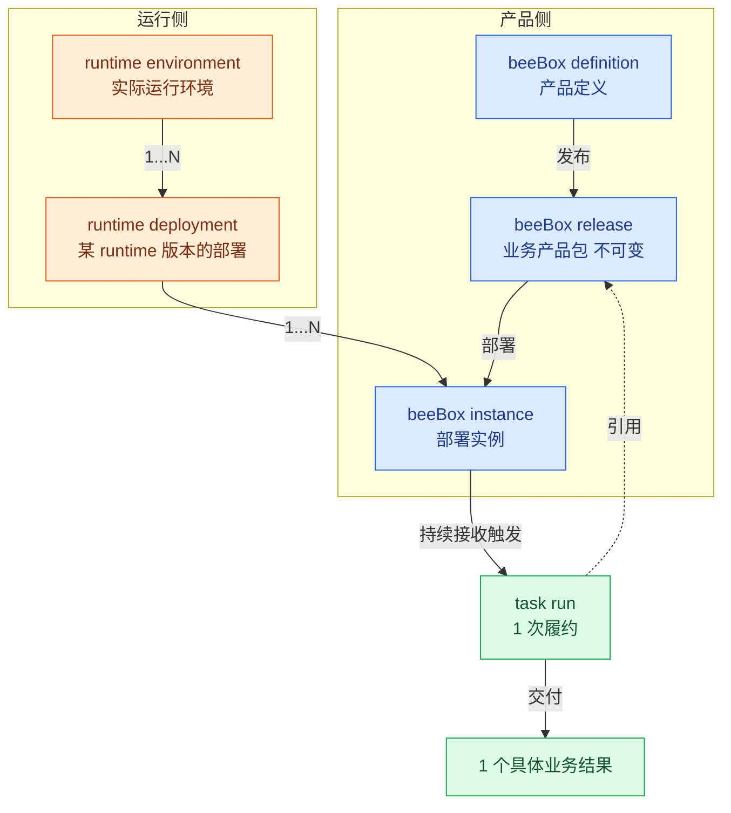
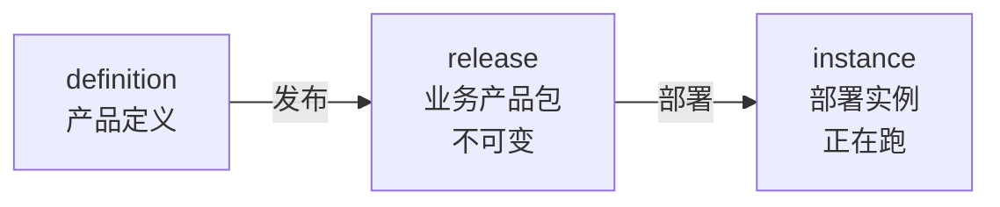
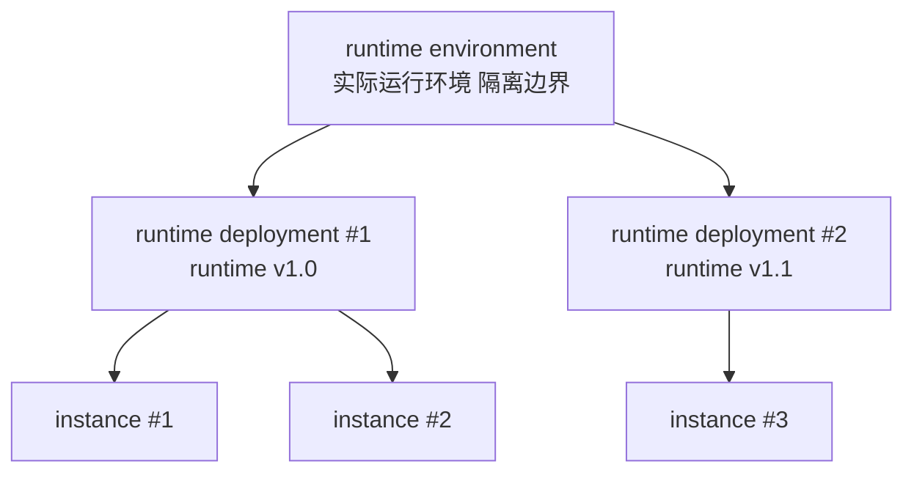

# beeBox 设计 v0.1

> **状态**：v0.1 草稿 · 修订中
> **日期**：2026-09-13
> **定位**：beeBox = 持续交付一类明确业务结果的数字精益工作单元

---

## 0. 一句话

beeBox 是持续交付一类明确业务结果的数字精益工作单元。

---

## 1. 产品定位和领域模型

beeBox 跟所有产品一样有**两件事**：**生命周期**（怎么从设计走到部署）和**运行关系**（产品跑在什么之上）。两件事落到产品上，beeBox 跑起来后每次接收触发产生 1 个 task run——产品完成一次履约，交付 1 个具体业务结果。

**总览图**（概念流转）：

**图怎么读**：

- 蓝色 = **产品侧**（definition → release → instance）
- 橙色 = **运行侧**（environment → deployment → instance）
- 绿色 = **履约层**（instance 持续接收触发 → task run → 交付业务结果）
- **instance 是产品侧和运行侧的交叉点**——既来自 release，又跑在 deployment 里
- **task run 引用 release**——instance 跑 task run 时固定引用 release 版本（不可变）

### 1.1 第一性定义

> **beeBox 是持续交付一类明确业务结果的数字精益工作单元。**

拆开看 4 个关键词：

- **业务结果**——可被验收的产出（不是任务、不是流程、不是操作）；beeBox 围绕"一类"（一组同类的）业务结果构建——可以持续重复跑出 N 个具体的业务结果
- **持续交付**——不是一次性完成，是持续地、可重复地交付
- **数字精益工作单元**——精益 cell 的数字版本，装在机器上的、可远程观察的
- **产品单元**——1 个独立可安装、可运行、可度量、可改善的产品单元

### 1.2 产品属性

| 属性 | 含义 |
|---|---|
| **可安装** | 一份包安装出 1 个可工作的 beeBox |
| **可运行** | 启动后持续接收触发、持续产出业务结果 |
| **可度量** | 运行时数据可观测、可统计 |
| **可持续改善** | 运行时数据反哺业务改进（看板 → 调优 → 验证）|

### 1.3 核心价值

| 价值 | 含义 |
|---|---|
| **业务结果导向** | 1 个 beeBox 围绕一类明确业务结果（不是任务、不是流程、不是操作）|
| **持续流动** | 通过拉动 / WIP 限制 / 队列透明 / 瓶颈暴露，持续减少等待与积压 |
| **持续改善** | 运行时数据反哺业务改进（看板数据 → 调优 → 验证）|

### 1.4 边界关系

| 概念 | 范围 | 关系 |
|---|---|---|
| **operation** | 1 个不可再分的加工动作（input / output / type 已声明）| 最小执行单元（原子工序）|
| **beeline** | 1 类任务的标准作业路线 | 1...N 个 operation 组成的有向图（支持顺序 / 并发 / 分支）|
| **beeBox** | 1 个可独立运营和验收的数字工作 cell | 1...N 条 beeline 组成 |
| **queen** | 1 个 beeBox 的运营责任主体 | 1 个 beeBox 指定 1 个 queen（1:1）|
| **企业价值流** | 端到端业务流 | 1...N 个 beeBox 串联 |

例子（电商订单履行）：

- beeBox 1：订单接收（验收 = 入库率）
- beeBox 2：仓库分拣（验收 = 准确率）
- beeBox 3：物流发货（验收 = 及时率）
- 3 个 beeBox 串联 = 订单履行企业价值流

### 1.5 产品生命周期

beeBox 走过 3 个阶段：**前 2 阶段**（definition / release）是 beeBox 的产物（被设计 / 被发布）；**第 3 阶段**（instance）是 beeBox 的运行实例——产品装上后开始跑，持续接收触发产生 task run。

每个 beeBox 由 1 个 queen 负责运营——queen 是 beeBox 的责任主体（决定 beeBox 接收什么 task / 交付什么 result），不是 runtime 实现组件。queen 不在产品生命周期 3 阶段里独立成段（queen 是 beeBox 的属性，beeBox 装上后 queen 自然跟着运行）。

- **definition**（产品定义）——业务结果 / 验收标准 / 改善指标 / beeline 引用（通过 task 1:1 绑定）
- **release**（业务产品包）——围绕一类业务结果发布的不可变版本，固定引用其全部 beeline_version 和依赖版本
- **instance**（部署实例）——release 的一个部署，正在跑

每个阶段一对多：1 个 definition → 多个 release（版本演进）；1 个 release → 多个 instance（多环境 / 多租户）。

### 1.6 运行关系

instance 必须跑在一个执行环境之上——这就是 **beeBox runtime**。runtime 拆成 2 层：**runtime environment**（实际运行环境 + 隔离边界）跟 **runtime deployment**（某 runtime 版本在 environment 的一次具体部署）；instance 部署在 deployment 里。

- **runtime environment** = 实际运行环境 + 隔离边界
- **runtime deployment** = 某个 **runtime 版本**在 environment 的一次具体部署（runtime 隐含在 deployment 里）
- **beeBox instance** = 部署在 runtime deployment 里的应用
- **3 层关系**：1 environment → 1...N deployment；1 deployment → 1...N instance
- **多 environment 场景**：多个 **runtime environment** 描述不同环境类型（dev / staging / prod / 不同云厂商）——每个 environment 是独立的隔离边界
- runtime **不属于 beeBox 产品本身**——它是 beeBox 跑在什么之上
- 想要新 runtime 版本 = 重新创建 1 个 **新 runtime deployment**（不修改老 deployment；runtime deployment 没有"升级"这一说，每次版本变化都是新创建）；新 deployment 跟老 release **有兼容边界**——对**不兼容**的老 release 不升级（老 instance 继续在**老 deployment** 上跑完所有 in-flight task run 后下线），兼容的老 release 正常升级

---

## 2. 核心契约与执行语义

### 2.1 履约合同

每个 beeBox 都带一份"履约合同"，分 2 个层次：

**单次履约**（评价每次 task run）：

- **业务结果定义**——承诺交付什么（可被验收的产出）
- **验收标准**——怎么算"本次合格"（做完 + 做好：业务结果交付 + 质量 / 时效 / 成本 达到单次阈值）
- **例外条款**——什么情况不交付 / 退回（异常 / 失败 / 超出范围时的回退路径）

**履约指标**（评价 beeBox 持续运行）：

- **履约质量**（一次做对率 / 通过率 / 异常率 / 返工率）
- **履约时效**（交付时长 / 等待时长 / 端到端时长）
- **履约成本**（资源消耗 / 单位成本 / 浪费率）

### 2.2 task run 履约

beeBox 跑起来后持续接收触发，每次触发产生 1 个 **task run**——产品完成一次履约，交付 1 个具体业务结果。

- task run **不在产品生命周期里**（不是产品演化的某个阶段）
- task run **不在运行关系里**（不是 instance 跟 runtime 的关系）
- task run 是 **产品完成一次履约**——instance 内的一次具体执行单位
- 走完 1 个 task run = 走完 1 条 beeline = 按 beeline 路线执行对应的 operation 步骤

### 2.3 版本引用

task run 引用 release（product 不可变，固定引用）：

- **引用时点** = task run 创建瞬间
- **引用范围** = release 隐含引用的全部 beeline_version + 依赖版本（隐式跟随 release）
- **升级语义** = 部署新 release 到**新 instance** + **切流**（新接收的触发切到新 instance）；in-flight task run 不受切流影响，继续在旧 instance 上跑老 release；旧 instance 跑完所有 task run 后下线
- **回滚语义** = 部署上一个 release 到新 instance + 切流回老版本；in-flight task run 不受影响
- **beeline 升级** = 升级 beeline_version + 产生新 release（beeline 升级必然带动 release 升级）

### 2.4 审计字段

每个 task run 必须带 5 个审计字段：

| 字段 | 含义 |
|---|---|
| `task_run.beeBox_release_id` | 任务创建时的 release 标识 |
| `task_run.beeBox_instance_id` | 任务创建时的 instance 标识（执行位置）|
| `task_run.beeLine_id` | 任务走的是哪条 beeline（beeLine 的标识）|
| `task_run.beeLine_version` | 任务走的那条 beeline 的版本号（显式记录）|
| `task_run.runtime_deployment_id` | 任务创建时的 deployment 标识（运行层位置）|

---

## 3. 实现设计

具体说明 §1 提到的产品组件怎么落地实现。按 **产品侧 / 运行时 / 履约** 3 块组织：产品侧对应 beeBox 生命周期的 3 阶段（definition → release → instance），运行时对应 runtime 部署层，履约对应 task run 执行层。

**queen**（beeBox 1:1 责任主体，§1.4）是 beeBox 的**设计层属性**——1 个 beeBox 指定 1 个 queen（哪个责任主体）。queen 不属于 runtime 实现组件（trigger handler / executor / bee 才是）；queen 只在 §3.1 definition 里作为 beeBox 的属性声明，runtime 平台跟 queen 解耦。

### 3.1 BeeBox definition

definition 是 beeBox 产品的"设计图"——定义 1 个 beeBox 接收什么 task、每类 task 走哪条 beeline、交付什么业务结果、用什么度量评估。

#### 3.1.1 存储形态

- **结构化 schema**——beeBox definition 是结构化描述（JSON / YAML / DB 记录），不是代码、不是配置文件散落
- **1 个 definition 1 份记录**——definition 是 1 个有版本演进的设计对象（不是 1 次性文件）；支持查看、对比、版本回溯
- **与代码解耦**——definition 不嵌入在某个代码仓里，是平台/管理面的对象；beeline / schema 各自独立维护，definition 只**引用**它们

#### 3.1.2 数据结构

definition 包含**基础元信息 + 履约生命周期 4 块**：

| 块 | 内容 | 备注 |
|---|---|---|
| **基础元信息** | beeBox 基础标识（id / version / description / **queen**）| queen 是 beeBox 1:1 责任主体 |
| **履约对象** | beeBox 接收什么 task（输入 schema / 适用业务场景）| 1 个 beeBox 可能接收多类 task；每类 task 1:1 绑定 1 条 beeline |
| **履约过程** | 怎么履约（每类 task 1:1 绑定 1 条 beeline，beeline 内部资源归 beeline 自己管）| 全部用"引用"——松耦合 |
| **履约结果** | 1 个 beeBox 交付什么业务结果（业务定义 + 验收标准 + 例外条款）| 对应 §2.1 单次履约 |
| **履约度量** | 质量 / 时效 / 成本 各自的度量方式 + 目标值 | 对应 §2.1 履约指标 |

> 1 个 definition **不包含** beeline / schema 的**实现**——只引用它们的标识。

#### 3.1.3 引用机制

definition 跟 beeline / schema 的关系是**"引用"**（按被引用对象自身字段形式），不是"内嵌"——"履约过程"块里所有引用都遵循这个机制：

- **beeline 引用**——`beeline_id` + `beeline_version`（递增序列号，绑定到具体 version）；definition 不持有 beeline 的实现；引用发生在 task 块（每类 task 1:1 绑定 1 条 beeline）
- **task / result 的 schema 引用**——`task_schema` / `result_schema` 引用 schema 资源（schema 是数据/资源对象，按 id 定位）
- **引用时点**——definition 引用的是"目标对象的当前状态"；被引用对象演进时通过新建对象 + 切换 definition 引用

引用而非内嵌的好处：
- beeline / schema 各自独立维护，definition 不需要知道实现细节
- 同一份 beeline 可被多个 definition 引用（通过 id 定位）
- definition 自身只描述产品设计，体积小、易对比

#### 3.1.4 编辑与验证

- **编辑方式**——通过管理面 / API 创建 / 修改 definition（不是直接改 JSON 文件）
- **schema 校验**——definition 自身有 schema（"definition 怎么写"），编辑时实时校验字段、类型、必填项
- **引用完整性校验**——保存前校验所有引用都真实存在（task 绑定的 beeline_id + version 是否可用 / task_schema / result_schema 是否存在）
- **履约指标可达性**——校验指标定义里引用的数据源可观测（没有引向不存在的指标）

#### 3.1.5 与 release 的关系

definition 修改 **不影响已发布 release**：

- release 是 definition 在某时刻的**不可变快照**（详见 §3.2）
- definition 修改后，原 release 仍然按老定义继续运行（in-flight task run 不受新 definition 影响）
- 修改 definition 后想用上 → 触发新 release（基于新 definition 重新打包）→ 部署到新 instance → 切流

definition 是**演化的设计对象**，release 是**冻结的运行版本**——两者解耦，definition 可频繁改，release 一旦发布不变。

definition 的具体结构化 schema 定义见 [beebox-definition-schema.md](./beebox-definition-schema.md)。

### 3.2 BeeBox release

release 是 beeBox definition 的**不可变快照**——definition 当时的完整状态（task 列表 / result / metrics）+ 所有外部引用固定到具体版本（beeline_version / schema_id）。

#### 3.2.1 release 是什么

- **不可变**——发布后内容不能改；升级 = 发布新 release，不修改老 release
- **完整快照**——含 definition 全部内容 + 所有引用对象的固定版本（跟 definition 不同，definition 引用是"当前"语义，release 引用是"固定"语义）
- **独立标识**——每个 release 有 `release_id`（按 definition_id 派生，如 `task-fulfillment@1.2.0`）+ 发布时间戳

#### 3.2.2 打包流程

definition → release 的过程：

1. **校验 definition**——definition 自身 schema 校验 + 所有引用都真实存在（beeline_id / task_schema / result_schema 都在）
2. **固定所有引用版本**——beeline 引用固定到具体 `beeline_version`（release 不再使用 `^1.0.0` 约束语义，每个 release 绑定具体 version）
3. **生成不可变 artifact**——definition 内容 + 固定版本引用打包成 1 个 release（带 release_id + 时间戳 + 不可变校验和）
4. **存储**——release 写入 release 仓库（按 release_id 索引，不允许覆盖）

#### 3.2.3 打包内容

1 份 release 包含：

| 块 | 内容 | 来源 |
|---|---|---|
| **元信息** | release_id / definition_id / definition_version / 发布时间戳 / 校验和 | 打包时生成 |
| **definition 内容** | task 列表 / result / metrics 全部内容 | 从 definition 复制 |
| **beeline 引用（固定）** | 1...N 条 `{beeline_id, beeline_version}` | 从 definition 复制并固定 version |
| **schema 引用** | task_schema / result_schema / operation input/output 引用的 schema 完整内容 | 拉取 schema 实际内容嵌入（不只引用）|
| **依赖清单** | 1 份 release 涉及的所有 beeline_id / schema_id 清单 | 打包时扫描生成（用于审计 / 复盘）|

> release 嵌入 schema 实际内容（不只引用）——保证 release 独立可运行，schema 后续修改不影响老 release。

#### 3.2.4 不可变性

- **写后只读**——release 发布后内容不能修改
- **校验和验证**——每次读取 release 用校验和验证完整性（防意外篡改）
- **不允许覆盖**——同 `release_id` 不能发布第二次（强制不可变）
- **保留历史**——所有 release 永久保留，不删除（升级 = 部署新 release，不是替换老 release）

#### 3.2.5 升级 / 回滚

**升级**（beeBox 行为改进）：

1. 修改 definition → 触发新 release（`@1.3.0`）
2. 部署新 release 到新 instance（不动老 instance）
3. 切流——新接收的触发走新 instance，老 instance 继续消化 in-flight task run
4. 老 instance 跑完所有 in-flight 后下线
5. 升级完成，新 release 100% 流量

**回滚**（新 release 有问题）：

1. 部署上一个 release（`@1.2.0`）到新 instance
2. 切流回老 release
3. 新 release instance 下线

**关键点**：
- in-flight task run 不受切流影响（在老 instance 跑老 release 直到完成）
- 升级 / 回滚都是"创建新 instance + 切流"，不是修改老 instance
- 任意时刻都有 1...N 个 release 跑在 instance 上（升级过渡期）

### 3.3 BeeBox instance

instance 是 release 的**运行实例**——1 个 release 的 1 次部署，跑在 runtime deployment 里，持续接收 task 产生 task run。

#### 3.3.1 instance 是什么

- **1 个 instance = 1 个 release 的 1 次部署**——instance 跟 release 1:1 绑定（1 个 instance 只跑 1 个 release）
- **跑在 deployment 里**——instance 不能独立存在，必须跑在 1 个 runtime deployment 里；同 1 个 deployment 可跑 1...N 个 instance
- **多实例并存**——1 个 release 可部署多个 instance（多环境 / 多租户 / 升级过渡期并存）
- **状态有生命周期**——启动 → 运行 → 排空 → 停止

#### 3.3.2 部署流程

release → instance 的过程：

1. **选定 release**——按 `release_id` 选 1 个具体 release
2. **选定 runtime deployment**——instance 跑在哪个 deployment（按兼容性、容量等选择）
3. **启动 instance**——加载 release 全部内容（definition + 固定引用），绑定到选定的 deployment
4. **instance 就绪**——开始接收 task，进入"运行中"状态

**关键点**：
- 1 个 instance 启动后不能换 release（要换 release = 部署新 instance + 切流）
- 1 个 instance 启动后不能换 deployment（同理）

#### 3.3.3 instance 生命周期

| 状态 | 含义 | 行为 |
|---|---|---|
| **启动中** | 加载 release 还没就绪 | 不接收 task |
| **运行中** | 已就绪，正常接收 task | 接收 task，产生 task run |
| **排空中** | 停止接收新 task，等待 in-flight 完成 | 拒收新 task，跑完已有 task run |
| **已停止** | 无 task run，可删除 | 不接收 task，不跑 task run |

状态转换：
- 启动中 → 运行中（启动完成）
- 运行中 → 排空中（发起下线 / 升级切流）
- 排空中 → 已停止（in-flight 全部完成）
- 运行中 → 已停止（异常情况，强杀）

#### 3.3.4 跟 task run 的关系

- task run 在 instance 内产生（§2.2）—— instance 接收 task → 产生 task run
- task run 引用 release（不可变绑定，§2.3）—— 当前 instance 跑哪个 release，task run 就引用哪个 release
- task run 同时引用 instance（执行位置，§2.4 audit 字段 `task_run.beeBox_instance_id`）
- 升级切流后，老 instance 继续消化 in-flight task run 直到全部完成

#### 3.3.5 跟 runtime 的关系

- instance 跑在 runtime deployment 里（§1.6 运行关系）—— 1 deployment 跑 1...N instance
- instance 启动时绑定到 1 个 deployment（绑定后不能换）
- deployment 升级 = 创建新 deployment（不是"升级"老 deployment），老 deployment 上的老 instance 不受影响
- 兼容性边界：
  - **兼容**——新 deployment 可跑老 release 的 instance（迁移 instance 到新 deployment）
  - **不兼容**——老 instance 继续在老 deployment 上跑完 in-flight 后下线

### 3.4 运行时实现

runtime environment / runtime deployment / instance 3 层的实现细节。

#### 3.4.1 runtime deployment 启动

**启动流程**：

1. **选定 environment**——选 1 个 runtime environment（dev / staging / prod / 不同云厂商）
2. **选定 runtime 版本**——选 1 个具体 runtime 版本（如 `runtime v1.0.0`）
3. **创建 deployment**——在 environment 内启动 1 个 deployment（带 `runtime_deployment_id` 标识）
4. **就绪**——deployment 启动完成后等待 instance 接入

**deployment 标识**：`runtime_deployment_id`（按 environment_id + runtime_version 派生，如 `env_prod__runtime_v1.0.0__deploy_001`）

**deployment 状态**：
- 启动中（runtime 拉起中）
- 就绪（可接收 instance 接入）
- 排空中（不再接收新 instance，老 instance 跑完后清空）
- 已停止（清空完成，可删除）

#### 3.4.2 instance 接入

**接入流程**：

1. **加载 release**——instance 启动时加载 1 个具体 release（release_id）
2. **注册到 deployment**——instance 注册到 1 个 deployment，建立连接
3. **健康检查**——instance 通过 deployment 暴露的健康检查端点确认就绪
4. **开始接收 task**——进入"运行中"状态

**约束**：
- 1 个 instance 只能绑定 1 个 deployment（绑定后不能换）
- 1 个 instance 启动时校验 release 跟 deployment 的兼容性
- 兼容性失败 → instance 启动失败（不部署）

#### 3.4.3 运行时升级

**升级 runtime 版本 = 创建新 deployment**（不修改老 deployment）：

- 老 deployment 上的老 instance 继续跑老 release，不受影响
- 新 deployment 准备好后，老 instance 可选择性迁移（见 §3.4.4 兼容性边界）
- 老 deployment 上的 instance 全跑完后，deployment 可下线

**升级不能"原地升级"**——每次 runtime 版本变化都是创建新 deployment（保持老 deployment 不可变，老 instance 行为可追溯）。

#### 3.4.4 兼容性边界

新 deployment 跟老 release 的兼容性有 2 种处理：

| 兼容性 | 处理 |
|---|---|
| **兼容** | 新 deployment 可跑老 release → 老 instance 可迁移到新 deployment（流量随之迁移，instance 继续跑 release）|
| **不兼容** | 新 deployment 不能跑老 release → 老 instance 继续在老 deployment 上跑完所有 in-flight task run 后下线 |

**兼容性判定**：
- runtime 版本变更（minor / patch）：通常兼容
- runtime 大版本变更（major）：可能不兼容
- 具体判定由 runtime 平台给出（beeBox / release 不关心）

#### 3.4.5 多 environment 场景

1 个 beeOS 平台可管理多个 runtime environment：

| environment | 用途 | 典型例子 |
|---|---|---|
| **dev** | 开发联调 | 每个开发者 1 个独立 environment |
| **staging** | 预发布验证 | 1 个团队共享 |
| **prod** | 生产服务 | 多区域 / 多云厂商 |

- **隔离边界**——每个 environment 是独立的隔离边界（不同环境之间不共享数据 / 资源）
- **跨 environment 部署**——同一份 release 可部署到多个 environment（dev 验证完 → staging 验证 → prod 上线）
- **environment 注册**——platform 管理员注册 environment，标记用途 / 区域 / 云厂商

### 3.5 履约实现

task run 在 instance 内的完整执行流程。

#### 3.5.1 task run 触发

**触发来源**：
- 上游 beeBox（其他 instance 发来的 task，通过 instance 间协议）
- 外部系统（HTTP / 消息队列 / 定时器等）
- 平台调度（运维手动触发 / 自动扩缩容触发的预热 task）

**触发流程**：

1. **instance 接收 trigger**——trigger 包含 task 数据（按 task_schema 形状）
2. **task run 创建**——instance 立即创建 1 个 task run（带 §2.4 全部 audit 字段），task run 不可变记录开始时间 / 入口数据
3. **进入执行**——task run 派发到 instance 的执行器（执行 beeline 编排）

**关键点**：
- 触发瞬间 task run 就绑定到 release（不可变，§2.3）—— instance 后续切流不影响这个 task run
- in-flight task run 受 instance 状态保护（instance 下线前要排空，§3.3.3）

#### 3.5.2 beeline 加载

**加载流程**：

1. **task run 选 beeline**——按 task 的 `beeline_id`（在 definition 里绑定）从 instance 加载的 release 中找到具体 beeline
2. **校验**——校验 beeline 完整性（operations / next 链 / 无环，参见 `beebox-beeline-schema.md` 字段约束）
3. **构建执行图**——把 beeline 的有向图加载到 instance 的执行器中（每个 op_id 变成 1 个可执行节点）

**关键点**：
- beeline 已经在 release 中固定版本（§3.2.3 打包内容），instance 不需要再查外部
- 加载过程开销小（beeline 已经在内存中，instance 启动时一次性加载完所有 beeline）

#### 3.5.3 operation 执行

**执行流程**（按 beeline 有向图）：

1. **起点 operation**——找到 `input_from: external` 的 op（task 输入作为起点）
2. **逐 op 执行**——按 next 链推进：
   - **顺序**——按 next 顺序执行下一个 op
   - **并发**——同时启动多个 next op（fan-out）
   - **分支**——按 `when` 条件选 1 个 next op（互斥）
   - **汇聚**——所有前置 op 完成后才执行当前 op（fan-in）
3. **op 内动作**——每个 op 调对应的 `bee`（`bee.type` 寻址 worker）或 `external_system` 完成具体加工
4. **终点**——没有 next 的 op 完成时 task run 结束

**关键点**：
- task run 跨 op 的状态（input / output 中间数据）保存在 instance 内存或临时存储
- 每个 op 执行结果记录到 task run 审计字段（步骤级日志）

#### 3.5.4 异常处理

按 §1.3 持续流动原则暴露——不静默吞错，让异常显式可观测。

**异常分类**：

| 异常 | 处理 |
|---|---|
| **op 执行失败**（bee 抛错 / 外部系统超时）| 当前 op 标记为失败，按 beeline 编排决定下一步（无 next = task run 失败；分支条件可走错误处理 op）|
| **beeline 完整性错误**（环 / 引用不存在）| 加载时校验失败 → task run 不创建（启动期错误，不进入执行）|
| **task 数据不符合 schema**（task_schema 校验失败）| 触发时校验失败 → trigger 拒绝（不创建 task run）|

**暴露方式**：
- task run 记录每步异常（步骤级 error 信息）
- §2.4 audit 字段含异常信息
- 业务侧可通过 task run 查询接口查异常
- 持续改善靠异常数据驱动（§1.3 持续流动）

#### 3.5.5 审计

每个 task run 记录 §2.4 全部 audit 字段：

| 字段 | 何时记录 |
|---|---|
| `task_run.beeBox_release_id` | task run 创建时（绑定 release）|
| `task_run.beeBox_instance_id` | task run 创建时（绑定 instance）|
| `task_run.beeLine_id` | beeline 加载时 |
| `task_run.beeLine_version` | beeline 加载时 |
| `task_run.runtime_deployment_id` | task run 创建时（绑定 deployment）|
| 步骤级日志 | 每个 op 执行完成时（input / output / duration / error）|
| 异常信息 | op 失败时 |

**审计原则**：
- audit 字段在 task run 创建瞬间定型（不可变）
- 步骤级日志 + 异常信息可后续追加（不影响 audit 字段）
- audit 用于复盘 / 举证 / 改进（§1.3 持续改善）
