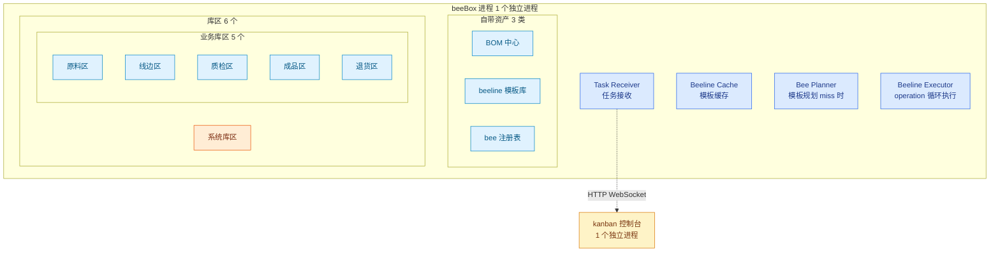
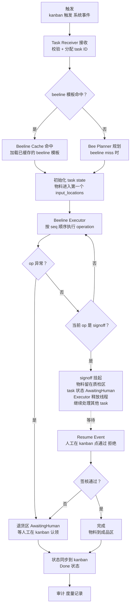
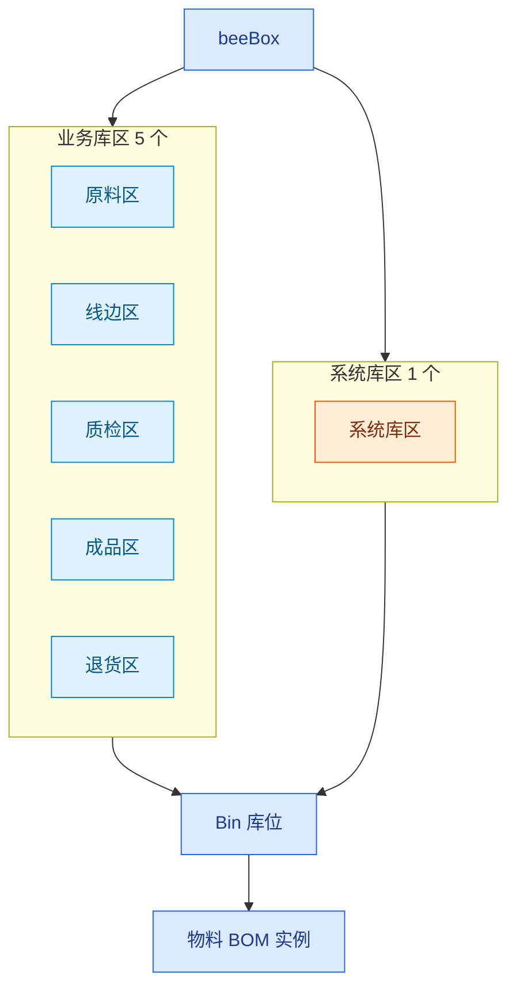
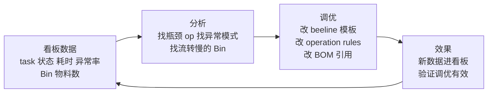
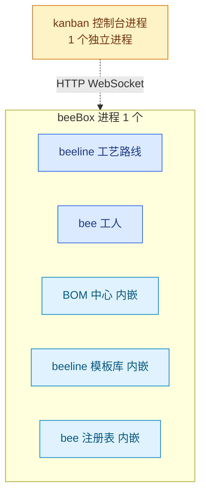

# beeBox 设计 v0.1

> **状态**：v0.1 草稿 · 修订中
> **日期**：2026-09-11
> **定位**：beeBox = 数字精益工作单元（独立交付单元 / 独立进程 / 自带一切资产）

## 0. 一句话

beeBox 三大要素 **beeline（流水线 / 工艺路线）/ bee（工人 / 智能体）/ 库区（5 业务 + 1 系统）**，一个内置控制台 **kanban（看板视图）**。
**beeline 在 beeBox 内跑**，由 **operation（工序）** 序列组成；**agent operation 调 bee**；
beeBox 内部库区分 **2 类**：**业务库区**（5 个：原料 / 线边 / 质检 / 成品 / 退货，物料流转）+ **系统库区**（1 个：凭证 / 连接 / 限流，bee 按需调取）。
每个 operation 驱动物料在 **5 业务库区**间流转。

> 1 个 beeBox = 1 个完整业务价值流；beeBox 是 v0.1 的交付单元，自带 BOM / beeline 模板 / bee 注册表。

## 1. 定位与边界

### 1.1 beeBox 是什么

beeBox 是一个**独立交付单元**——装上就能跑出一个完整业务价值流：

- **自带资产**——BOM 中心 / beeline 模板库 / bee 注册表全部内嵌在 beeBox 包内，零外部依赖
- **自带运行时**——4 大内核组件（Task Receiver / Beeline Cache / Bee Planner / Beeline Executor）跑在 beeBox 进程内
- **自带看板**——kanban 控制台是 beeBox 的标配 UI，看任务流转、看异常、看度量
- **业务价值流为边界**——1 个 beeBox = 1 个端到端业务流（如 接单 → 生产 → 出货）
- **自带一切，零外部依赖**——v0.1 装上即用，资产改完直接生效（Cache 跟源同进程，自动失效）

### 1.2 beeBox 不是什么

- **不是平台**——beeBox 不管"多个业务流之间的协同"；多个 beeBox 怎么编排是后续话题
- **不是设计工具**——beeBox 自带 kanban（用户侧 / 现场视角），不带"设计 beeline / 物料 / 规则"的工作台
- **不是调度器**——beeBox 不接收"路由 / 调度"指令（单机版只有 1 个 beeBox 进程，所有 task 都到它这里）
- **不是资产服务**——beeBox 内嵌的资产只服务自己，不对外共享

### 1.3 业务价值流边界

beeBox 模板**复制即用**——beeBox 是个壳子，里面跑什么业务价值流由模板决定：

| 维度 | 含义 | 例子 |
|---|---|---|
| **业务领域** | 这个 beeBox 覆盖哪个业务 | 财务 / 客服 / 生产 / 物流 |
| **价值流起点** | 什么事件触发 task | 新订单 / 客户请求 / 库存预警 |
| **价值流终点** | task 完成的标志 | 成品入库 / 客户回复 / 发货签收 |
| **关键工序** | beeline 包含哪些 operation | data_io → agent → qc → signoff |
| **必备物料** | BOM 引用列表 | 科目余额表 / 客户档案 / 产品清单 |

**v0.1 内置模板（示例）**：
- **会计期末关账**：拉科目余额 → agent 对账 → qc 平衡校验 → signoff 经理签核 → 成品区归档
- **订单到出货**：新订单 → 拉库存 → agent 分配仓位 → qc 完整性 → signoff 仓库主管 → 成品区发货

## 2. 设计原则

| 原则 | 含义 |
|---|---|
| **以业务价值流为边界** | 1 个 beeBox = 1 个端到端业务流；不混入其他业务 |
| **以运行改善为核心** | 装上即用，跑出数据，按数据调优；不强调"先设计再运行" |
| **自带一切，零外部依赖** | BOM / beeline 模板 / bee 注册 全部内嵌在 beeBox 包内，v0.1 不引外部资产层 |
| **标准接口** | beeBox 暴露 4 个对外接口（健康 / 资产导出 / 任务查询 / 任务接管预留），谁调用都行（运维 / 二次开发 / 第三方集成） |
| **Bee = 智能体，operation = 标准作业** | operation 即标准作业，不另设 SOP 层；agent operation 才调 bee |
| **看板 + 自働化** | kanban 暴露问题（看板），异常回流到退货区（自働化），人工在 kanban 认领处理 |
| **物料分业务 / 系统** | 业务物料被 operation 驱动流转；系统物料被 operation / bee 只读不流转 |

## 3. beeBox 模板

### 3.1 模板概念

beeBox 模板 = **壳子 + 预制资产**：

- **壳子** = beeBox 进程 + 4 大内核组件 + kanban 控制台 + 6 库区骨架（空 Bin）
- **预制资产** = BOM 引用列表 + beeline 模板（operation 序列）+ bee 注册表

模板决定"beeBox 跑什么业务"，壳子决定"beeBox 怎么跑"。

### 3.2 v0.1 内置模板

v0.1 提供 **1-2 个开箱即用模板**（开箱即跑，作为参考样例）：

- **会计期末关账模板**（财务领域）
- **订单到出货模板**（生产 / 物流领域）

用户可以：
- **直接装**——装上就有一个能跑的 beeBox
- **复制改**——基于模板改 BOM / beeline / bee，定制自己的业务流
- **从零搭**——v0.1 后期支持通过"beeline 模板编辑器"（beeBox 内的简易工具）从零设计

### 3.3 模板与资产的关系

```
beeBox 模板
  ├── 壳子（beeBox 进程 + 内核 + kanban + 库区）
  └── 预制资产
       ├── BOM 引用列表（从自带 BOM 中心选 schema）
       ├── beeline 模板（operation 序列，工艺路线）
       └── bee 注册表（agent operation 要调哪些 bee）
```

## 4. 核心组件



### 4.1 4 大内核组件

| 编号 | 名称 | 职责 |
|---|---|---|
| ① | **Task Receiver** | 接收 task（来自 kanban / 系统事件 / 调度触发），校验输入 + 分配 task ID |
| ② | **Beeline Cache** | 缓存 beeline 模板（v0.1 = 进程内 dict，源在同进程自动失效）|
| ③ | **Bee Planner** | beeline miss 时规划（推荐 beeline / 校验模板合法性）|
| ④ | **Beeline Executor** | 在 beeBox 内按 seq 顺序执行 operation，驱动物料在 5 业务库区间流转 |

### 4.2 kanban 控制台

- **定位**：beeBox 自带的用户侧 / 现场视角
- **核心问题**：现在 task 在 beeBox 里怎么跑？跑到哪了？哪里堵？哪里出问题？
- **看什么**：task 列表 / 当前 operation / 所在库区 / 异常 task / 耗时
- **能做什么**：触发新 task / 认领异常 task（退货区）/ 签核 task（质检 / 成品区）
- **视觉**：Kanban 看板——task 在 5 业务库区流转的可视化视图（Trello 风格：5 列横排 = 5 业务库区，每列下 task 卡片堆叠）
- **进程**：1 个独立进程，通过 HTTP / WebSocket 跟 beeBox 进程通信

## 5. 资产

beeBox 自带 3 类资产，**全部内嵌在 beeBox 进程内**（v0.1 零外部依赖）。

### 5.1 BOM 中心

- **存什么**：物料清单 schema（业务物料 + 系统物料）
- **怎么用**：beeBox 通过"BOM 引用列表"从 BOM 中心选 schema；schema 实例化后落到 Bin
- **v0.1 存储**：beeBox 进程内 dict + JSON 文件持久化（进程重启可恢复）

### 5.2 beeline 模板库

- **存什么**：工艺路线 schema（operation 序列）
- **怎么用**：beeline Cache 从这里加载模板；Bee Planner miss 时从模板库规划
- **跟 BOM 中心的关系**：beeline 模板独立于 BOM 中心——beeline = 工艺路线（怎么加工），BOM = 物料清单（用什么料），两者是两类独立资产

### 5.3 bee 注册表

- **存什么**：bee 智能体定义（能力 / 输入输出 / 适用 operation / 代码位置）
- **怎么用**：agent operation 触发时，按 `bee_ref` 从 bee 注册表加载 bee，加载完调起来执行
- **v0.1 简化**：bee 智能体是 beeBox 进程内的 Python 模块，bee 注册表记录模块名 + 函数入口

### 5.4 外部资产引用接口（v0.1 预留）

beeBox 暴露"外部资产引用"接口——**v0.1 定义接口，不实现外部拉取**：

- 接口定义：beeBox 支持从外部 HTTP 端点拉 BOM schema / beeline 模板 / bee 定义
- v0.1 默认关闭，资产全内嵌
- 留接口的原因：未来多 beeBox 场景下，资产可能需要共享；接口先定义好，升级不用改架构

## 6. 业务流程

### 6.1 operation 5 种 type

| type | 是否需要 bee | 例子 |
|---|---|---|
| **data_io** | ❌ | 拉科目余额 / 生成 PDF / 存结果 |
| **transform** | ❌ | 字段映射 / 聚合 / 格式转换 |
| **agent** | ✅ **bee 智能体** | 银行对账推理 / 合同条款提取 |
| **qc** | ❌ | 平衡校验 / 完整性校验 |
| **signoff** | 🟡 人工/混合 | 经理签核 |

> 关键：**不是每个 operation 都需要 bee**。只有需要"判断 / 推理 / 对话"的 operation 才放 bee。

### 6.2 operation 必含属性

| 属性 | 必含 | 含义 |
|---|---|---|
| **seq** | ✅ | operation 序号（严格按 seq 顺序执行）|
| **type** | ✅ | 加工类型（5 种之一）|
| **input_locations** | ✅ | 读哪些 Bin（可多）|
| **output_locations** | ✅ | 落到哪些 Bin（可多）|
| **bee_ref** | 🟡 agent 才有 | 被调的 bee（如 `bee.finance.bank_reconciler`）—— 按需从 bee 注册表加载 |
| **credential_ref** | 🟡 agent 才有 | 指向系统物料（凭证 / 连接 / 限流的实例，对应 BOM schema），bee 从 Bin 拿系统物料（只读不流转）|
| **rules** | 🟡 qc 必含 | op 的输入参数（按 type 不同——qc = 校验规则；data_io = 数据格式 / 字段必填；transform = 字段映射 / 缺省值；agent = prompt 模板 / 输出 schema；signoff = 审批规则）|
| **exception_handler** | 🟡 | 异常处理（退货区 / 重试 / 人工）|

### 6.3 task E2E 流程

**触发 → 接收 → 定位 beeline → operation 循环 → 完成**：



### 6.4 流程阶段说明

| 阶段 | 涉及组件 | 关键动作 |
|---|---|---|
| 1. 触发 | （外部）| kanban 上点"新建 task" / 系统事件触发 |
| 2. 接收 | ① Task Receiver | 校验输入 / 权限，分配 task ID，写入 task state |
| 3. 定位 beeline | ② Beeline Cache / ③ Bee Planner | 命中 → 加载；miss → Bee Planner 规划 |
| 4. 初始化 | （Executor 内部）| 物料从原料区拉到 beeline 第一个 op 的 input_locations |
| 5. operation 循环 | ④ Beeline Executor | 按 seq 顺序执行 op；每 op 完成 = 物料流转到 output_locations |
| 6. 异常处理 | （异常回流逻辑）| 任意 op 异常 → 物料到退货区 AwaitingHuman，等人工认领 |
| 7. 签核 / 挂起 / 恢复 | ④ Beeline Executor | 执行到 signoff op → 物料留在质检区 → task 状态变 AwaitingHuman → Executor 保存 task state + 释放线程 → 继续处理其他 task；人工在 kanban 点通过/拒绝 → 触发 Resume Event → task 恢复继续 |
| 8. 状态同步 | （BeeLine Executor 旁路 / kanban 进程）| 实时推 task 状态变化到 kanban 控制台 |
| 9. 审计 | （Beeline Executor 旁路）| 写 task 审计日志 / 度量数据 |

### 6.5 关键约束

- **operation 严格按 seq 顺序执行**——v0.1 不允许并行，避免物料竞争
- **物料在 op 之间流转**——每个 op 必须显式声明 input_locations / output_locations
- **agent op 调 bee**——bee 从系统库区拿系统物料（凭证 / 连接 / 限流，只读不流转）
- **signoff 阻塞 = Executor 释放线程**——signoff 不阻塞 Executor（避免线程/协程被全部占满），通过"挂起 / 恢复"机制：Executor 保存 task state + 释放线程，Resume Event 触发后续
- **异常就回退货区**——不重试，不跳过（v0.1 简化），等人工处理
- **状态实时同步 kanban**——task 状态变化立刻推，不批处理

### 6.6 signoff 挂起 / 恢复（v0.1 简化）

- **v0.1**：Executor 释放线程后**轮询 Resume**（简单实现，单 beeBox 够用）
- **未来**：完整事件驱动 Resume Event（多 beeBox 场景，事件路由到正确 beeBox）

## 7. 库区与 Bin 流转

### 7.1 库区结构



### 7.2 库区与 Bin

- **库位（Bin）是统一管理粒度**——所有库区（业务 5 + 系统 1）下面都有 Bin，所有物料（数据 / 工具 / 凭证 / 文档等）都按 Bin 存放
- **业务库区 5 个**：原料 / 线边 / 质检 / 成品 / 退货——物料流转用
- **系统库区 1 个**：凭证 / 连接 / 限流——bee 按需调取

### 7.3 业务物料 vs 系统物料

| 维度 | 业务物料 | 系统物料 |
|---|---|---|
| **例子** | 科目余额 / PDF / 对账结果 | 凭证 / 连接 / 限流配置 / 数据集 |
| **使用方式** | 被 operation 驱动流转（input → output 路径）| 被 operation / bee 读取（只读不流转）|
| **放在哪** | 5 业务库区 Bin | 系统库区 Bin |
| **schema** | BOM 中心（业务物料 schema）| BOM 中心（系统物料 schema）|
| **怎么被引用** | operation.input_locations / output_locations | operation.credential_ref（bee 从 Bin 拿）|

> 两者都符合 BOM schema，区别是"使用方式"（流转 vs 只读）。

### 7.4 Bin 流转规则

- **业务物料**按 operation 规定的路径流转（input_locations → output_locations）
- **系统物料**（凭证 / 连接 / 限流）在原地被 operation / bee 读取，**不参与流转**
- 物料流转的原子性：单 op 完成后才落 Bin（v0.1 不做事务，op 失败回退到退货区）

## 8. 运行改善循环

beeBox 的核心理念——**装上即跑，按数据调优**。运行改善循环是 beeBox 持续优化的反馈机制。

### 8.1 反馈机制



### 8.2 看板数据采集

kanban 控制台自动采集（无需额外配置）：

- **task 数据**：每个 task 的状态 / 所在库区 / 当前 operation / 耗时
- **Bin 数据**：每个 Bin 的物料数 / 流转频率 / 平均停留时间
- **operation 数据**：每个 op 的执行次数 / 成功率 / 平均耗时 / 异常率
- **bee 数据**：agent op 调 bee 的次数 / 成功率 / 平均耗时

### 8.3 调优动作

基于看板数据，调优动作（人工在 kanban 内的"模板编辑器"里做，v0.1 提供简易版）：

- **改 beeline 模板**——调整 operation 顺序、增删 op、改变 type
- **改 operation.rules**——调校验规则 / prompt 模板 / 字段映射
- **改 BOM 引用**——增删物料 schema 引用
- **改 bee 注册表**——注册新 bee、调整 bee 适用 operation

### 8.4 调优生效机制

- **单机版**：模板在 beeBox 进程内，**修改即生效**（Beeline Cache 跟源同进程自动失效）
- **反馈闭环短**：调优 → 新 task 进 → 新数据出 → 验证有效，整个循环在 beeBox 单进程内完成，无需重启

## 9. 对外接口

beeBox 暴露 4 个标准对外接口，**谁调用都行**（运维 / 二次开发 / 第三方集成）。

| 接口 | 用途 | v0.1 状态 |
|---|---|---|
| **健康检查** | liveness / readiness 探针 | ✅ 实现 |
| **资产导出** | 导出 BOM / beeline 模板 / bee 注册表 | ✅ 实现 |
| **任务查询** | 查询 task 状态 / 当前 operation / 所在库区 / 异常 | ✅ 实现 |
| **任务接管预留** | 接管 task（暂停 / 恢复 / 取消）| 🟡 v0.1 定义接口，不实现接管逻辑 |

### 9.1 健康检查

- `GET /healthz`——liveness（进程是否活着）
- `GET /readyz`——readiness（beeBox 是否就绪接收 task）

### 9.2 资产导出

- `GET /api/v1/assets/bom`——导出 BOM 中心所有 schema
- `GET /api/v1/assets/beeline`——导出 beeline 模板库
- `GET /api/v1/assets/bee`——导出 bee 注册表

### 9.3 任务查询

- `GET /api/v1/tasks`——task 列表（按状态 / 库区 / operation 过滤）
- `GET /api/v1/tasks/{task_id}`——单个 task 详情
- `GET /api/v1/bins`——Bin 列表（按库区过滤）
- `GET /api/v1/bins/{bin_id}/materials`——Bin 内物料

### 9.4 任务接管（v0.1 预留）

- `POST /api/v1/tasks/{task_id}/pause`——暂停 task（v0.1 不实现，定义接口）
- `POST /api/v1/tasks/{task_id}/resume`——恢复 task（v0.1 不实现，定义接口）
- `POST /api/v1/tasks/{task_id}/cancel`——取消 task（v0.1 不实现，定义接口）

> 接管逻辑留待多 beeBox 协同 / 平台化场景时实现。v0.1 单 beeBox 场景，task 全在 beeBox 进程内，直接走进程内 API 即可。

## 10. 部署形态

### 10.1 进程结构

beeBox v0.1 = **2 个进程**：

- **1 个 beeBox 进程**——4 大内核组件 + 6 库区 + 3 类资产
- **1 个 kanban 控制台进程**——看板 UI

### 10.2 部署图



### 10.3 关键约束

- **beeBox 永远 1 个独立进程**——不管未来怎么扩，beeBox 进程边界不变
- **kanban 永远 1 个独立进程**——多用户靠单进程内 asyncio / 多线程扛
- **资产全内嵌**——BOM / beeline 模板库 / bee 注册表 全部在 beeBox 进程内 dict + JSON 文件持久化
- **进程间通信** = HTTP / WebSocket（kanban ↔ beeBox 走 `localhost:port`）
- **零外部依赖**——beeBox 装上即用，不需要起其他服务

### 10.4 持久化

- **BOM 中心**——JSON 文件
- **beeline 模板库**——JSON 文件
- **bee 注册表**——JSON 文件（v0.1 简化：bee 是 beeBox 进程内的 Python 模块，注册表记录模块名 + 函数入口）
- **task state**——JSON 文件（v0.1 简化：进程内 dict + 定期 dump；signoff 挂起时强制 dump 一次）
- **审计日志**——JSON Lines 文件

### 10.5 启动方式（v0.1 推荐）

**2 个独立 CLI 各自起**：

- `beebox start`——起 beeBox 进程
- `kanban start`——起 kanban 控制台进程

理由：
- 简单清晰，2 个进程 = 2 个 CLI
- 跟"进程独立"约束对齐，每个进程有独立入口
- 升级时（比如 beeBox 进程要重启）互不影响

## 11. 决策日志（v0.1 快照）

### 11.1 ✅ 已确定

**核心要素**
- beeBox = 独立交付单元（1 个进程），自带 BOM / beeline 模板 / bee 注册表
- 4 大内核组件：Task Receiver / Beeline Cache / Bee Planner / Beeline Executor
- 1 个控制台：kanban（看板视图），1 个独立进程
- 1 个 beeBox = 1 个完整业务价值流
- 6 库区：业务 5（原料 / 线边 / 质检 / 成品 / 退货）+ 系统 1（凭证 / 连接 / 限流）

**operation**
- operation 5 type：data_io / transform / agent / qc / signoff
- operation 必含：seq / type / input_locations / output_locations
- agent operation 才调 bee
- operation 用 `credential_ref` 指向系统库区 Bin

**物料 / 库区 / 凭证**
- 物料 = BOM 实例 = 库位上的被动资源
- 库位（Bin）是统一管理粒度
- 物料 = 业务物料 + 系统物料（都符合 BOM schema，区别是"使用方式"——流转 vs 只读）

**资产**
- 3 类自带资产：BOM 中心 / beeline 模板库 / bee 注册表
- v0.1 全部内嵌在 beeBox 进程内（dict + JSON 文件持久化）
- beeline 模板库独立于 BOM 中心
- 外部资产引用接口预留（v0.1 定义不实现）

**部署形态**
- beeBox v0.1 = 2 进程（1 个 beeBox + 1 个 kanban）
- 资产全内嵌，零外部依赖
- 启动方式：2 个独立 CLI（`beebox` / `kanban`）
- 进程间通信：HTTP / WebSocket

**对外接口**
- 4 个标准对外接口：健康检查 / 资产导出 / 任务查询 / 任务接管预留
- 谁调用都行（运维 / 二次开发 / 第三方集成）

**运行改善**
- 看板数据自动采集（task / Bin / operation / bee 四类数据）
- 调优动作：改 beeline 模板 / 改 operation.rules / 改 BOM 引用 / 改 bee 注册表
- 调优生效：单 beeBox 进程内，修改即生效（Cache 跟源同进程自动失效）

### 11.2 ❓ 待澄清（v0.2+ 解决）

**业务 / 流程**
- 跨 beeBox 协作（1 个 task 能不能跨业务流）——v0.1 不支持
- 物料粒度（字段 / 记录 / 文件）——v0.1 默认记录粒度
- operation 编排是否支持并行 / 条件分支——v0.1 严格 seq 顺序
- 异常重试策略——v0.1 不重试，直接回退货区

**资产 / 安全**
- 系统库区凭证管理（加密 / 注入 / 轮转 / 审计）——v0.1 明文存 JSON，v0.2 加密
- bee 注册表的查找 / 加载 / 释放机制——v0.1 进程内 Python 模块
- 资产导入接口（跟"资产导出"对称）——v0.1 不做

**部署 / 扩展**
- 持久化格式（BOM 用 JSON / YAML / SQLite）——v0.1 JSON
- task state 持久化机制——v0.1 定期 dump + signoff 挂起时强制 dump
- Beeline Cache 失效协议（轮询 / 推送 / 消息队列）——v0.1 自动失效（同进程）
- 任务接管接口实现——v0.1 定义不实现
- kanban 移动端 / 大屏——v0.1 桌面 Web

**模板 / 工具**
- 模板编辑器（v0.1 简易版）——完整 IDE 形态工具待 v0.2
- 多 beeBox 场景下的资产共享——v0.1 不支持（资产孤岛）
- beeBox 升级 / 热更新——v0.1 重启进程升级

> 任何"待澄清"定下来后，移到 §11.1 已确定，并在对应章节加详细设计。
