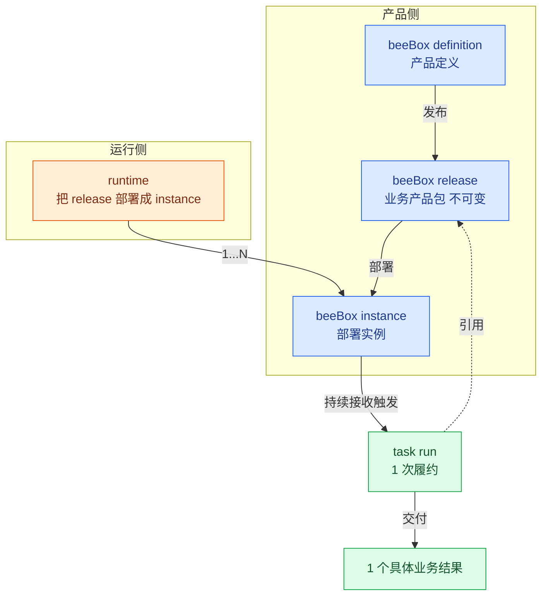
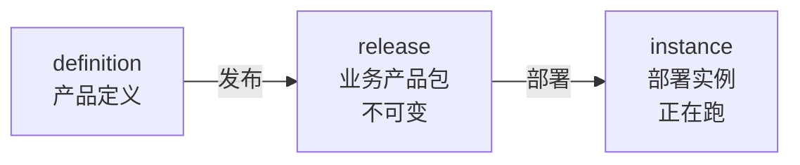
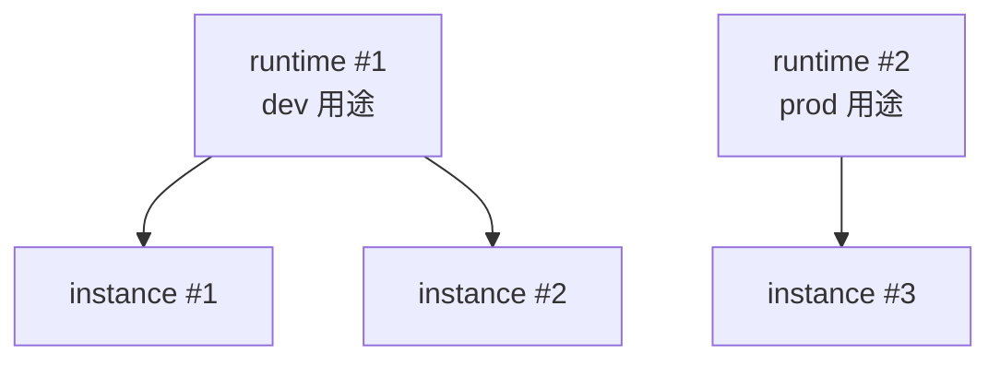
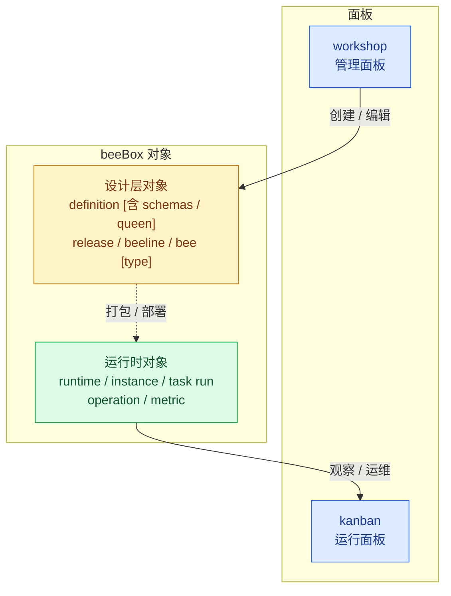

# beeOS / beeBox 设计 v0.1

> **状态**：v0.1 草稿 · 修订中
> **日期**：2026-09-13
> **定位**：beeOS = 业务履约操作系统（Business Fulfillment Operating System），beeBox = bounded 业务履约单元（bounded Business Fulfillment Unit）

---

## 0. 架构宣言

beeOS is a Business Fulfillment Operating System.

Its fundamental unit is the beeBox: a bounded Business Fulfillment Unit.

A Business Fulfillment fulfills a business intent under an explicit contract and policy, producing a verifiable business result.

> **beeBox 不是 workflow 容器**——而是 1 个有明确业务责任边界的履约单元；beeline / operation / runtime / queen 都是为了让这个履约单元成立而存在的**机制**，不是核心概念。
>
> **fulfill vs execute**：履约单元的核心语义是"业务目标是否被实现"（fulfill），不是"怎么执行"（execute）；beeBox 围绕 fulfill 设计，不是围绕 execute 设计。

## 0.5 产品语言与商业叙事

beeOS 是**技术 / 品牌名称**，"履约盒子"（fulfillment box）是**产品语言**——两者指代同一类对象（beeBox），只是面向不同读者。

**对客户怎么说**（不是编排器，是履约盒子）：

> "这是一个**订单异常处理履约盒子**。接进去以后，它负责把订单异常从发现一直处理到闭环。"
>
> 客户看到的是：**订单异常 → 履约盒子 → 已解决订单**——里面用了 AI Agent / LLM / API / RPA / Workflow / 人 / ERP / CRM 都变成实现细节。
>
> **客户买的是业务结果，不是编排器**。

**商业叙事（一句）**：

> **beeOS 不卖 AI，不卖 Workflow。beeOS 交付成熟的履约盒子。**
>
> 一个履约盒子，承接一项明确的业务责任，并以可验证的业务结果完成履约。

**三层产品层次**：

| 层 | 内容 | 谁买 / 谁用 |
|---|---|---|
| **履约盒子**（beeBox）| 客户真正购买的东西——"帮我完成 X" | 企业客户 |
| **履约盒子市场**（Catalog）| 成熟盒子的集合，按行业 / 业务价值流分类 | 企业客户挑选 + 安装 + 配置 |
| **beeOS 基础设施**（platform）| 背后提供 Contract / Policy / Queen / BeeLine / Runtime / Evidence / Metrics 能力 | beeOS 团队 |

**关键点**：
- "beeOS 是平台，beeBox 是产品，履约结果是价值"——这三个层次分开后，创业叙事清晰
- 客户甚至可以不知道 beeOS 内部细节——只用履约盒子
- 详细 GTM（Catalog 设计 / 成熟度 Certification / 商业飞轮 / 单行业起步策略）见 [docs/beeos-gtm.md](./beeos-gtm.md)

---

## 1. 产品定位和领域模型

beeBox 跟所有产品一样有**两件事**：**生命周期**（怎么从设计走到部署）和**运行关系**（产品跑在什么之上）。两件事落到产品上，beeBox 跑起来后每次接收触发产生 1 个 task run——产品完成一次履约，交付 1 个具体业务结果。

**产品架构层级**：

- **核心层**：Business Fulfillment（业务履约）+ beeBox（bounded 履约单元）—— 业务的基本事实
- **机制层**：release / beeline / operation / runtime / task run / queen—— 让核心层能成立的具体实现

**总览图**（概念流转）：



**图怎么读**：

- 蓝色 = **产品侧**（definition → release → instance）
- 橙色 = **运行侧**（runtime 1 个对象，把 release 部署成 instance）
- 绿色 = **履约层**（instance 持续接收触发 → task run → 交付业务结果）
- **instance 是产品侧和运行侧的交叉点**——既来自 release，又跑在 runtime 里
- **task run 引用 release**——instance 跑 task run 时固定引用 release 版本（不可变）

### 1.1 第一性定义

> **beeBox 是 1 个 bounded Business Fulfillment Unit——一个有明确业务责任边界的履约单元。**

beeBox 不是 workflow 容器，而是 1 个**履约单元**（unit of fulfillment）——围绕"执行 1 次业务履约（Business Fulfillment）"这件事，把所有相关的责任 / 合同 / 能力 / 政策 / 生命周期 / 度量 / 所有权都圈定在一个明确边界内，让这个履约单元可以**被独立设计 / 部署 / 运行 / 验收 / 度量 / 持续改善**。

**bounded 的含义**——beeBox 的"边界"不是简单的容器边界，而是业务责任边界：

- **bounded business responsibility**——1 个 beeBox 负责 1 类业务履约，职责清晰
- **bounded contract**——1 个 beeBox 有 1 份明确的履约合同（业务结果 + 验收标准 + 例外条款）
- **bounded capabilities**——1 个 beeBox 自带履约所需的 schemas / beelines / queen 配置
- **bounded policies**——1 个 beeBox 有 1 份 queen 授权策略（任务流动 / 异常处理 / 持续改善）
- **bounded lifecycle**——1 个 beeBox 走过 definition → release → instance 的独立生命周期
- **bounded metrics**——1 个 beeBox 有 1 份自己的度量（质量 / 时效 / 成本）
- **bounded ownership**——1 个 beeBox 由 1 个 owner 负责运营（beeBox owner）

> 多个 beeBox 串联 = 企业价值流（§1.4 核心层）。

### 1.2 产品属性

1 个 beeBox 履约单元的产品属性（让 §1.1 的"履约单元"在产品视角可操作）：

| 属性 | 含义 |
|---|---|
| **可安装** | 一份包安装出 1 个可工作的 beeBox |
| **可运行** | 启动后持续接收触发、持续产出业务结果 |
| **可度量** | 运行时数据可观测、可统计 |
| **可持续改善** | 运行时数据反哺业务改进（看板 → 调优 → 验证）|

### 1.3 核心价值

| 价值 | 含义 |
|---|---|
| **业务结果导向** | 1 个 beeBox 围绕一类明确业务结果（不是任务、不是流程、不是操作）|
| **持续流动** | 通过拉动 / WIP 限制 / 队列透明 / 瓶颈暴露，持续减少等待与积压 |
| **持续改善** | 运行时数据反哺业务改进（看板数据 → 调优 → 验证）|

### 1.4 边界关系

beeBox 的所有概念分**核心层**和**机制层**——核心层是 beeOS 真正在管理的业务事实，机制层是让核心层能成立的具体实现。

**核心层**（业务事实）：

| 概念 | 范围 | 关系 |
|---|---|---|
| **Business Fulfillment** | 1 次业务履约 | 在合同 + 政策约束下执行 1 个业务意图，交付 1 个可验证的业务结果 |
| **beeBox** | 1 个有明确业务责任边界的履约单元 | 1 个 beeBox = 1 个 bounded 履约单元（bounded business responsibility / contract / capabilities / policies / lifecycle / metrics / ownership）|
| **企业价值流** | 端到端业务流 | 1...N 个 beeBox 串联 |

**机制层**（让核心层能成立的具体实现）：

| 概念 | 范围 | 角色 |
|---|---|---|
| **beeline** | 1 类任务的标准作业路线 | procedure（履约的步骤定义）—— 1...N 个 operation 组成的有向图（支持顺序 / 并发 / 分支）|
| **operation** | 1 个不可再分的加工动作（input / output / type 已声明）| execution step（履约中的具体执行）|
| **release** | beeBox 设计产物的不可变快照 | versioning（beeBox 的版本载体）|
| **task run** | 1 次履约的执行实例 | fulfillment instance（履约的 1 次发生）|
| **schema** | definition 自带的数据形状定义 | data contract（履约数据的形状）|
| **runtime** | 把 release 部署成 instance 的服务 | execution environment（履约的运行基础）|
| **queen** | beeBox 的自治运营智能体（definition 顶层字段）| autonomous control（履约的智能决策）|

> **核心层是 beeOS 业务的基本事实**；机制层是为核心层服务的实现，机制变了不影响核心语义。

例子（电商订单履行）：

- beeBox 1：订单接收（验收 = 入库率）
- beeBox 2：仓库分拣（验收 = 准确率）
- beeBox 3：物流发货（验收 = 及时率）
- 3 个 beeBox 串联 = 订单履行企业价值流

### 1.5 产品生命周期

beeBox 走过 3 个阶段：**前 2 阶段**（definition / release）是 beeBox 的产物（被设计 / 被发布）；**第 3 阶段**（instance）是 beeBox 的运行实例——产品装上后开始跑，持续接收触发产生 task run。

每个 beeBox 由 1 份 queen 配置负责运营——queen 是 definition 顶层字段（决定 beeBox 接收什么 task / 交付什么 result），不是 runtime 实现组件。queen 不在产品生命周期 3 阶段里独立成段（queen 跟着 definition 走，definition 改了 queen 跟着改，release 打包时 queen 配置嵌入 release）。



- **definition**（产品定义）——业务结果 / 验收标准 / 改善指标 / beeline 引用（通过 task 1:1 绑定）
- **release**（业务产品包）——围绕一类业务结果发布的不可变版本，固定引用其全部 beeline_version 和依赖版本
- **instance**（部署实例）——release 的一个部署，正在跑

每个阶段一对多：1 个 definition → 多个 release（版本演进）；1 个 release → 多个 instance（多环境 / 多租户）。

### 1.6 运行关系

instance 必须跑在一个执行环境之上——这就是 **beeBox runtime**。**runtime 是 1 类对象**，唯一职责是"把 release 部署成 instance 并持续运行"——environment / deployment / 升级 / 兼容性校验都是 runtime 的内部能力，不暴露为独立对象。



- **runtime** = 把 release 部署成 instance 并持续运行的服务（1 类对象）
- **beeBox instance** = 部署在 runtime 里的应用实例
- **关系**：1 runtime → 1...N instance（同一 runtime 可跑不同 release 的 instance，也可以跑同一 release 的多副本）
- **多 runtime 场景**：1 个 beeOS 平台可有 1...N 个 runtime，按用途 / 区域 / 租户划分（dev / staging / prod / 不同云厂商 / 不同区域）——每个 runtime 是独立的隔离边界
- runtime **不属于 beeBox 产品本身**——它是 beeBox 跑在什么之上
- **runtime 升级 = 创建新 runtime + 在新 runtime 上重新部署 instance + 切流**（runtime 不可变——运行中的 runtime 不能升级配置 / 版本；instance 启动后绑定 runtime 不能换，要换只能重新部署）

---

## 2. 核心契约与执行语义

### 2.1 履约合同

每个 beeBox 都带一份"履约合同"，分 2 个层次：

**单次履约**（评价每次 task run）：

- **业务结果定义**——承诺交付什么（可被验收的产出）
- **验收标准**——怎么算"本次合格"（做完 + 做好：业务结果交付 + 质量 / 时效 / 成本 达到单次阈值）
- **例外条款**——什么情况不交付 / 退回（异常 / 失败 / 超出范围时的回退路径）

**履约指标**（评价 beeBox 持续运行）：

- **履约质量**（一次做对率 / 通过率 / 异常率 / 返工率）
- **履约时效**（交付时长 / 等待时长 / 端到端时长）
- **履约成本**（资源消耗 / 单位成本 / 浪费率）

#### Business Fulfillment 的语义结构

**1 次 Business Fulfillment** 由 6 个**语义层级**组成——每个层级回答 1 个清晰的问题：

```
Contract       → What must be fulfilled（什么必须被履约）
Policy         → Under what constraints（在什么约束下履约）
BeeLine        → How it may be fulfilled（如何被履约）
TaskRun        → One actual fulfillment（一次实际的履约）
Result         → What was actually produced（实际产出了什么）
Acceptance     → Whether the contract was satisfied（合同是否被满足）
```

**关键区分**：

> **BeeLine describes how a fulfillment may be performed. It does not define what fulfillment is.**
>
> BeeLine 描述的是"履约如何被执行"，不定义"什么是履约"。这是 BeeLine 跟其他概念的本质区别——其他 5 个概念都是"履约"本身的维度（合同 / 政策 / 履约事件 / 实际产出 / 是否被满足），只有 BeeLine 是"履约的实现方式"。

**映射到设计稿**：

| 语义层级 | 设计对象 | 来源 |
|---|---|---|
| Contract | `result.acceptance` / `result.exceptions`（验收标准 + 例外条款）| definition.result |
| Policy | `queen.authorization` / `queen.rules`（queen 授权 + 自治规则）| definition.queen |
| BeeLine | `task[].beeline_id` + `beeline_version`（履约程序的具体编排）| definition.task + 独立 beeline 仓库 |
| TaskRun | task run 实例（runtime 内执行）| runtime |
| Result | task run 输出的 result 数据（业务结果）| runtime / audit |
| Acceptance | task run 的验收判断（result 数据是否符合 acceptance 字段）| runtime |

### 2.2 task run 履约

**核心关系**（业务事实）：

```
beeBox
  │ defines（定义 1 类业务履约）
  ▼
Business Fulfillment（1 次业务履约）
  │ occurs as（实际发生）
  ▼
task run（1 次履约事实的运行记录）
```

- **beeBox = 责任边界**——1 个 beeBox 定义 1 类业务履约的责任
- **Business Fulfillment = 业务事实**——1 次具体的业务履约（合同 + 政策约束下完成业务意图）
- **task run = 履约事实的运行记录**——1 次 Business Fulfillment 实际发生的执行实例 + 审计痕迹

**机制实现**（task run 怎么跑起来）：

- task run **不在产品生命周期里**（不是产品演化的某个阶段）
- task run **不在运行关系里**（不是 instance 跟 runtime 的关系）
- task run 是 **instance 内的一次具体执行单位**——beeBox 跑起来后每次接收触发产生 1 个 task run
- task run 按绑定的 beeline 编排跑 operation 步骤（beeline / operation 是机制层实现，不是核心关系）

> **关键点**：task run 跟 beeline / operation 不是同一层级——beeline 是实现履约的"程序路径"，task run 是"履约事件本身"。核心关系是 beeBox defines Business Fulfillment occurs as Task Run，beeline 只是实现 Task Run 的机制。
>
> **业务验收 ≠ 执行完成**：Task Run 完成后还要经过 Acceptance 阶段（§3.4.6）——验收通过 = Business Fulfillment 成功；验收失败（result 不符合 contract）= Fulfillment 拒绝。两者不能混为一谈。

### 2.3 版本引用

task run 引用 release（product 不可变，固定引用）：

- **引用时点** = task run 创建瞬间
- **引用范围** = release 隐含引用的全部 beeline_version + 依赖版本（隐式跟随 release）
- **升级语义** = 部署新 release 到**新 instance** + **切流**（新接收的触发切到新 instance）；in-flight task run 不受切流影响，继续在旧 instance 上跑老 release；旧 instance 跑完所有 task run 后下线
- **回滚语义** = 部署上一个 release 到新 instance + 切流回老版本；in-flight task run 不受影响
- **beeline 升级** = 升级 beeline_version + 产生新 release（beeline 升级必然带动 release 升级）

### 2.4 task run 履约记录

Task Run 不是"workflow execution"——而是 **1 次 Business Fulfillment 的 execution record**（履约事实的运行记录）。它要能回答关于这次履约的所有业务问题。

**Task Run 字段（12 个问题）**：

| 问题 | 字段 |
|---|---|
| **Who requested this fulfillment?** | `originator`（触发源：上游 beeBox id / 外部系统 / 平台调度）|
| **What business intent was being fulfilled?** | `intent`（task type + task 输入 payload，引用 definition.task_schema）|
| **Under which contract?** | `contract_ref`（definition_id + version + result_schema_id）|
| **Under which policy?** | `policy_decision`（queen 决策：authorization active + rules 应用 trace）|
| **Which release performed it?** | `beeBox_release_id`（任务创建时的 release 标识）|
| **Which procedure was selected?** | `beeLine_id` + `beeLine_version`（任务走的是哪条 beeline + version）|
| **What result was produced?** | `result`（业务结果数据，引用 result_schema）|
| **Was the result accepted?** | `acceptance`（验收判定：pass / fail + 触发的 acceptance 规则）|
| **What evidence proves it?** | `evidence`（执行日志：operation step 列表 + 输入输出 + 状态变更）|
| **What did it cost?** | `cost`（成本度量：资源消耗 / 单位成本）|
| **How long did it take?** | `latency`（时长度量：等待时长 / 执行时长 / 总时长）|
| **What exceptions occurred?** | `exceptions`（例外条款触发记录：condition + action + 时间）|

**辅助字段**：

| 字段 | 含义 |
|---|---|
| `task_run_id` | task run 唯一标识（持久化 object id）|
| `beeBox_instance_id` | 任务创建时的 instance 标识（执行位置）|
| `runtime_id` | 任务创建时的 runtime 标识（运行层位置）|
| `created_at` / `started_at` / `finished_at` | 时间戳 |

**关键点**：

- Task Run 是**持久化对象（durable object）**——不依赖 instance 内存，instance 重启后 task run 状态可恢复
- Task run 创建瞬间**固化 12 个字段的核心部分**（originator / intent / contract_ref / beeBox_release_id / beeLine_id+version / runtime_id），后续字段随执行实时更新
- 12 个问题覆盖了 1 次完整履约事实的业务层 + 执行层信息——可以独立审计任何 1 次 task run

---

## 3. 实现设计

具体说明 §1 提到的产品组件怎么落地实现。按 **产品侧 / 运行时 / 履约** 3 块组织：产品侧对应 beeBox 生命周期的 3 阶段（definition → release → instance），运行时对应 runtime 部署层，履约对应 task run 执行层。

**queen**（beeBox 1:1 智能体，§1.4）是 **definition 顶层字段**——不再独立成对象。queen 是 beeBox 的自治运营智能体，在履约合同 + 授权策略约束下管理任务流动 / 运行异常 / 持续改善。queen 不属于 runtime 实现组件，由 runtime 平台的智能体引擎（queen engine，加载 release 里的 definition 时同步加载 queen 字段）执行。queen 字段结构见 [beebox-definition-schema.md](./beebox-definition-schema.md)。

### 3.1 BeeBox definition

definition 是 beeBox 产品的"设计图"——定义 1 个 beeBox 接收什么 task、每类 task 走哪条 beeline、交付什么业务结果、用什么度量评估。

#### 3.1.1 存储形态

- **结构化 schema**——beeBox definition 是结构化描述（JSON / YAML / DB 记录），不是代码、不是配置文件散落
- **1 个 definition 1 份记录**——definition 是 1 个有版本演进的设计对象（不是 1 次性文件）；支持查看、对比、版本回溯
- **与代码解耦**——definition 不嵌入在某个代码仓里，是平台/管理面的对象；beeline / schema 各自独立维护，definition 只**引用**它们

#### 3.1.2 数据结构

definition 包含**基础元信息 + 数据形状 + 履约生命周期 5 块（按 Fulfillment 4 维度 + 度量）**：

| 块 | Fulfillment 维度 | 内容 | 备注 |
|---|---|---|---|
| **基础元信息** | — | beeBox 基础标识（id / version / description）| 标识 beeBox 自身 |
| **数据形状** | — | definition 自带的 schema 列表（task / result / operation input/output 都引用这里）| 跟着 definition 走 |
| **履约意图** | Intent | beeBox 接收什么 task（输入 schema / 适用业务场景）| 1 个 beeBox 可能接收多类 task |
| **履约合同** | Contract | 1 个 beeBox 交付什么业务结果（业务定义 + 验收标准 + 例外条款）| 对应 §2.1 单次履约 |
| **履约政策** | Policy | beeBox 的 queen 自治运营配置（authorization / rules）| 由 runtime 平台的 queen engine 执行 |
| **履约程序** | Procedure | 每类 task 1:1 绑定 1 条 beeline 作为 procedure 实现 | 引用 beeline_id + version，不含 beeline 实现 |
| **履约度量** | Metrics | 质量 / 时效 / 成本 各自的度量方式 + 目标值 | 对应 §2.1 履约指标 |

> 5 块（4 + 1）按 Fulfillment 的 4 维度组织——业务意图 → 履约合同 → 履约政策 → 履约程序 → 履约度量，跟 §2.1 / §0 完全对齐。
> 
> 1 个 definition **不包含** beeline 的**实现**——只引用 beeline_id + version。queen / schemas 是 definition 自身内容（不引用外部对象）。
>
> **beeline 不是履约本身**——beeline 是履约程序路径（procedure）的具体实现，不是 Business Fulfillment 本身；Business Fulfillment = Intent + Contract + Policy + Procedure（详见 §2.1）。

#### 3.1.3 引用机制

definition 跟 beeline / schema 的关系是**"引用"**（按被引用对象自身字段形式），不是"内嵌"——beeline 引用发生在 task 块（履约程序维度），schema 引用发生在 task_schema / result_schema / schema 内 ref：

- **beeline 引用**——`beeline_id` + `beeline_version`（递增序列号，绑定到具体 version）；definition 不持有 beeline 的实现；引用发生在 task 块（每类 task 1:1 绑定 1 条 beeline 作为 procedure 实现）
- **task / result 的 schema 引用**——`task_schema` / `result_schema` 引用 schema 资源（schema 是数据/资源对象，按 id 定位）
- **引用时点**——definition 引用的是"目标对象的当前状态"；被引用对象演进时通过新建对象 + 切换 definition 引用

引用而非内嵌的好处：
- beeline / schema 各自独立维护，definition 不需要知道实现细节
- 同一份 beeline 可被多个 definition 引用（通过 id 定位）
- definition 自身只描述产品设计，体积小、易对比

#### 3.1.4 编辑与验证

- **编辑方式**——通过管理面 / API 创建 / 修改 definition（不是直接改 JSON 文件）
- **schema 校验**——definition 自身有 schema（"definition 怎么写"），编辑时实时校验字段、类型、必填项
- **引用完整性校验**——保存前校验所有引用都真实存在（task 绑定的 beeline_id + version 是否可用 / task_schema / result_schema 是否存在）
- **履约指标可达性**——校验指标定义里引用的数据源可观测（没有引向不存在的指标）

#### 3.1.5 与 release 的关系

definition 修改 **不影响已发布 release**：

- release 是 definition 在某时刻的**不可变快照**（详见 §3.2）
- definition 修改后，原 release 仍然按老定义继续运行（in-flight task run 不受新 definition 影响）
- 修改 definition 后想用上 → 触发新 release（基于新 definition 重新打包）→ 部署到新 instance → 切流

definition 是**演化的设计对象**，release 是**冻结的运行版本**——两者解耦，definition 可频繁改，release 一旦发布不变。

definition 的具体结构化 schema 定义见 [beebox-definition-schema.md](./beebox-definition-schema.md)。

### 3.2 BeeBox release

release 是 beeBox definition 的**不可变快照**——definition 当时的完整状态（task 列表 / result / metrics）+ 所有外部引用固定到具体版本（beeline_version / schema_id）。

#### 3.2.1 release 是什么

- **不可变**——发布后内容不能改；升级 = 发布新 release，不修改老 release
- **完整快照**——含 definition 全部内容 + 所有引用对象的固定版本（跟 definition 不同，definition 引用是"当前"语义，release 引用是"固定"语义）
- **独立标识**——每个 release 有 `release_id`（按 definition_id 派生，如 `task-fulfillment@1.2.0`）+ 发布时间戳

#### 3.2.2 打包流程

definition → release 的过程：

1. **校验 definition**——definition 自身 schema 校验 + 所有引用都真实存在（beeline_id / task_schema / result_schema 都在）
2. **固定所有引用版本**——beeline 引用固定到具体 `beeline_version`（release 不再使用 `^1.0.0` 约束语义，每个 release 绑定具体 version）
3. **生成不可变 artifact**——definition 内容 + 固定版本引用打包成 1 个 release（带 release_id + 时间戳 + 不可变校验和）
4. **存储**——release 写入 release 仓库（按 release_id 索引，不允许覆盖）

#### 3.2.3 打包内容（dependency closure）

release 是 beeBox 的**完整 dependency closure**——保证 release 独立可运行，外部对象（beeline / schema）后续修改不影响老 release。

1 份 release 由 **manifest + artifacts** 两部分组成：

**manifest**（依赖清单 + 元信息，引用型）：

| 字段 | 含义 |
|---|---|
| `release_id` | release 唯一标识（按 definition_id 派生，如 `task-fulfillment@1.2.0`）|
| `definition_id` / `definition_version` | release 基于哪个 definition |
| `beeline_refs` | 1...N 条 `{beeline_id, beeline_version}`（被引用型，按 version 固定）|
| `digest` | 整个 release 的不可变校验和（防意外篡改）|
| `created_at` | 发布时间戳 |

**artifacts**（实物载荷，内容型）：

| 字段 | 含义 |
|---|---|
| `definition` | definition 全部内容（task / process / result / metrics / schemas / queen 配置）—— **schemas 跟着嵌入**（不只引用 schema id）|

> **关键点**：schema 已经内嵌在 definition 里（§1.4 机制层），所以 release 直接包含 definition 全部内容 = schema 跟着嵌入；beeline 因为独立维护（含 version），release 只固定 version 引用，不嵌入 beeline 内容。
> 
> **效果**：release 是自包含的——装上后能独立运行，不需要再访问外部 beeline / schema 仓库；老 release 行为永远固定，不被外部对象后续修改影响。

#### 3.2.4 不可变性

- **写后只读**——release 发布后内容不能修改
- **校验和验证**——每次读取 release 用校验和验证完整性（防意外篡改）
- **不允许覆盖**——同 `release_id` 不能发布第二次（强制不可变）
- **保留历史**——所有 release 永久保留，不删除（升级 = 部署新 release，不是替换老 release）

#### 3.2.5 升级 / 回滚

**升级**（beeBox 行为改进）：

1. 修改 definition → 触发新 release（`@1.3.0`）
2. 部署新 release 到新 instance（不动老 instance）
3. 切流——新接收的触发走新 instance，老 instance 继续消化 in-flight task run
4. 老 instance 跑完所有 in-flight 后下线
5. 升级完成，新 release 100% 流量

**回滚**（新 release 有问题）：

1. 部署上一个 release（`@1.2.0`）到新 instance
2. 切流回老 release
3. 新 release instance 下线

**关键点**：
- in-flight task run 不受切流影响（在老 instance 跑老 release 直到完成）
- 升级 / 回滚都是"创建新 instance + 切流"，不是修改老 instance
- 任意时刻都有 1...N 个 release 跑在 instance 上（升级过渡期）

### 3.3 BeeBox instance

instance 是 release 的**运行实例**——1 个 release 的 1 次部署，跑在 runtime 里，持续接收 task 产生 task run。

#### 3.3.1 instance 是什么

- **1 个 instance = 1 个 release 的 1 次部署**——instance 跟 release 1:1 绑定（1 个 instance 只跑 1 个 release）
- **跑在 runtime 里**——instance 不能独立存在，必须跑在 1 个 runtime 里；同 1 个 runtime 可跑 1...N 个 instance
- **多实例并存**——1 个 release 可部署多个 instance（多 runtime / 多租户 / 升级过渡期并存）
- **状态有生命周期**——启动 → 运行 → 排空 → 停止

#### 3.3.2 部署流程

release → instance 的过程：

1. **选定 release**——按 `release_id` 选 1 个具体 release
2. **选定 runtime**——instance 跑在哪个 runtime（按兼容性、容量等选择）
3. **启动 instance**——加载 release 全部内容（definition + 固定引用），绑定到选定的 runtime
4. **instance 就绪**——开始接收 task，进入"运行中"状态

**关键点**：
- 1 个 instance 启动后不能换 release（要换 release = 部署新 instance + 切流）
- 1 个 instance 启动后不能换 runtime（同理）

#### 3.3.3 instance 生命周期

| 状态 | 含义 | 行为 |
|---|---|---|
| **启动中** | 加载 release 还没就绪 | 不接收 task |
| **运行中** | 已就绪，正常接收 task | 接收 task，产生 task run |
| **排空中** | 停止接收新 task，等待 in-flight 完成 | 拒收新 task，跑完已有 task run |
| **已停止** | 无 task run，可删除 | 不接收 task，不跑 task run |

状态转换：
- 启动中 → 运行中（启动完成）
- 运行中 → 排空中（发起下线 / 升级切流）
- 排空中 → 已停止（in-flight 全部完成）
- 运行中 → 已停止（异常情况，强杀）

#### 3.3.4 跟 task run 的关系

- task run 在 instance 内产生（§2.2）—— instance 接收 task → 产生 task run
- task run 引用 release（不可变绑定，§2.3）—— 当前 instance 跑哪个 release，task run 就引用哪个 release
- task run 同时引用 instance（执行位置，§2.4 audit 字段 `task_run.beeBox_instance_id`）
- 升级切流后，老 instance 继续消化 in-flight task run 直到全部完成

#### 3.3.5 跟 runtime 的关系

- instance 跑在 runtime 里（§1.6 运行关系）—— 1 runtime 跑 1...N instance
- instance 启动时绑定到 1 个 runtime（绑定后不能换——要换 runtime 只能重新部署 instance）
- **runtime 不可变**——运行中的 runtime 不能升级配置 / 版本；runtime_version / config 任何变化都 = 创建新 runtime
- **runtime 升级 = 创建新 runtime + 在新 runtime 上重新部署 instance + 切流**（详见 [beebox-runtime-design.md §5](./beebox-runtime-design.md#5-升级--兼容性)）：
  1. 创建新 runtime（runtime_version / config 变更）
  2. 在新 runtime 上启动新 instance（绑定同一 release，启动时校验兼容性）
  3. 切流：新接收的触发走新 instance，老 instance 继续消化 in-flight task run
  4. 老 instance 跑完所有 in-flight 后下线
  5. 老 runtime 删除

runtime 的实现细节（状态机 / 内部组件 / 接口约定）见 [beebox-runtime-design.md](./beebox-runtime-design.md)。


### 3.4 履约实现

task run 在 instance 内的完整执行流程。

#### 3.4.1 task run 触发 + durable object

**Task Run 是 durable object**——持久化对象，不依赖 instance 内存：

| 持久化字段 | 含义 |
|---|---|
| `task_run_id` | task run 唯一标识（持久化 object id）|
| `identity` | originator / intent / contract_ref / release_id / beeline_id+version / runtime_id（创建瞬间固化）|
| `status` | 履约状态（见下方状态机）|
| `current_op` | 当前执行的 operation（推进）|
| `inputs` / `outputs` | 各 operation 的输入输出（按 op_id 索引）|
| `checkpoints` | operation 完成时的 checkpoint（支持 resume）|
| `event_log` | 事件流（trigger / op_start / op_finish / exception / accept 等）|

**为什么是 durable object**：
- instance 重启 → task run 状态不丢，可以 resume
- runtime 切换 → task run 持续（在新 runtime 找到对应 instance 即可）
- audit / 排错 → 任何 task run 的 12 个问题都能查

**触发流程**：

1. **instance 接收 trigger**——trigger 包含 task 数据（按 task_schema 形状）+ originator（请求方）
2. **task run 创建（持久化）**——立即在 runtime 的持久层创建 1 个 durable task run object，固化 identity（originator / intent / contract_ref / release_id / beeline_id+version / runtime_id / instance_id）
3. **进入执行**——task run 派发到 instance 的执行器，开始按 beeline 编排执行；event_log 写入 `task_triggered`

**关键点**：
- 触发瞬间 task run 就绑定到 release（不可变，§2.3）—— instance 后续切流不影响这个 task run
- instance 重启 / 升级不影响 task run 状态（durable object 持久化保证）
- in-flight task run 受 instance 状态保护（instance 下线前要排空，§3.3.3）

#### 3.4.2 beeline 加载

**加载流程**：

1. **task run 选 beeline**——按 task 的 `beeline_id`（在 definition 里绑定）从 instance 加载的 release 中找到具体 beeline
2. **校验**——校验 beeline 完整性（operations / next 链 / 无环，参见 `beebox-beeline-schema.md` 字段约束）
3. **构建执行图**——把 beeline 的有向图加载到 instance 的执行器中（每个 op_id 变成 1 个可执行节点）

**关键点**：
- beeline 已经在 release 中固定版本（§3.2.3 打包内容），instance 不需要再查外部
- 加载过程开销小（beeline 已经在内存中，instance 启动时一次性加载完所有 beeline）

#### 3.4.3 operation 执行

**执行流程**（按 beeline 有向图）：

1. **起点 operation**——找到 `input_from: external` 的 op（task 输入作为起点）
2. **逐 op 执行**——按 next 链推进：
   - **顺序**——按 next 顺序执行下一个 op
   - **并发**——同时启动多个 next op（fan-out）
   - **分支**——按 `when` 条件选 1 个 next op（互斥）
   - **汇聚**——所有前置 op 完成后才执行当前 op（fan-in）
3. **op 内动作**——每个 op 调对应的 `bee`（`bee.type` 寻址 worker）或 `external_system` 完成具体加工
4. **终点**——没有 next 的 op 完成时 task run 结束

**关键点**：
- task run 跨 op 的状态（input / output 中间数据）保存在 instance 内存或临时存储
- 每个 op 执行结果记录到 task run 审计字段（步骤级日志）

#### 3.4.4 异常处理 + task run 状态机

按 §1.3 持续流动原则暴露——不静默吞错，让异常显式可观测。

**Task Run 状态机**（履约层状态，不只是 execution 状态）：

| 状态 | 含义 |
|---|---|
| **triggered** | task run 创建，等待进入执行 |
| **running** | 正在按 beeline 执行 operation |
| **RETRYING** | op 失败后重试中（带重试次数上限 + 重试策略）|
| **PARTIALLY_COMPLETED** | 部分 operation 完成（如分支一边失败，一边成功）|
| **WAITING_EXTERNAL** | 等待外部系统响应（外部 API 调用 / 异步回调）|
| **COMPENSATING** | 触发补偿动作（执行反向 op 撤销已完成操作）|
| **REJECTED** | 显式拒绝（合同例外条款触发，决定不交付）|
| **COMPLETED** | 正常完成（验收通过）|
| **FAILED** | 失败（验收不通过 / 重试耗尽 / 拒绝后无补偿）|

**异常处理动作**：

| 异常类型 | 状态转换 | 处理动作 |
|---|---|---|
| **op 临时失败**（网络抖动 / 外部超时）| → RETRYING | runtime 重试 op（按 op idempotency 策略：required / optional / forbidden）|
| **op 永久失败**（业务规则不满足）| → FAILED | 当前 op 标记失败，按 beeline 编排决定下一步（无 next = task run 失败；分支条件可走错误处理 op）|
| **外部异步等待**（需要外部回调）| → WAITING_EXTERNAL | task run 持久化等待，runtime 注册回调；回调到达后恢复执行 |
| **需要补偿**（已完成部分要撤销）| → COMPENSATING | 执行反向 op（每个 op 可声明 compensate_bee）|
| **合同例外触发**（验收规则 fail 且 actions=rollback/no_deliver）| → REJECTED / COMPENSATING | 按 contract.exceptions.actions 执行（no_deliver / rollback / escalate）|
| **beeline 完整性错误**（环 / 引用不存在）| 启动期错误 | task run 不创建（不进入执行）|
| **task 数据不符合 schema** | 触发期错误 | trigger 拒绝（不创建 task run）|

**重试 vs 补偿策略**：

- **retry**——op idempotency.mode = required / optional：runtime 可重试
- **compensate**——op 失败但合同要求 rollback：执行反向 op（state reversal）
- **resume**——WAITING_EXTERNAL 后回调到达：从 checkpoint 继续
- **reject**——合同例外触发 no_deliver：标记 REJECTED，不交付
- **dead-letter**——重试耗尽 / 补偿失败：标记 FAILED，queen 接管（人工 / 自动改善）

**暴露方式**：
- task run 持久化 event_log（含 status 转换 + 异常原因）
- §2.4 12 字段记录完整履约事实
- kanban（§4.2）展示实时异常
- 持续改善靠异常数据驱动（§1.3 持续流动 / queen.rules.continuous_improvement）

#### 3.4.5 审计

每个 task run 记录 §2.4 全部 audit 字段：

| 字段 | 何时记录 |
|---|---|
| `task_run.beeBox_release_id` | task run 创建时（绑定 release）|
| `task_run.beeBox_instance_id` | task run 创建时（绑定 instance）|
| `task_run.beeLine_id` | beeline 加载时 |
| `task_run.beeLine_version` | beeline 加载时 |
| `task_run.runtime_id` | task run 创建时（绑定 runtime）|
| 步骤级日志 | 每个 op 执行完成时（input / output / duration / error）|
| 异常信息 | op 失败时 |

**审计原则**：
- audit 字段在 task run 创建瞬间定型（不可变）
- 步骤级日志 + 异常信息可后续追加（不影响 audit 字段）
- audit 用于复盘 / 举证 / 改进（§1.3 持续改善）

#### 3.4.6 Acceptance 阶段（业务验收 ≠ 执行完成）

**关键区分**：

> **Task Run 完成 ≠ Business Fulfillment 成功**
>
> 例子：Beeline 完整跑完，所有 operation 都成功，但 result 数据不符合业务验收标准
> → TaskRun 状态 = COMPLETED，Fulfillment 状态 = REJECTED

**任务 run 完成后进入 Acceptance 阶段**——独立的履约层阶段，不再属于执行层（§3.4.3 / §3.4.4）。

**Acceptance 状态机**（新增 4 个状态）：

| 状态 | 含义 |
|---|---|
| **AWAITING_ACCEPTANCE** | task run 完成后进入，等待业务验收判定 |
| **ACCEPTED** | 验收通过——Business Fulfillment 成功（produce 业务结果）|
| **REJECTED** | 验收不通过——Business Fulfillment 失败（contract 被违反）|
| **COMPENSATING_ACCEPTANCE** | 验收触发补偿——执行反向操作后回到 AWAITING_ACCEPTANCE |

**Acceptance 流程**：

1. **触发**——task run 进入 COMPLETED 状态后自动转入 AWAITING_ACCEPTANCE
2. **执行 acceptance 规则**——按 definition.result.acceptance 列表逐条判定 result 数据
3. **判定结果**：
   - **全部通过** → ACCEPTED（业务履约成功）
   - **任一失败** → 按 contract.exceptions 决定：no_deliver / rollback / escalate
   - **rollback** → COMPENSATING_ACCEPTANCE（执行反向 op）→ AWAITING_ACCEPTANCE
   - **escalate** → 触发 queen 接管（人工 / 自动决策）
4. **记录**——§2.4 task_run.acceptance 字段记录判定结果

**关键点**：

- 业务验收是**独立阶段**，不是 task run 状态机的延续
- 验收失败 ≠ 执行失败——Beeline 可能完美执行，但 result 不符合业务期望
- 验收触发补偿 ≠ 异常补偿——补偿的目标不同（异常补偿撤销已完成的错误；验收补偿撤销不符合业务的执行）

#### 3.4.7 Queen 自治边界（bounded autonomy）

**Queen 是 bounded autonomy**——在 contract + authorization policy 约束下管理履约变量，但不是"拥有生产环境权限的 Agent"。

**Queen 可以改变什么**（履约变量 / runtime 调度）：

| Queen 操作 | 含义 |
|---|---|
| **调整并发量** | 改变 instance 并发 task run 的数量 |
| **选择 procedure** | 同一 task 类型的多个 beeline 之间选择（可选 procedure）|
| **retry 决策** | 决定 op 重试次数 / 间隔 / 放弃阈值 |
| **route 决策** | 决定 task run 走哪个 instance / runtime |
| **escalate** | 验收失败时把决策权交给人工 |
| **pause** | 临时暂停 beeBox 接收新 task（按合同条件触发）|

**Queen 不能改变什么**（合同 / 政策 / 验收 / release）：

| 不可变项 | 原因 |
|---|---|
| **修改 contract** | contract 是 beeBox 责任边界，queen 是边界内的决策者，不能改边界本身 |
| **修改 acceptance** | 验收标准是 contract 的一部分，queen 不能放宽 / 收紧验收 |
| **修改 release** | release 是不可变 artifact，queen 不能 hot-patch 跑 release 的 instance |
| **修改 policy** | policy 是 beeBox 自己的 queen 授权策略，queen 不能自授权 |

**关键区分**：

> Queen = "在履约合同内做运维决策的智能体"，不是"无限制的运维 Agent"。
> Queen 的权力来自 beeBox owner 的定义 + 授权，queen 永远不会越权（不能改 contract / acceptance / release / policy）。

**审计**：Queen 每次决策都记录到 task run.policy_decision 字段（§2.4 12 字段之一），决策可追溯、可复盘。

---

## 4. workshop 和 kanban 面板

beeOS 平台提供 **2 个面板产品入口**，分别面向不同角色、不同工作场景：

| 面板 | 角色 | 对象层级 |
|---|---|---|
| **workshop（管理面板）** | owner / 管理员 | 设计层对象（definition / release / beeline / schema / bee）|
| **kanban（运行面板）** | 运维 / 观察者 | 运行时对象（instance / task run / operation / runtime / 异常）|

### 4.1 workshop（管理面板）

**角色**：beeBox owner / 平台管理员

**管什么**（设计层对象）：

| 对象 | 典型动作 |
|---|---|
| **beeBox definition** | 创建 / 编辑 / 版本演进 / 校验 / 引用完整性检查 |
| **beeBox release** | 打包 / 发布 / 查看历史 / 校验和验证 |
| **beeline** | 注册 / 编辑有向图（operations / next 链）/ 校验无环 |
| **schema** | 注册 / 编辑字段定义（业务字段 / 嵌套引用）|
| **bee（type）** | 查看可用的 worker 类型（bee 注册归 runtime 平台）|

**典型场景**：
- owner 创建 1 个新 beeBox → 编辑 definition → 注册 / 引用 beeline / schema
- owner 修改 definition → 打包新 release → 准备部署
- 平台管理员注册新的 beeline / schema（供 beeBox 引用）；bee（worker 类型）在 runtime 平台注册

**关键特点**：
- 设计层操作，**不直接影响运行时**（改 definition 不影响已发布 release）
- 提供 schema 校验 / 引用完整性校验（编辑时实时反馈）
- 提供版本对比 / 回溯（definition / release 演进历史）

### 4.2 kanban（运行面板）

**角色**：运维 / 平台观察者 / beeBox owner（查看自己 beeBox 的运行）

**管什么**（运行时对象）：

| 对象 | 典型动作 |
|---|---|
| **runtime** | 注册 runtime / 查看 runtime 状态 / 启动 / 排空 / 删除 |
| **beeBox instance** | 查看 instance 列表 / 状态（运行中 / 排空 / 已停止）/ 健康检查 |
| **task run** | 查看实时 / 历史 task run / 跟踪每个 task run 的状态 / 审计字段 |
| **operation 执行** | 查看 op 执行过程（步骤级日志）/ 失败原因 / 重试记录 |
| **异常 / 告警** | 查看异常列表 / 异常详情 / 触发告警（持续暴露，§1.3） |
| **履约指标** | 查看质量 / 时效 / 成本度量（§2.1 履约指标）|

**典型场景**：
- 运维查看 instance 列表，发现 1 个 instance 排空中（等切流完成）
- 运维跟踪 1 个 task run，发现 op 失败，定位到 beeline 哪一步
- owner 在 kanban 看板上看自己 beeBox 的运行数据（持续流动、持续改善的看板数据来源）
- 平台告警：某 instance task run 异常率超阈值

**关键特点**：
- 只读 + 运维操作（启动 / 停止 instance / 切流等），**不编辑设计层对象**
- 实时性 + 历史回溯（实时看 instance + 回溯历史 task run）
- 跟 §1.3 持续流动对应——kanban 是"看板 / 拉动 / 瓶颈暴露"的实现载体

### 4.3 两面板的协作

workshop 和 kanban 是 beeOS 平台的 2 个独立入口，但通过 beeBox 对象协作：



**典型闭环**：

1. **workshop 优化**——kanban 发现某 op 失败率高 → workshop 修 beeline → 新 release → kanban 看新版本效果
2. **kanban 调整**——kanban 看到某 instance 异常 → 切流到健康 instance → workshop 不变（设计不变，运维动作）
3. **owner 看板反馈**——owner 在 kanban 看板看自己 beeBox 的运行数据（queen engine 同步产出建议）→ workshop 调 definition

两面板都是 beeOS 平台的产品入口，**没有先后依赖**——owner 优先用 workshop 设计 beeBox；运维优先用 kanban 运维 beeBox；持续改善靠 2 个面板协作完成（§1.3）。
