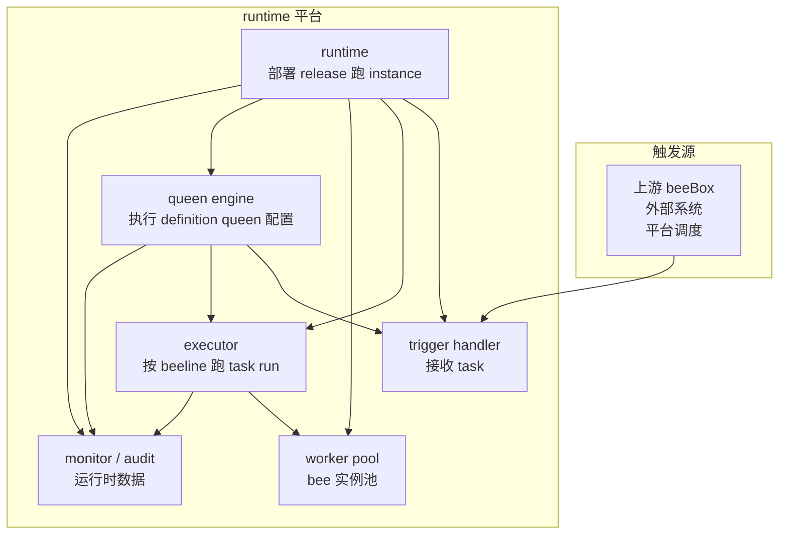

# BeeBox runtime 设计

> **状态**：v0.1 草稿 · 修订中
> **日期**：2026-09-15
> **对应**：[beebox-design.md §1.6 运行关系](./beebox-design.md#16-运行关系) · §3.3 instance · §3.5 履约实现 · [beebox-runtime-schema.md](./beebox-runtime-schema.md)

runtime 平台的整体设计规格。**runtime 平台是 beeOS 平台的基础设施层**——提供 beeBox / beeline / schema / bee 等业务对象"跑起来"所需的运行时能力。

---

## 1. runtime 是什么

runtime 平台对外只暴露 1 类对象：**runtime**——其唯一职责是"把 release 部署成 instance 并持续运行"。

| 层级 | 内容 | 设计文件 |
|---|---|---|
| **业务层（beeOS 平台）** | beeBox / beeline / schema / bee 等业务对象 + workshop / kanban 面板 | `beebox-design.md` + 各 schema 文件 |
| **基础设施层（runtime 平台）** | runtime 对象 + 5 类内部组件（trigger handler / executor / worker pool / queen engine / monitor / audit）| `beebox-runtime-design.md` + `beebox-runtime-schema.md` |

**runtime 平台跟 beeOS 平台是 2 个独立产品**——runtime 升级不影响 beeOS 平台业务对象（runtime 兼容性边界，§5）。

---

## 2. 内部组件

runtime 平台除了 `runtime` 这 1 类对象，还有 5 类**内部组件**——平台运行时跑起来的"内部代码"，不暴露为独立 schema：

| 内部组件 | 职责 |
|---|---|
| **trigger handler** | 接收 task（HTTP endpoint / MQ topic / RPC handler / 平台调度）|
| **executor** | 按 beeline 编排跑 task run（顺序 / 并发 / 分支 / 汇聚）|
| **worker pool** | bee 类型的 worker 实例池（executor 调 worker 干活）|
| **queen engine** | 执行 beeBox definition 顶层 `queen` 配置（合同约束检查 + 授权策略执行 + 自治规则运行）|
| **monitor / audit** | 运行时数据收集 + audit 字段记录与查询接口 |

**关键点**：
- 内部组件是**平台能力**，不需要 platform 管理员配置——runtime 平台自带
- 内部组件的**配置参数**（worker pool 大小、trigger handler 监听端口等）放在 runtime 对象的 `config` 字段（具体形式由 runtime 平台决定）
- 业务侧（beeBox / beeline）只跟内部组件**交互**，不声明内部组件

---

## 3. 架构图

**图怎么读**：
- 蓝色 = **runtime 平台对外对象**（runtime）—— 唯一被声明的资源
- 黄色 = **runtime 平台内部组件**（trigger / executor / worker / queen engine / monitor）—— 平台自带，不声明
- 绿色 = **触发源**——外部进 runtime 的入口

---

## 4. 状态

runtime 生命周期 4 个状态：

| 状态 | 含义 | 行为 |
|---|---|---|
| **启动中** | runtime 拉起中 | 不接收 instance 接入 |
| **就绪** | runtime 已就绪 | 可接收 instance 接入 / 触发 task |
| **排空中** | 不再接收新 instance，老 instance 跑完后清空 | 拒收新 instance，老 instance 跑完 in-flight 后下线 |
| **已停止** | 清空完成，可删除 | 不接收 instance，不跑 task run |

状态转换：
- 启动中 → 就绪（启动完成）
- 就绪 → 排空中（发起下线 / 升级切流）
- 排空中 → 已停止（in-flight instance 全部完成）
- 就绪 → 已停止（异常情况，强杀）

---

## 5. 升级 / 兼容性

**核心不变量**：
- **runtime 不可变**——运行中的 runtime 不能升级（runtime_version / config / region / cloud_provider 等不可变字段任何变化都 = 创建新 runtime）
- **instance 跟 runtime 1:1 绑定**——instance 启动后绑定 runtime 不能换，要换只能重新部署

**升级流程**：

1. **创建新 runtime**——runtime_version / config 变更（保留原 id 还是新建，看平台设计）
2. **在新 runtime 上启动新 instance**——绑同一 release；instance 启动时校验 release 跟 runtime 兼容性
3. **切流**——新接收的触发走新 instance，老 instance 继续消化 in-flight task run
4. **老 instance 跑完 in-flight 后下线**——自然排空
5. **老 runtime 删除**

**兼容性**：

- 兼容性判定由 runtime 平台内部给出（runtime_version / config 变更时判断老 release 能不能跑）
- 校验时机是 **instance 启动时**——新 runtime 上启动新 instance，校验 release 跟 runtime 兼容性
- 校验失败 → instance 启动失败（不是 runtime 升级失败；可以重新部署老 release 到新 runtime 看是否兼容）
- 没有"instance 迁移"——instance 不能从老 runtime 搬到新 runtime，要换只能重新部署

**关键点**：
- runtime 平台升级**不修改老 runtime**——老 instance 行为可追溯
- 升级不能"原地升级"——保持老 runtime 不可变

---

## 6. 接口约定

runtime 平台给 beeOS 平台提供：

| 接口 | 用途 |
|---|---|
| **runtime 注册 / 状态** | 注册 runtime（声明用途 / 区域 / 云厂商）；查询 runtime 状态 |
| **instance 启动 / 状态 / 停止** | 在 runtime 内启动 instance；查询 / 停止 instance |
| **task run 触发 / 状态** | instance 接收 task 触发；查询 task run 状态（实时 + 历史）|
| **audit 查询** | 查询 task run audit 字段（[beebox-design.md §2.4](./beebox-design.md#24-审计字段)）|
| **queen 引擎入口** | runtime 平台加载 release 时同步加载 definition 顶层 `queen` 配置，由 queen engine 执行 |

**关键点**：
- runtime 平台接口是 beeOS 平台跟 runtime 平台交互的边界
- 接口稳定 → beeOS 平台演进不需要 runtime 平台配合
- 接口变动 → runtime 平台升级需要 beeOS 平台配合

---

## 7. 跟 beeOS 平台的关系

| 维度 | beeOS 平台 | runtime 平台 |
|---|---|---|
| **职责** | 业务对象 + 面板 | 把 release 部署成 instance 并持续运行 |
| **演进** | 业务对象演进（definition / release / beeline 等）| 平台版本演进（runtime_version 升级）|
| **使用方** | owner / 运维（通过 workshop / kanban）| beeOS 平台自身 |
| **演进影响** | 业务侧改进（产品演进）| 底层兼容性（release 可不可在新 runtime 上跑）|

**关键点**：
- runtime 平台**独立于** beeOS 平台演进（runtime 可以升级 / 降级，beeOS 业务对象在新 runtime 上重新部署）
- 同一份 release 可以跑在不同 runtime_version 的 runtime 上（兼容性由 runtime 平台在 instance 启动时判定）
- beeOS 平台通过 runtime 平台的 API 交互（runtime 注册 / instance 启动 / task run 触发 / audit 查询）

---

## 8. 跟其他设计稿的对照

| runtime 章节 | 对应 |
|---|---|
| §1 runtime 是什么 | beebox-design.md §1.6 运行关系 · §3.3 instance |
| §2 内部组件（trigger / executor / worker / queen engine / monitor / audit） | beebox-design.md §3.5 履约实现 |
| §4 状态 | [beebox-runtime-schema.md §4 字段约束](./beebox-runtime-schema.md#4-字段约束) |
| §5 升级 / 兼容性 | beebox-design.md §3.3.5 跟 runtime 的关系 |
| §6 接口约定 | beebox-design.md §3.5 履约实现（task run 触发 / audit 查询） |

| runtime 对象 / 组件 | schema 文件 |
|---|---|
| runtime | [beebox-runtime-schema.md](./beebox-runtime-schema.md) |
| trigger / executor / worker / queen engine / monitor / audit | （runtime 平台内部，无独立 schema）|