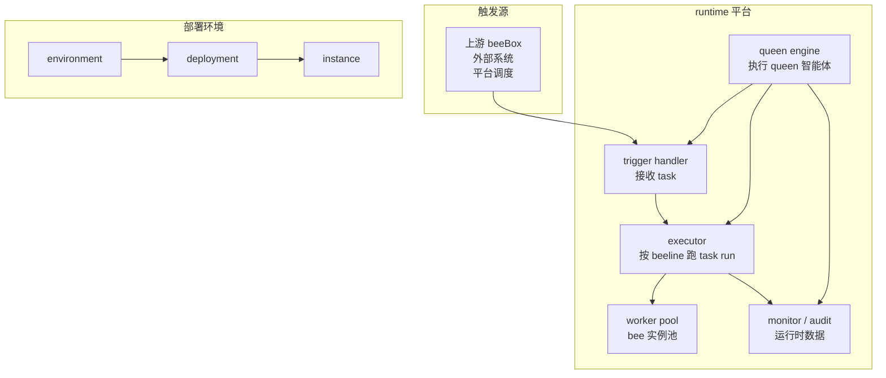

# BeeBox runtime 设计

> **状态**：v0.1 草稿 · 修订中
> **日期**：2026-09-15
> **对应**：[beebox-design.md §1.6 运行关系](./beebox-design.md#16-运行关系) · §3.3 instance · §3.4 运行时实现 · §3.5 履约实现

runtime 平台的整体设计规格。**runtime 平台是 beeOS 平台的基础设施层**——提供 beeBox / beeline / queen / bee 等业务对象"跑起来"所需的运行时能力。

---

## 1. runtime 平台是什么

runtime 平台是 beeOS 平台的**基础设施层**，跟 beeOS 平台是 2 个独立产品：

| 层级 | 内容 | 设计文件 |
|---|---|---|
| **业务层（beeOS 平台）** | beeBox / beeline / schema / queen / bee 等业务对象 + workshop / kanban 面板 | `beebox-design.md` + 各 schema 文件 |
| **基础设施层（runtime 平台）** | environment / deployment / executor / worker / trigger handler / queen engine 等 | `beebox-runtime-design.md` + `beebox-runtime-schema.md` |

runtime 平台**独立演进**——runtime 升级不影响 beeOS 平台业务对象（runtime deployment 兼容性边界，§3.4.4）。

---

## 2. 组件清单

runtime 平台由 5 层组件构成：

### 2.1 环境层

- **runtime environment**——实际运行环境 + 隔离边界（dev / staging / prod / 不同云厂商）

### 2.2 部署层

- **runtime deployment**——某 runtime 版本在 environment 的一次部署

### 2.3 执行层

- **trigger handler**——接收 task 的入口（HTTP endpoint / 消息队列 topic / RPC handler / 平台调度）
- **executor**——按 beeline 编排跑 task run（顺序 / 并发 / 分支 / 汇聚）
- **worker pool**——bee 类型的实际 worker 实例池（executor 调 worker 干活）

### 2.4 运营层

- **queen engine**——执行 queen 智能体的引擎（合同约束检查 + 授权策略执行 + 自治规则运行）

### 2.5 观测层

- **monitor**——运行时数据收集（task run / instance / metric / 异常）
- **audit**——audit 字段记录与查询接口

---

## 3. 架构图

---

## 4. 跟 beeOS 平台的关系

| 维度 | beeOS 平台 | runtime 平台 |
|---|---|---|
| **职责** | 业务对象 + 面板 | 业务对象"跑起来"的基础设施 |
| **演进** | 业务对象演进（definition / release / beeline 等）| 平台版本演进（runtime deployment 升级）|
| **使用方** | owner / 运维（通过 workshop / kanban）| beeOS 平台自身 |
| **演进影响** | 业务侧改进（产品演进）| 底层兼容性（业务对象迁移）|

**关键点**：
- runtime 平台**独立于** beeOS 平台演进（runtime 可以升级 / 降级，beeOS 业务对象可选择迁移）
- 同一份 release 可以跑在不同 runtime 版本（兼容性边界由 runtime 平台给出）
- beeOS 平台通过 runtime 平台的 API 交互（环境注册 / deployment 启动 / instance 部署 / task run 触发 / audit 查询）

---

## 5. 接口约定

runtime 平台给 beeOS 平台提供：

| 接口 | 用途 |
|---|---|
| **environment 注册** | 注册 runtime environment（dev / staging / prod / 多云厂商）|
| **deployment 启动 / 状态** | 在 environment 内启动 deployment，查询 deployment 状态 |
| **instance 启动 / 状态 / 停止** | 在 deployment 内启动 instance，查询 / 停止 instance |
| **task run 触发 / 状态** | instance 接收 task 触发；查询 task run 状态（实时 + 历史）|
| **audit 查询** | 查询 task run audit 字段（§2.4）|
| **queen 引擎入口** | queen 决策通过 runtime 平台的智能体引擎执行 |

**关键点**：
- runtime 平台接口是 beeOS 平台跟 runtime 平台交互的边界
- 接口稳定 → beeOS 平台演进不需要 runtime 平台配合
- 接口变动 → runtime 平台升级需要 beeOS 平台配合

---

## 6. 升级 / 兼容性

runtime 平台升级 = 创建新 deployment（详见 §3.4.3）：

- 新 deployment 在 environment 内启动
- 老 deployment 上的 instance 继续跑老 release
- 兼容性边界（兼容 / 不兼容）由 runtime 平台给出（详见 §3.4.4）

**关键点**：
- runtime 平台升级**不修改老 deployment**——老 instance 行为可追溯
- 兼容性判定由 runtime 平台内部给出（升级版本时判断）
- 不兼容时，老 instance 继续在老 deployment 上跑完所有 in-flight task run 后下线

---

## 7. 跟其他设计稿的对照

| runtime 章节 | 对应 |
|---|---|
| §2.1 环境层（environment）| beebox-design.md §1.6 运行关系 |
| §2.2 部署层（deployment）| beebox-design.md §3.4 运行时实现 |
| §2.3 执行层（trigger / executor / worker）| beebox-design.md §3.5 履约实现 |
| §2.4 运营层（queen engine）| beebox-queen-schema.md（智能体引擎）|
| §2.5 观测层（monitor / audit）| beebox-design.md §3.5.5 审计 |

| runtime 组件 | schema 文件 |
|---|---|
| environment | `beebox-runtime-schema.md` |
| deployment | `beebox-runtime-schema.md` |
| trigger / executor / worker / queen engine / monitor / audit | （runtime 平台内部，无独立 schema）|