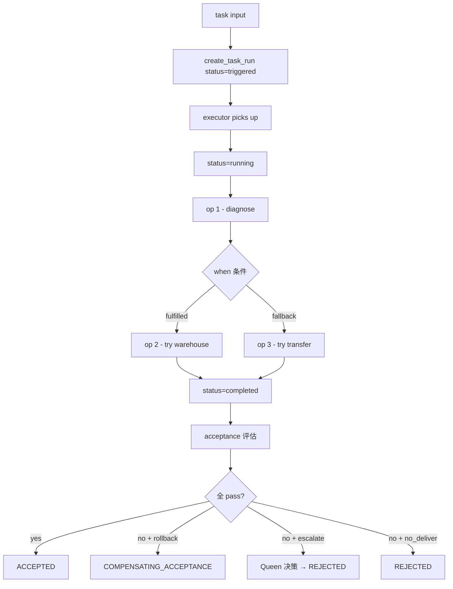

# runtime - 进程内 executor + TaskRun + Acceptance

> 按 [beebox-design.md §3.4] 实现的业务履约运行时。
> **业务语义是真的，基础设施可以是假的**——PoC 2 在进程内跑通完整 task run 闭环。

## 模块

```
runtime/
  __init__.py            # 统一导出
  models.py              # TaskRun durable object + 9 状态机 + Acceptance 4 状态
  executor.py            # BeelineExecutor（顺序 / 分支推进 + when 评估）
  mock_runner.py         # MockOperationRunner（业务 op 类型映射）
  acceptance.py          # Acceptance 评估器（4 状态转移）
  queen.py               # Queen escalation hook
```

## 流程



## TaskRun 9 状态机

| 状态 | PoC 2 | 含义 |
|---|---|---|
| `triggered` | ✅ | task run 创建，等待进入执行 |
| `running` | ✅ | 正在按 beeline 执行 operation |
| `RETRYING` | ⏳ 下一轮 | op 失败重试中 |
| `PARTIALLY_COMPLETED` | ⏳ 下一轮 | 部分 op 完成 |
| `WAITING_EXTERNAL` | ⏳ 下一轮 | 等待外部响应 |
| `COMPENSATING` | ⏳ 下一轮 | 触发补偿 |
| `REJECTED` | ⏳ 下一轮 | 显式拒绝 |
| `COMPLETED` | ✅ | 正常完成（beeline 跑完） |
| `FAILED` | ✅ | 失败（验收不通过 / op 失败） |

## Acceptance 4 状态机（独立阶段）

| 状态 | 含义 |
|---|---|
| `AWAITING_ACCEPTANCE` | task run COMPLETED 后进入，等验收判定 |
| `ACCEPTED` | 验收通过 → Business Fulfillment 成功 |
| `REJECTED` | 验收不通过 → Business Fulfillment 失败 |
| `COMPENSATING_ACCEPTANCE` | 触发补偿（执行反向 op 后回 AWAITING）|

## 端到端冒烟

```python
from boxes.inventory_shortage import get_definition
from beelines import get_beeline
from runtime import (
    create_task_run, BeelineExecutor, evaluate_acceptance,
    default_queen_escalation_handler,
)

box = get_definition()
beeline = get_beeline()

# 1. 创建 task run
task_run = create_task_run(
    originator="orders.api",
    intent="handle_order_exception",
    contract_ref=box.result.result_schema,
    release_id=f"{box.id}@v{box.version}",
    beeline_id=beeline.id, beeline_version=beeline.version,
    runtime_id="runtime_dev", instance_id="instance_local",
)

# 2. 执行 beeline
executor = BeelineExecutor()
task_run = executor.execute(task_run, beeline, input_data)
# → status: triggered → running → completed

# 3. 跑 acceptance
eval_result = evaluate_acceptance(
    task_run, box.result,
    queen_decision_fn=lambda tr, failed: default_queen_escalation_handler(
        tr, failed, box.queen.rules.model_dump()
    ),
)
# → status: ACCEPTED / REJECTED / COMPENSATING_ACCEPTANCE
```

## Mock Operation 覆盖

| op.type | handler | 输出 |
|---|---|---|
| `validate_exception` | diagnose | exception_type / severity / customer_tier |
| `warehouse_inventory_lookup` | 替代仓 | resolution_type=fulfilled |
| `inter_warehouse_transfer` | 跨仓调拨 | resolution_type=fulfilled |
| `replenishment_check` | 补货 ETA | resolution_type=partial_fulfilled |
| `product_substitution` | 替代品 | resolution_type=fulfilled |
| `compensation_calc` | 补偿计算 | resolution_type=refunded |
| `customer_notification` | 通知 | customer_notified=true |
| `human_escalation` | 升级人工 | resolution_type=escalated |

## Queen 自治边界

PoC 2 实现 escalation decision hook：
- 触发场景：acceptance 失败 + exception.action=escalate
- 决策依据：`queen.rules.exception_handling.escalation_rules`
- 默认返回 `auto_resolve` 或 `queen.<action>`

Queen 不可改：contract / acceptance / release / policy（bounded autonomy）。

## PoC 2 已暴露的真实问题

- mock runner 没填满所有 result 字段，导致 acceptance 大部分 rule fail
- acceptance rule 设计需要 executor 辅助填字段（如 `order_state_consistent`、`evidence_complete`）
- 下一轮改进 mock + executor 协作模式